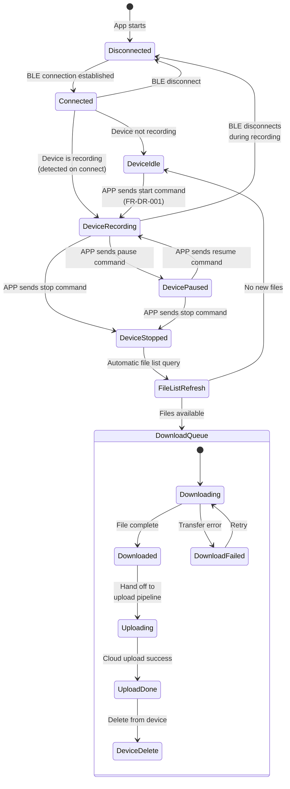
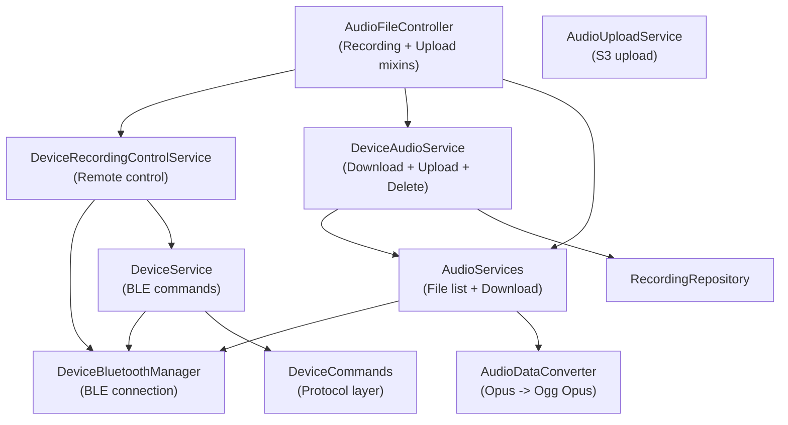

# Device Recording / BLE Transfer (设备录音 / BLE传输)

> SRD Version: 1.2 | Module: 04-recording | Sub-Module: device-recording
> Bitable: 设备录音 (9 requirements: APP-237 ~ APP-248)

---

## 1. Purpose & Scope

This document specifies the BLE hardware recording sub-module: remote control of the Memoket recording pen via the APP, audio file download from device to phone (via BLE or WiFi), and handoff to the upload pipeline.

**In Scope:**
- APP-initiated remote recording control: start/pause/resume/stop on BLE device
- Device connection state management and recording state detection
- Device file list retrieval and automatic download queue
- BLE audio file transfer (Opus raw stream -> Ogg Opus .opus files)
- BLE/WiFi transfer mode switching
- Disconnect/reconnect handling during recording and transfer
- Post-download upload to cloud + device file deletion after successful upload
- Recording notes during device recording session

**Out of Scope:**
- BLE device pairing/bonding/scanning (separate my_device module SRD)
- Firmware OTA update (separate module)
- Device hardware firmware logic (hardware team's SRD)
- Server-side audio processing (Backend/AI SRD)

---

## 2. State Model

### 2.1 Device Recording Lifecycle



### 2.2 RecordItem Status for Device Files

| Phase | AudioStatusType | Code | Description |
|-------|----------------|------|-------------|
| File discovered | `audioSourceDevice` | -4 | Placeholder from device file list, not yet downloaded |
| Downloading/Uploading | `audioUploadingFont` | 0 | BLE download in progress or cloud upload in progress |
| Download failed | `audioUploadError` | -2 | BLE transfer failure |
| Upload complete | `audioUploadFontDone` | 1 | File on S3, awaiting transcription |

### 2.3 Device Recording Session

`DeviceRecordingSession` tracks per-device recording state:
- `isPaused: bool` -- whether the device recording is paused
- `deviceKey: String` -- device identifier (serverId or MAC)
- Accessed via `DeviceBluetoothManager.getRecordingSession(deviceKey)`

---

## 3. Functional Requirements

### FR-DR-001: APP Remote Start Recording (APP-237)
- The system MUST verify BLE connection status before sending start command.
- If not connected, the system MUST disable the remote record button and display "Device not connected" prompt.
- If connected, the system MUST send a start recording command to the device.
- On success, the system MUST: (1) insert a `RecordItem` with `status = audioRecording` (-1) and `sourceType = 'device'` into the recording list, (2) display the recording control interface with timer and waveform.
- On failure (e.g., device already recording), the system MUST display "Cannot operate currently" prompt.
- **Verification:** Connect device, tap remote record; verify device begins recording; verify list shows recording item.

### FR-DR-002: APP Remote Pause/Resume (APP-237)
- Pause/resume commands MUST check connection status before sending.
- If connection is lost, the system MUST display "No connection, cannot pause/resume" and retain the recording control interface.
- `DeviceRecordingControlService.togglePauseResume()` MUST read `session.isPaused` to determine whether to send pause or resume command.
- The system MUST only operate on items where `isDeviceRecording(record)` returns true (status = -1 AND sourceType = 'device').
- **Verification:** During device recording, tap pause; verify device pauses; tap resume; verify device resumes.

### FR-DR-003: APP Remote Stop (APP-237)
- Stop command MUST check connection status before sending.
- `DeviceRecordingControlService.stopIfDeviceRecording()` MUST send stop command and return the device reference.
- After stop, the system MUST trigger device file list refresh to discover the newly recorded file.
- **Verification:** During device recording, tap stop; verify recording stops; verify file appears in device file list.

### FR-DR-004: BLE/WiFi Transfer Mode Switch (APP-238)
- The system MUST support switching between BLE and WiFi transfer modes.
- BLE transfer: default mode, uses BLE data channel.
- WiFi transfer: higher bandwidth mode, requires WiFi connectivity.
- Each mode MUST support its own resume-from-breakpoint mechanism.
- When switching modes, the current file transfer MUST restart from the beginning (not resume).
- If WiFi transfer fails more than 3 times, the system SHOULD fall back or prompt the user.
- **Verification:** Start BLE download, switch to WiFi; verify download restarts; verify WiFi transfer completes.

### FR-DR-005: Device Reconnection Handling (APP-239)
- On BLE disconnect during recording, the system MUST display "Device disconnected" prompt.
- Auto-reconnect is event-driven (Bluetooth adapter state change), with 500ms delay between sequential reconnects.
- On successful reconnect:
  - If device is still recording: return to recording control interface.
  - If device is not recording: return to device file list / idle state.
- On reconnect during file transfer: MUST resume transfer from breakpoint.
- **Verification:** Disconnect BLE during recording; verify prompt shown; reconnect; verify correct state transition.

### FR-DR-006: Device File List Retrieval (APP-240)
- On BLE connection established, the system MUST automatically query the device for its file list.
- Each device file MUST be converted to a `RecordItem` with:
  - `status = audioSourceDevice` (-4)
  - `sourceType = 'device'`
  - `duration = file.duration * 1000` (convert seconds to milliseconds)
  - `originName = file.name` (device-side filename)
  - `deviceId = serverId` (device identifier)
- **Verification:** Connect device with 3 files; verify 3 RecordItems appear with status -4.

### FR-DR-007: Automatic Download Queue (APP-241)
- After file list retrieval, the system MUST automatically enqueue files for download, ordered most-recent to oldest.
- `AudioServices.processAndEnqueueDeviceFiles()` MUST convert files to RecordItems and feed them to `AudioFileController.enqueueDeviceFileTransfers()`.
- Each file goes through: BLE download -> cloud upload -> device delete.
- The full pipeline is orchestrated by `DeviceAudioService.processDeviceAudio()`.
- **Verification:** Connect device with 3 files; verify download starts automatically; verify order is newest first.

### FR-DR-008: Live BLE Transfer During Recording (APP-242)
- The system SHOULD support streaming audio data over BLE while the device is still recording ("edge-record-edge-transfer").
- The BLE device streams raw Opus frames; the APP receives and assembles into Ogg Opus (.opus) files using `AudioDataConverter`.
- **Note:** This is a v1.2 feature, currently in development.
- **Verification:** Start device recording; verify audio data arrives in real-time via BLE; verify assembled .opus file is playable.

### FR-DR-009: Breakpoint Resume Transfer (APP-245)
- BLE and WiFi transfers MUST support resume from breakpoint after disconnect.
- The transfer protocol uses sequence numbers and ACK to track progress.
- On reconnect, transfer MUST resume from the last acknowledged position.
- **Verification:** Start BLE download of large file, disconnect at 50%; reconnect; verify download resumes from ~50%.

### FR-DR-010: Recording Bookmark (Hardware Marking) (APP-246)
- The system SHOULD support hardware-initiated bookmarks (timestamps marked by button press on device during recording).
- **Status:** UX not started. Deferred.

### FR-DR-011: In-Recording Notes (APP-248)
- The system MUST allow users to add text notes during a device recording session via the APP.
- Notes are associated with the current recording timestamp.
- Notes are synced via `RecordingNotesSyncService` after upload.
- **Verification:** During device recording, add a note; verify note appears in transcription detail after upload and processing.

---

## 4. Data Contract

### 4.1 BLE Protocol Layers

| Layer | Responsibility | Key Details |
|-------|---------------|-------------|
| **Application Layer** | Audio data semantics | Opus audio frames, file metadata (name, size, duration), recording commands (start/pause/stop), file list queries, file delete commands |
| **Transport Layer** | Reliable delivery | Sequence numbers, ACK/NACK, packet reassembly, breakpoint tracking |
| **BLE Layer** | Physical transport | MTU = 511 bytes (514 - 3 overhead), GATT characteristics for data and control |

### 4.2 BLE Configuration

| Parameter | Value | Source |
|-----------|-------|--------|
| MTU | 511 bytes | `ota_commands.dart:173` (fixed, future: dynamic negotiation) |
| Scan timeout | 30 seconds | `device_bluetooth_manager.dart:231` |
| Auto-reconnect delay | 500ms between devices | `device_bluetooth_manager.dart:1124` |
| Reconnect strategy | Event-driven on adapter state change | `device_bluetooth_manager.dart:1105` |

### 4.3 Device Audio Format

| Parameter | Value | Source |
|-----------|-------|--------|
| Raw stream format | Opus frames | `audio_data_converter.dart:8` |
| Output container | Ogg Opus (.opus) | `audio_data_converter.dart` |
| Playability | VLC-compatible with correct duration | Note in `nfr_config_values.json` |

### 4.4 Device RecordItem Fields

| Field | Value | Notes |
|-------|-------|-------|
| `id` | `DateTime.now().toIso8601String()` | Temporary, replaced by server ID after upload |
| `originName` | Device filename | Used for device-side file operations (delete after upload) |
| `sourceType` | `'device'` | Enum: `AudioSourceType.device.name` |
| `deviceId` | Server-registered device ID or MAC | Used to locate BLE connection for commands |
| `fileSize` | From device file metadata | Bytes |
| `duration` | `file.duration * 1000` | Milliseconds (converted from seconds) |
| `status` | -4 initially | `audioSourceDevice` placeholder |

### 4.5 Device Commands

| Command | Service | Method |
|---------|---------|--------|
| Start recording | `DeviceService` | `startRecording(device)` |
| Pause recording | `DeviceService` | `pauseRecording(device)` |
| Resume recording | `DeviceService` | `resumeRecording(device)` |
| Stop recording | `DeviceService` | `stopRecording(device)` |
| Get file list | `DeviceCommands` | Via BLE command protocol |
| Download file | `AudioServices` | `downloadFile(fileName, fileSize, deviceId)` |
| Delete file | `DeviceCommands` | `delDeviceAudioFile(connection, deviceId, fileName)` |

---

## 5. Interface Contract

### 5.1 DeviceRecordingControlService API

```dart
class DeviceRecordingControlService {
  bool isDeviceRecording(RecordItem record);
  Future<BluetoothDevice?> togglePauseResume({required RecordItem record});
  Future<BluetoothDevice?> stopIfDeviceRecording({required RecordItem record});
}
```

### 5.2 DeviceAudioService API

```dart
class DeviceAudioService {
  Future<RecordItem?> downloadDeviceAudio(
    RecordItem item, {
    void Function(String id, double progress)? onDownloadProgress,
    void Function(RecordItem updatedItem)? onItemUpdated,
  });
  
  Future<RecordItem?> processDeviceAudio(
    RecordItem item, {
    void Function(String id, double progress)? onDownloadProgress,
    void Function(RecordItem updatedItem)? onItemUpdated,
    required Future<RecordItem?> Function(RecordItem) uploadToCloud,
  });
  
  Future<void> deleteFromDeviceAfterUpload({
    required String fileName,
    required String deviceId,
  });
}
```

### 5.3 AudioServices (Static) API

```dart
class AudioServices {
  static Future<void> processAndEnqueueDeviceFiles(List<dynamic> files, String deviceId);
  static Future<List<RecordItem>> processDeviceFileList(List<dynamic> files, String serverId);
  static Future<AudioDownloadResult> downloadFile(String fileName, {int? fileSize, String? deviceId, ...});
}
```

---

## 6. Error Handling

### 6.1 Connection Errors

| Error | Handling | Recovery |
|-------|----------|----------|
| BLE not connected on command send | Disable UI controls, show "Device not connected" | Wait for auto-reconnect |
| BLE disconnect during recording | Show prompt, preserve recording state | On reconnect: check if still recording |
| BLE disconnect during transfer | Show prompt, preserve transfer progress | On reconnect: breakpoint resume |
| Command send failure (device busy) | Show "Cannot operate currently" | User retries when device is ready |

### 6.2 Transfer Errors

| Error | Status Transition | Recovery |
|-------|-------------------|----------|
| BLE download fails | `audioSourceDevice` -> `audioUploadError` | Manual retry or auto-retry on reconnect |
| BLE download returns null path | Remain at `audioSourceDevice` | Show failure toast |
| Audio duration = 0 after download | Item stays, upload skipped | Log warning |
| WiFi transfer fails > 3 times | Prompt user | User decides: retry or switch to BLE |

### 6.3 Post-Upload Device Cleanup

| Scenario | Behavior |
|----------|----------|
| Upload success + device connected | `deleteFromDeviceAfterUpload()` sends delete command via BLE |
| Upload success + device disconnected | Log warning, skip device delete; file remains on device |
| Upload success + no valid deviceId | Log warning, skip device delete |
| Device delete command fails | Log error, continue (non-blocking); file remains on device |

---

## 7. Non-Functional Requirements

| ID | Category | Requirement | Target |
|----|----------|-------------|--------|
| NFR-DR-001 | Performance | BLE file list retrieval latency | < 3 seconds for 10 files |
| NFR-DR-002 | Performance | BLE transfer throughput | ~20-50 KB/s (BLE 5.0, MTU 511) |
| NFR-DR-003 | Reliability | Transfer resume after disconnect | 100% resume within 1 reconnect cycle |
| NFR-DR-004 | Reliability | Auto-reconnect on Bluetooth adapter toggle | Event-driven, no retry count limit |
| NFR-DR-005 | UX | Download progress feedback | 0-100% progress via callback |
| NFR-DR-006 | Compatibility | BLE MTU | Fixed 511 bytes (future: dynamic negotiation) |

---

## 8. Observability

### 8.1 Key Log Tags

| Tag | Events |
|-----|--------|
| `DeviceAudioService` | Download start/complete/fail, upload delegation, device delete |
| `AudioServices` | File list processing, enqueue to transfer queue |
| `DeviceRecordingControlService` | Pause/resume/stop command dispatch |
| `DeviceBluetoothManager` | Connection state changes, reconnect events |

### 8.2 Analytics Events

| Event | Trigger | Properties |
|-------|---------|------------|
| `device_recording_start` | Remote start command success | deviceId |
| `device_recording_stop` | Remote stop command success | deviceId, durationMs |
| `device_download_start` | BLE file download begins | fileName, fileSize |
| `device_download_complete` | BLE file download success | fileName, durationMs, transferTimeMs |
| `device_download_failed` | BLE file download failure | fileName, failReason |
| `device_file_deleted` | Device file deleted after upload | fileName, deviceId |
| `device_disconnect_during_recording` | BLE disconnect while recording | deviceId |

---

## 9. Dependency Map



---

## 10. Open Questions & Future Considerations

| ID | Topic | Status | Notes |
|----|-------|--------|-------|
| OQ-DR-001 | Dynamic MTU negotiation | Deferred | Currently fixed at 511 bytes. Code comment indicates future dynamic MTU. Higher MTU = faster transfer. |
| OQ-DR-002 | WiFi transfer protocol | In progress | APP-238 specifies WiFi mode but implementation details are evolving. Need to define WiFi discovery and direct transfer protocol. |
| OQ-DR-003 | Multi-device concurrent recording | Not specified | Current design assumes single device recording at a time. Multi-device scenario needs session isolation. |
| OQ-DR-004 | Hardware bookmark integration | Not started | APP-246: Hardware button press creates timestamp bookmark. UX design not started. |
| OQ-DR-005 | Pause functionality on device | TBD | APP-237 note: "Pause functionality pending". Device firmware may not support pause for all models. |
| OQ-DR-006 | Device storage management | Not specified | No UI to show device storage capacity/usage. User cannot see how full the device is. |
| OQ-DR-007 | Orphan files on device | Edge case | If upload succeeds but device delete fails (disconnect), files remain on device. No cleanup mechanism on next connect. |
