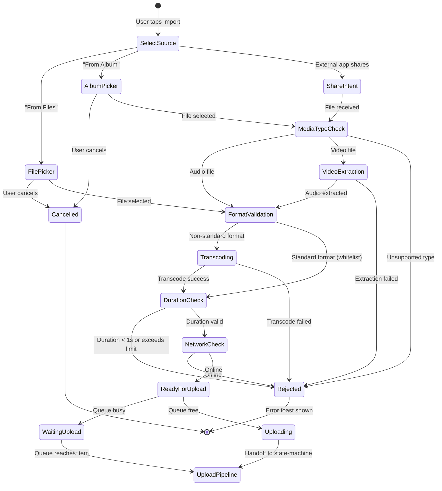
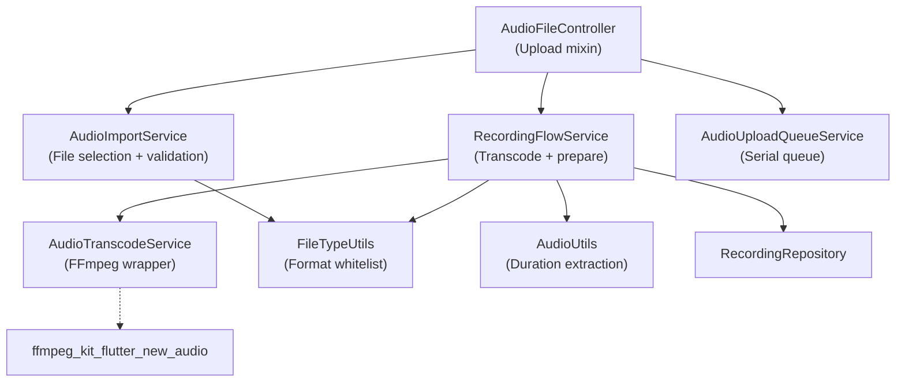

# File Import (文件导入)

> SRD Version: 1.2 | Module: 04-recording | Sub-Module: file-import
> Bitable: 文件导入 (4 requirements: APP-031, APP-033, APP-034, APP-243)

---

## 1. Purpose & Scope

This document specifies the file import sub-module: importing audio files from external sources (file picker, photo album, third-party app share intent), validating format and constraints, transcoding if necessary, and handing off to the upload pipeline.

**In Scope:**
- Audio file selection from system file picker
- Audio/video file selection from photo album (video -> audio extraction)
- Share intent reception from third-party apps
- File format validation against whitelist
- Audio format transcoding (non-standard -> m4a via FFmpeg)
- File size and duration validation
- Import-to-upload handoff
- File naming and metadata extraction

**Out of Scope:**
- Upload pipeline execution (see state-machine.md)
- Audio recording (see local-recording.md)
- BLE device file transfer (see device-recording.md)
- Server-side transcoding or processing

---

## 2. State Model

### 2.1 Import Flow States



### 2.2 RecordItem Status for Imported Files

| Phase | AudioStatusType | Code |
|-------|----------------|------|
| Validated, queued | `audioWaitingUpload` | 5 |
| Upload in progress | `audioUploadingFont` | 0 |
| Upload failed | `audioUploadError` | -2 |

---

## 3. Functional Requirements

### FR-FI-001: Import from File Picker (APP-031)
- The system MUST open the system file picker via `FilePicker.platform.pickFiles(allowMultiple: false)`.
- The system MUST NOT restrict file type at the picker level (to support renamed/misnamed files).
- After selection, the system MUST validate the file extension against the audio whitelist.
- If the extension is not in the whitelist, the system MUST display an "Unsupported format" error toast.
- If the file path is null or empty, the system MUST display an error toast and return null.
- **Verification:** Open file picker, select an .mp3 file; verify import proceeds. Select a .pdf file; verify "Unsupported format" toast.

### FR-FI-002: Import from Photo Album (APP-031)
- The system MUST open the system gallery via `ImagePicker().pickVideo(source: ImageSource.gallery)`.
- The system MUST accept both audio and video files from the gallery.
- For video files, the system MUST extract audio using `AudioTranscodeService.extractAudioFromVideo()`.
- Video files MUST be rejected with a warning toast indicating only audio files are supported (for share intent path).
- **Verification:** Open album, select a video; verify audio is extracted as .m4a; verify resulting audio is playable.

### FR-FI-003: Share Intent Reception (APP-031)
- The system MUST listen for share intents via `ReceiveSharingIntent` on both initial media and media stream.
- The system MUST filter out text and URL media types.
- Video media types MUST be rejected with "Only audio files supported" toast.
- Audio media types MUST proceed to format validation.
- The system MUST call `handleSharedFile()` which validates and delegates to `processAndUpload()`.
- **Verification:** Share an .m4a file from another app to Memoket; verify import proceeds; share a .mp4 video; verify rejection toast.

### FR-FI-004: Format Transcoding (APP-033)
- Supported audio formats (no transcoding needed): `mp3`, `m4a`, `aac`, `wav`, `ogg`, `opus`.
- Non-standard audio formats (e.g., `flac`, `webm`) MUST be transcoded to m4a via `AudioTranscodeService.convertToM4a()`.
- Video files MUST have audio extracted via `AudioTranscodeService.extractAudioFromVideo()`.
- FFmpeg command for transcoding: `-vn -c:a aac -ar 16000 -b:a 32k -ac 2`.
- **Note:** WMA is explicitly excluded (commented out) as unsupported on both Android and iOS.
- **Verification:** Import a .flac file; verify it is transcoded to .m4a; verify the output is playable.

### FR-FI-005: File Validation (APP-243)
- **Format validation:** File extension MUST be in `commonAudioExtensions` set: {mp3, m4a, aac, wav, ogg, opus}.
- **Duration validation:** Audio duration MUST be >= 1 second. Files < 1 second MUST be rejected (and deleted if transcoded).
- **Duration extraction:** Use `AudioUtils.getAudioDurationAndFixExtension()` which also corrects mismatched extensions.
- **File accessibility:** File MUST exist and be readable. Size MUST be > 0 bytes.
- The system SHOULD validate duration BEFORE starting transcoding to avoid wasting resources on oversized files (see OQ-FI-001).
- **Verification:** Import a 0.5s audio file; verify rejection. Import a valid 30s file; verify acceptance.

### FR-FI-006: Import Metadata Construction
- The system MUST create a `RecordItem` via `RecordingFlowService.prepareImportedRecordForUpload()` with:
  - `id`: current ISO 8601 timestamp (temporary)
  - `name`: original filename without extension
  - `sourceType`: `'upload'`
  - `status`: `audioWaitingUpload` (5)
  - `duration`: extracted duration in milliseconds
  - `localLocation`: path to the (possibly transcoded) file
- `fileCreatedAt` MUST be determined by priority: (1) original file's modified time, (2) transcoded file's modified time, (3) current timestamp.
- **Verification:** Import a file; verify RecordItem has correct name, duration, and fileCreatedAt matches original file timestamp.

---

## 4. Data Contract

### 4.1 Supported Audio Formats

| Format | Extension | Transcoding Required | Notes |
|--------|-----------|---------------------|-------|
| MP3 | `.mp3` | No | Direct upload |
| M4A/AAC | `.m4a` | No | Native recording format |
| AAC (raw) | `.aac` | No | Direct upload |
| WAV | `.wav` | No | Direct upload (may be large) |
| Ogg Vorbis/Opus | `.ogg` | No | Direct upload |
| Opus | `.opus` | No | BLE device native format |
| FLAC | `.flac` | Yes -> m4a | Lossless, needs transcoding |
| WebM | `.webm` | Yes -> m4a | Browser recording format |
| WMA | `.wma` | **Rejected** | Unsupported on iOS and Android |
| Video (any) | `.mp4`, `.mov`, etc. | Yes -> m4a (extract audio) | Via `extractAudioFromVideo()` |

### 4.2 Transcoding Parameters

| Parameter | Value | Source |
|-----------|-------|--------|
| Output codec | AAC | `audio_transcode_service.dart` |
| Output container | .m4a | All FFmpeg commands |
| Sample rate | 16000 Hz | `-ar 16000` |
| Bitrate | 32 kbps | `-b:a 32k` |
| Channels | 2 (stereo) | `-ac 2` |
| Video strip | Yes | `-vn` flag |

**Note:** Transcoding output (16kHz/32kbps/stereo) differs from recording output (44.1kHz/platform-default/mono). This is intentional for bandwidth optimization on imported files.

### 4.3 Import RecordItem Fields

| Field | Value | Notes |
|-------|-------|-------|
| `id` | `DateTime.now().toIso8601String()` | Temporary |
| `name` | `basename(originalFilePath)` without extension | User-visible name |
| `sourceType` | `'upload'` | Not 'imported' -- uses upload source type |
| `status` | 5 (`audioWaitingUpload`) | Enters queue |
| `duration` | Extracted, in milliseconds | From `AudioUtils.getAudioDurationAndFixExtension()` |
| `localLocation` | Path to validated/transcoded file | May differ from original if transcoded |

### 4.4 Import Sources and Entry Points

| Source | Service Method | Trigger |
|--------|---------------|---------|
| File picker | `AudioImportService.pickFileFromFiles()` | User taps "Import from Files" |
| Photo album | `AudioImportService.pickFileFromAlbum()` | User taps "Import from Album" |
| Share intent (initial) | `ReceiveSharingIntent.getInitialMedia()` | App launched via share |
| Share intent (stream) | `ReceiveSharingIntent.getMediaStream()` | App already running, receives share |

---

## 5. Interface Contract

### 5.1 AudioImportService API

```dart
class AudioImportService {
  static const Set<String> allowedAudioExtensions;  // = FileTypeUtils.commonAudioExtensions
  
  Future<String?> pickFileFromFiles();   // Returns file path or null
  Future<String?> pickFileFromAlbum();   // Returns file path or null
  
  void initSharingIntentListener(void Function(String filePath) onSharedFile);
  void cancelSharingIntentListener();
  
  Future<void> handleSharedFile(
    String filePath, {
    required Future<void> Function(String path) processAndUpload,
  });
}
```

### 5.2 RecordingFlowService (Import-Related) API

```dart
class RecordingFlowService {
  Future<String?> processAndTranscodeAudio(String filePath, {bool trustAsAudio = false});
  Future<PrepareImportedResult?> prepareImportedRecordForUpload(String filePath, String originalFilePath);
}
```

### 5.3 AudioTranscodeService API

```dart
class AudioTranscodeService {
  static Future<String> convertToM4a({required String inputPath});
  static Future<String?> convertToM4aAtPath({required String inputPath, required String outputPath});
  static Future<String> extractAudioFromVideo({required String videoPath});
  static Future<String> mergeAudios({required List<String> inputPaths});
  static Future<String> trimAudio({required String inputPath, required double startSeconds, required double endSeconds});
  static Future<String?> convertToMp3ForShare({required String inputPath});
}
```

---

## 6. Error Handling

### 6.1 Validation Errors

| Error | Toast Key | User Impact |
|-------|-----------|-------------|
| Unsupported format (extension not in whitelist) | `audio_file.import_unsupported_format` | File rejected, user returns to picker |
| Video file shared (share intent) | `audio_file.share_from_other_apps` | File rejected |
| Video file via album | `audio_file.only_audio_files_supported` | File rejected |
| File path null/empty | `audio_file.import_unsupported_format` | File rejected |
| File not readable | `audio_file.import_audio_failed` | File rejected |

### 6.2 Processing Errors

| Error | Handling | Recovery |
|-------|----------|----------|
| Transcoding failure (FFmpeg error) | `processAndTranscodeAudio` returns null | Log error; user can retry import |
| Duration extraction failure | `prepareImportedRecordForUpload` returns null | File skipped |
| Duration < 1 second | File deleted, returns null | User informed (implicit) |
| Duration exceeds limit | Toast shown | User must trim file externally |
| File size = 0 | Import skipped | Log error |

### 6.3 Known Bug-Driven Edge Cases

| Ticket | Issue | Resolution |
|--------|-------|------------|
| Ticket-000859 (P1) | 5-hour (278MB) file import: "Duration Exceeded" shown AFTER transcoding starts, wasting time | Root cause: Duration check happens after transcode. Fix needed: validate duration BEFORE transcoding. See OQ-FI-001. |
| Ticket-000656 (P1) | No upload progress indicator for imported files | Root cause: RecordItem inserted with status but UI card does not show uploading indicator. Fix: ensure status-based UI rendering for imported files matches recording files. |

---

## 7. Non-Functional Requirements

| ID | Category | Requirement | Target |
|----|----------|-------------|--------|
| NFR-FI-001 | Performance | File picker to validation complete | < 2 seconds for files < 100MB |
| NFR-FI-002 | Performance | Transcoding throughput (FFmpeg) | ~10x real-time for audio (e.g., 60s audio transcodes in ~6s) |
| NFR-FI-003 | Performance | Video audio extraction | ~5x real-time |
| NFR-FI-004 | Storage | Transcoded file cleanup | Transcoded temp files SHOULD be cleaned up after upload succeeds |
| NFR-FI-005 | UX | Import feedback | User MUST see immediate feedback (loading indicator or list item appears) within 1 second of file selection |
| NFR-FI-006 | Compatibility | Supported format coverage | All 6 whitelist formats MUST work on both iOS and Android |

---

## 8. Observability

### 8.1 Key Log Tags

| Tag | Events |
|-----|--------|
| `AudioImportService` | File pick result, sharing intent received, format validation |
| `RecordingFlowService` | Transcode start/complete/fail, import preparation, duration extraction |
| `AudioTranscodeService` | FFmpeg command execution, success/failure, output path |

### 8.2 Analytics Events

| Event | Trigger | Properties |
|-------|---------|------------|
| `file_import_started` | User selects file from any source | source (files/album/share), fileExtension, fileSize |
| `file_import_validated` | Format and duration checks pass | format, durationMs, wasTranscoded |
| `file_import_rejected` | Validation fails | reason (unsupported_format / duration_exceeded / file_empty) |
| `file_import_transcode_started` | Non-standard format transcoding begins | inputFormat, outputFormat |
| `file_import_transcode_completed` | Transcoding succeeds | inputFormat, transcodeDurationMs |
| `file_import_transcode_failed` | FFmpeg error | inputFormat, errorMessage |

---

## 9. Dependency Map



---

## 10. Open Questions & Future Considerations

| ID | Topic | Status | Notes |
|----|-------|--------|-------|
| OQ-FI-001 | Pre-transcode duration/size check | Bug-driven priority | Ticket-000859: Should validate duration and file size BEFORE starting FFmpeg transcoding. Currently, a 5-hour file gets transcoded before being rejected. Saves user wait time and device resources. |
| OQ-FI-002 | Multi-file import | Not implemented | `pickFiles(allowMultiple: false)` enforces single file. Future: batch import with queue integration. |
| OQ-FI-003 | File size limit | Not documented | No explicit file size limit. The `Duration Exceeded` error exists but specific thresholds are not defined in SRD. Need to document max duration and max file size. |
| OQ-FI-004 | Import progress for large files | Partial | Transcoding has no progress callback. For large files (>100MB), user sees only a spinner with no ETA. Consider FFmpeg progress parsing. |
| OQ-FI-005 | Duplicate import detection | Not implemented | No check for re-importing the same file. User can import the same file multiple times. Consider MD5-based deduplication. |
| OQ-FI-006 | Transcoding quality vs original | By design | Transcoded output is 16kHz/32kbps, significantly lower quality than source. This is intentional for bandwidth but may affect transcription quality for high-quality source material. |
