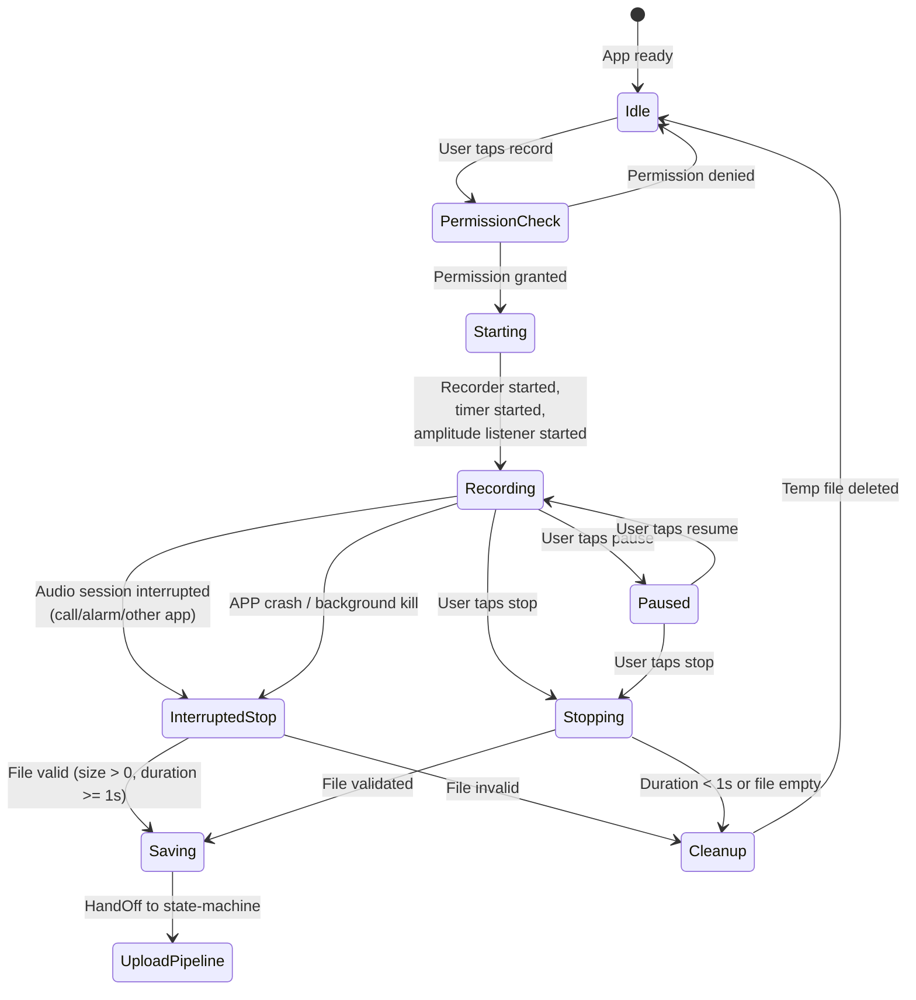
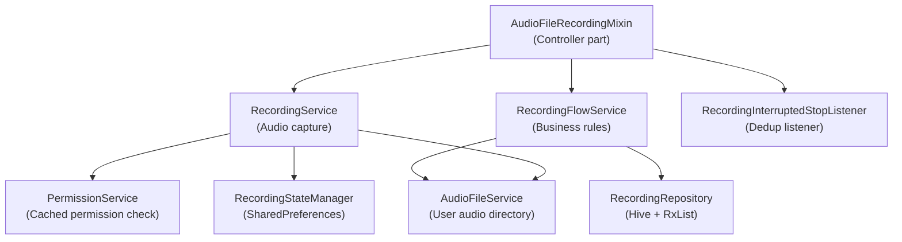

# Local Recording (本地录音)

> SRD Version: 1.2 | Module: 04-recording | Sub-Module: local-recording
> Bitable: 本地录音 (10 requirements: APP-001 ~ APP-010)

---

## 1. Purpose & Scope

This document specifies the phone microphone recording sub-module: the user-facing flow from tapping the record button through audio capture, pause/resume, stop, file save, and handoff to the upload pipeline.

**In Scope:**
- Microphone permission management
- Recording lifecycle: start -> pause -> resume -> stop -> save
- Audio format, sampling rate, file naming conventions
- Background recording (lock screen, app switch)
- Audio interruption handling (phone calls, alarms, other apps)
- Abnormal recording detection and recovery on app restart
- Recording state persistence across app restarts
- Real-time duration display and waveform amplitude data
- Platform-specific foreground service (Android) and lock screen controls (iOS)
- Recording debounce (prevent rapid multiple taps)

**Out of Scope:**
- Upload pipeline (see state-machine.md)
- Device/BLE recording (see device-recording.md)
- File import (see file-import.md)

---

## 2. State Model

### 2.1 Recording Session States



### 2.2 RecordingStateManager Persisted States

| Persisted Status | Description |
|-----------------|-------------|
| `recording` | Active recording in progress |
| `paused` | Recording is paused |
| `stopped` | Normal termination |
| `interrupted` | Abnormal termination with reason |

**Interruption Reasons:**
- `audio_interruption` -- iOS AudioSession interrupted by another app
- `audio_focus_loss` -- Android audio focus lost
- `app_killed` -- Process killed by OS while recording

---

## 3. Functional Requirements

### FR-LR-001: Start Recording (APP-001)
- The system MUST check microphone permission via `PermissionService` (cached) before starting.
- If permission is not granted, the system MUST request permission. If permanently denied, the system SHOULD guide user to system settings.
- The system MUST generate a file path in format: `audio_YYYY_MM_DD_HH_mm_ss.m4a` in the user audio directory.
- The system MUST configure the audio recorder with: encoder = AAC-LC, channels = 1 (mono), sample rate = 44100 Hz.
- The system MUST verify the recorder is actually recording after `_recorder.start()` returns (state validation).
- The system MUST start a 1-second periodic timer for elapsed time updates.
- The system MUST start amplitude monitoring (delayed 100ms after recording starts for Android compatibility).
- The system MUST enable screen wake lock during recording.
- **Verification:** Start recording; verify file is created at expected path; verify AAC-LC encoding via ffprobe; verify elapsed stream emits every second.

### FR-LR-002: Stop Recording (APP-002)
- The system MUST stop the recorder, cancel the timer, and stop amplitude monitoring.
- The system MUST calculate final duration: `accumulated + (now - lastResumeUtc)`.
- The system MUST use the path returned by `_recorder.stop()`, falling back to the expected path if null.
- The `stop()` method MUST be idempotent: if called when recorder is neither recording nor paused, it MUST return the previous stop result (via `_lastStopResult` cache).
- **Verification:** Record for 5 seconds, stop; verify duration is 5000ms +/- 500ms; verify file exists and is playable.

### FR-LR-003: Pause/Resume (APP-003)
- Pause MUST: stop the timer, accumulate the current segment duration, stop amplitude monitoring, emit amplitude 0.0.
- Resume MUST: restart the recorder, reset `_lastResumeUtc`, restart the periodic timer (accounting for accumulated time), restart amplitude monitoring (delayed 100ms).
- Pause/resume MUST be idempotent: pause when not recording is a no-op; resume when not paused is a no-op.
- **Verification:** Record 3s, pause 2s, resume 3s, stop; verify total duration is ~6000ms (not 8000ms).

### FR-LR-004: Cancel Recording (APP-004)
- Cancel MUST stop the recorder and delete the temporary file.
- Cancel MUST clear all recording state (timer, accumulated time, startUtc).
- Cancel MUST remove the `audioRecording` (-1) item from `RecordingRepository`.
- **Verification:** Start recording, cancel; verify no file remains; verify no recording item in repository.

### FR-LR-005: Interruption Detection (APP-005)
- The system MUST listen to `AudioSession.interruptionEventStream` for audio interruptions.
- On `AudioInterruptionType.pause` or `AudioInterruptionType.unknown`, the system MUST auto-stop the recording and emit on `interruptedStopStream`.
- The `RecordingInterruptedStopListener` MUST deduplicate events by file path to prevent double-handling.
- On `didChangeAppLifecycleState(AppLifecycleState.paused)`, the system MUST save current recording state via `RecordingStateManager`.
- **Verification:** Start recording, simulate phone call; verify recording auto-stops; verify file is saved; verify interrupted stop event is emitted exactly once.

### FR-LR-006: Abnormal Recording Cleanup (APP-006)
- On cold start, `RecordingFlowService.checkAbnormalRecordings()` MUST detect all items with `audioRecording` (-1) status where the recorder is NOT actually active.
- For each abnormal item with a valid local file (exists, size > 0):
  - If duration >= 1 second: auto-upload (transition to `audioUploadingFont`).
  - If duration < 1 second: delete file and remove item.
- For abnormal items with no valid file: search user audio directory for time-proximity match (within 1 hour), update `localLocation` if found.
- Items with truly missing files MUST be marked `audioInterrupted` (-3) or deleted.
- **Verification:** Create a recording item with status -1 but no active recorder; restart app; verify abnormal detection and appropriate cleanup.

### FR-LR-007: Real-Time Duration Update (APP-007)
- The system MUST emit elapsed duration every 1 second via `elapsedStream`.
- Duration calculation MUST account for pause segments: `accumulated + (now - lastResumeUtc)`.
- `RecordingFlowService.startDurationUpdater()` MUST propagate duration to the RecordItem in the list (in milliseconds).
- **Verification:** Record with 2 pause/resume cycles; verify displayed time matches actual elapsed recording time.

### FR-LR-008: Recording Debounce (APP-008)
- The system MUST prevent starting a new recording while:
  - Another recording is active (`audioRecording` exists in list)
  - An upload is in progress (`audioUploadingFont` exists in list)
- `RecordingFlowService.canStartRecording()` MUST return false if either condition is true.
- **Verification:** Start recording; tap record again; verify second tap is ignored; verify toast/feedback is shown.

### FR-LR-009: Recording UI State Recovery (APP-009)
- When user taps a list item with status `audioRecording` (-1), the system MUST reopen the recording sheet (not start a new recording).
- The recording sheet MUST display the current elapsed time and resume waveform display.
- **Verification:** Start recording, navigate away, tap the recording item; verify recording sheet reopens with correct elapsed time.

### FR-LR-010: Background Recording (APP-010)
- **Android:** The system MUST start a Foreground Service with notification showing elapsed time. Notification MUST update every second.
- **iOS:** The system MUST configure AudioSession for background recording. The system MUST update lock screen now-playing info with elapsed time. The system MUST call `beginBackgroundTask` / `endBackgroundTask` for upload after recording stops.
- Recording MUST continue when: screen is locked, user switches to another app, notification shade is pulled down.
- **Verification:** Start recording, lock screen, wait 60 seconds, unlock; verify recording continued and duration is ~60s.

---

## 4. Data Contract

### 4.1 Audio Format Specification

| Parameter | Value | Source |
|-----------|-------|--------|
| Container | M4A (.m4a) | `recording_service.dart:200` |
| Codec | AAC-LC | `RecordConfig(encoder: AudioEncoder.aacLc)` |
| Channels | 1 (mono) | `RecordConfig(numChannels: 1)` |
| Sample Rate | 44100 Hz | `RecordConfig(sampleRate: 44100)` |
| Output bitrate | Determined by platform encoder | Not explicitly set |

### 4.2 File Naming Convention

| Phase | Format | Example |
|-------|--------|---------|
| During recording | `audio_YYYY_MM_DD_HH_mm_ss.m4a` | `audio_2026_04_02_14_30_00.m4a` |
| After upload | `{serverId}.m4a` | `a1b2c3d4-e5f6-7890.m4a` |
| Storage path | `{appDocDir}/users/{userKey}/audio/` | `documents/users/abc123_cn/audio/` |

### 4.3 RecordItem Fields (Recording Phase)

| Field | Value During Recording |
|-------|----------------------|
| `id` | `startUtc.toIso8601String()` (temporary, replaced by server ID after presign) |
| `name` | `MM-DD HH:mm` formatted from startUtc |
| `status` | `-1` (audioRecording) |
| `sourceType` | `'recording'` (legacy) or `'phoneRecording'` |
| `localLocation` | Full file path |
| `duration` | Updated in real-time (milliseconds) |
| `s3Url` | `''` (empty until upload complete) |

### 4.4 Platform Communication

| Platform | Channel | Methods |
|----------|---------|---------|
| Android | `com.ssheng.memoketai/recording_service` | `startForegroundService`, `stopForegroundService`, `updateForegroundNotification` |
| iOS | `com.ssheng.memoketai/recording_service` | `beginBackgroundTask`, `endBackgroundTask`, `updateLockScreenInfo` |

---

## 5. Interface Contract

### 5.1 RecordingService API

```dart
class RecordingService {
  Future<bool> ensureMicPermission();
  Future<String> startRecording();     // Returns file path
  Future<void> pause();
  Future<void> resume();
  Future<({String path, DateTime? startUtc, Duration duration})> stop({bool isInterrupted = false});
  
  Stream<Duration> get elapsedStream;  // 1-second tick
  Stream<double> get amplitudeStream;  // Waveform data
  Stream<({String path, DateTime? startUtc, Duration duration})> get interruptedStopStream;
  
  String? get currentRecordingPath;
  DateTime? get currentRecordingStartUtc;
}
```

### 5.2 RecordingFlowService API

```dart
class RecordingFlowService {
  bool canStartRecording(List<RecordItem> recordings);
  bool hasRecording(List<RecordItem> recordings);
  bool hasUploading(List<RecordItem> recordings);
  RecordItem createRecordingItem(String filePath, DateTime startUtc);
  void startDurationUpdater(RecordItem item, Stream<Duration> elapsedStream, callback);
  void stopDurationUpdater();
  Future<CheckAbnormalResult> checkAbnormalRecordings(...);
  Future<PrepareAbnormalUploadResult?> prepareAbnormalUpload(RecordItem item);
  Future<SheetClosedProcessResult> processRecordingSheetClosedResult(...);
}
```

---

## 6. Error Handling

### 6.1 Permission Errors

| Error | Handling | User Impact |
|-------|----------|-------------|
| Microphone permission denied | Show system permission dialog; if permanently denied, guide to Settings | Cannot record |
| Recorder permission check fails | Throw `RecordingPermissionException` | Cannot record |
| Permission revoked mid-recording | Force `recheckPermission()` on next attempt | Recording may stop |

### 6.2 Recording Errors

| Error | Handling | Recovery |
|-------|----------|----------|
| `_recorder.start()` throws | Log error, recheck permission, rethrow | User retries |
| Recorder not in recording state after start | Throw `RecordingPermissionException` | User retries |
| Audio session interrupted (call/alarm) | Auto-stop via `interruptedStopStream`, save file | File saved, enters upload pipeline |
| APP crash during recording | State persisted via `RecordingStateManager`; detected on restart by `checkAbnormalRecordings()` | Auto-upload if file valid |
| Stop called when not recording | Idempotent: return `_lastStopResult` if available | No error |
| File path null after stop | Fall back to expected path based on startUtc | Transparent |

### 6.3 Known Bug-Driven Edge Cases

| Ticket | Issue | Resolution |
|--------|-------|------------|
| Ticket-000868 (P0) | Phone call during recording causes dead loop -- cannot pause/stop/save | Root cause: AudioSession state mismatch with AudioRecorder after call interrupt. Fix: idempotent stop + interrupted stop listener with dedup. |
| Ticket-000895 (P1) | "End recording failed" after auto-pause | Root cause: Recording auto-paused by system but stop() called on non-recording state. Fix: `_lastStopResult` cache for idempotent stop. |

---

## 7. Non-Functional Requirements

| ID | Category | Requirement | Target |
|----|----------|-------------|--------|
| NFR-LR-001 | Performance | Recording start latency (tap to first audio captured) | < 2500ms (measured ~2429ms in logs) |
| NFR-LR-002 | Performance | Pause/resume latency | < 200ms |
| NFR-LR-003 | Performance | Timer accuracy | +/- 1 second per 60 minutes |
| NFR-LR-004 | Reliability | Background recording on Android (Foreground Service) | Must survive 8+ hours |
| NFR-LR-005 | Reliability | Background recording on iOS (AudioSession) | Must survive lock screen + app switch |
| NFR-LR-006 | Storage | Recording file size estimate | ~1 MB per minute (AAC-LC 44.1kHz mono) |
| NFR-LR-007 | UX | Waveform amplitude update rate | Every 200ms (recorder's onAmplitudeChanged interval) |

---

## 8. Observability

### 8.1 Key Log Tags

| Tag | Events |
|-----|--------|
| `RecordingService` | Start/pause/resume/stop, state checks, interruption handling |
| `RecordingService-Performance` | Step-by-step timing for start flow (permission, directory, audio session, recorder, timer) |
| `RecordingService-Permission` | Permission check results |
| `RecordingFlowService` | Abnormal detection, validation failures, duration updates |
| `RecordingStateManager` | State save/load/clear, interruption state |

### 8.2 Analytics Events

| Event | Trigger | Properties |
|-------|---------|------------|
| `record_start` | Recording starts successfully | source=phone |
| `record_pause` | User pauses | elapsedMs |
| `record_resume` | User resumes | accumulatedMs |
| `record_stop` | User stops normally | totalDurationMs, fileSizeBytes |
| `record_interrupted` | Audio interruption detected | reason, elapsedMs |
| `record_abnormal_detected` | Cold start detects abnormal recordings | count, validFileCount, invalidFileCount |
| `record_permission_denied` | Microphone permission denied | isPermanentlyDenied |

---

## 9. Dependency Map



---

## 10. Open Questions & Future Considerations

| ID | Topic | Status | Notes |
|----|-------|--------|-------|
| OQ-LR-001 | Recording resume after app restart | Reserved | `RecordingStateManager.getRecordingState()` exists but is marked "reserved, not yet used". Future: detect interrupted recording on restart and offer resume. |
| OQ-LR-002 | Max recording duration limit | Not implemented | No maximum duration enforced. Users can theoretically record for hours. Consider adding a configurable limit with warning. |
| OQ-LR-003 | Recording quality settings | Not exposed | Codec/sample rate/channels are hardcoded. Future: expose quality presets (high/normal/low) in settings. |
| OQ-LR-004 | Stereo recording support | Not implemented | Currently mono only (`numChannels: 1`). May be needed for specific use cases. |
| OQ-LR-005 | Storage space pre-check | Not implemented | No check for available storage before starting recording. Should warn user if < 100MB free. |
