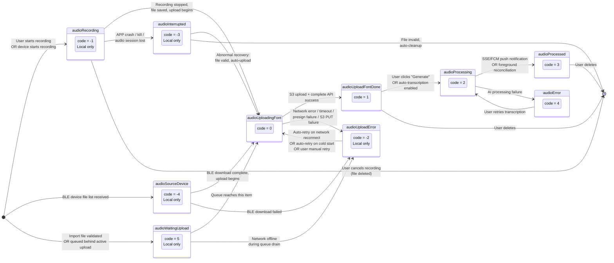

# Recording Core State Machine (录音核心状态机)

> SRD Version: 1.2 | Module: 04-recording | Sub-Module: state-machine
> Source of Truth: `AudioStatusType` enum in `shared/repositories/recording_repository.dart:20`

---

## 1. Purpose & Scope

This document defines the **single most critical state model** in the entire application: the `AudioStatusType` state machine that governs the lifecycle of every `RecordItem` from creation to transcription completion (or error terminal state).

All three audio sources (local recording, device recording, file import) converge into this unified state machine once audio capture is complete.

**In Scope:**
- Complete `AudioStatusType` enum definition and code mapping
- All legal state transitions with triggers (user action vs system event)
- Illegal/forbidden transitions and regression guard logic
- Concurrent state scenarios (recording while previous file uploads)
- Upload pipeline: presign -> S3 PUT -> complete -> processing -> done
- Error states, retry paths, and auto-recovery mechanisms

**Out of Scope:**
- Audio capture mechanics (covered in local-recording.md, device-recording.md)
- File validation/transcoding (covered in file-import.md)
- Transcription detail page behavior (separate SRD module)
- Server-side AI processing pipeline (Backend/AI SRD)

---

## 2. State Diagram

---

## 3. State Definition Table

| State Name | Code | Sync to Server | UI Text | Description | Entry Sources |
|-----------|------|----------------|---------|-------------|---------------|
| `audioSourceDevice` | -4 | No | *(empty)* | Placeholder for a BLE device file not yet downloaded to local. Created when device file list is received. | BLE file list refresh |
| `audioInterrupted` | -3 | No | "Error" | Recording was abnormally interrupted (APP crash, kill, audio session loss). File may or may not be valid. | APP restart detection via `RecordingFlowService.checkAbnormalRecordings()` |
| `audioUploadError` | -2 | No | "Upload failed" | Upload attempt failed. File exists locally and is eligible for retry. | Network error, presign failure, S3 PUT timeout, queue drain on offline |
| `audioRecording` | -1 | No | "Recording" | Audio is actively being captured (phone mic or device). Only ONE item can be in this state at a time. | User starts recording, device recording detected |
| `audioUploadingFont` | 0 | Yes | "Uploading..." | Active upload in progress: presign -> S3 PUT -> complete API. | Recording stop, import ready, BLE download complete, retry |
| `audioUploadFontDone` | 1 | Yes | *(empty)* | Upload to S3 completed. Server has the file. Waiting for user to trigger transcription (or auto-transcription). | Successful `completeUpload` API response |
| `audioProcessing` | 2 | Yes | "Generating..." | Server-side AI transcription/analysis is in progress. | User clicks "Generate" or auto-transcription triggers |
| `audioProcessed` | 3 | Yes | "Generated" | Transcription complete. Full detail page available. | SSE push, FCM notification, foreground status reconciliation |
| `audioError` | 4 | Yes | "Error" | Server-side processing failed. | AI pipeline failure |
| `audioWaitingUpload` | 5 | No | "Waiting..." | File is validated and ready for upload, queued behind an active upload. | File import when upload queue is busy |

### Audio Source Types

| Source | Enum Value | Description |
|--------|-----------|-------------|
| `device` | 0 | Audio from BLE hardware device |
| `phoneRecording` | 1 | Phone microphone recording (also legacy value `'recording'`) |
| `imported` | 2 | Imported file (sourceType = `'upload'` in RecordItem) |

---

## 4. Functional Requirements

### FR-SM-001: Upload Pipeline (APP-023)
- The system MUST execute the upload pipeline in this exact order: (1) validate file exists and size > 0, (2) calculate MD5 hash, (3) request presigned URL from server, (4) PUT file to S3 with Content-MD5 header, (5) call `completeUpload` API, (6) move file to user audio directory and rename to server ID.
- **Verification:** Integration test with mock S3; verify each step executes in order; verify file integrity via MD5 match.

### FR-SM-002: Serial Upload Queue (APP-023)
- The system MUST process uploads serially through `AudioUploadQueueService`. Only ONE S3 upload SHALL be active at any time.
- When a new upload is enqueued while another is active, it MUST enter `audioWaitingUpload` (code 5) state.
- **Verification:** Enqueue 3 uploads simultaneously; verify only 1 active upload at a time; verify queue drains in FIFO order.

### FR-SM-003: Auto-Retry on Network Reconnect (APP-025, APP-026)
- The system MUST automatically retry all `audioUploadError` items when `NetworkConnectivityService` detects transition from offline to online.
- The system MUST automatically retry all `audioUploadError` items on cold start if the local file still exists.
- **Verification:** Set device offline, trigger upload (observe failure), restore network; verify auto-retry within 5 seconds.

### FR-SM-004: Upload Cancellation on Network Loss
- The system MUST cancel the active S3 PUT request (via `CancelToken`) when network connectivity is lost, to avoid waiting for the full `sendTimeout` (10-20 minutes).
- Remaining `audioWaitingUpload` items in the queue MUST be transitioned to `audioUploadError` when the queue drains due to network failure.
- **Verification:** Start upload, disable network mid-transfer; verify cancellation occurs within 3 seconds; verify waiting items transition to error state.

### FR-SM-005: State Regression Guard (APP-030)
- When `RecordingRepository.replaceAll()` merges server data with local state, the system MUST NOT regress a local `audioProcessing` (2) item back to `audioUploadFontDone` (1) or `audioUploadingFont` (0).
- If local state is `audioProcessing` and server returns `audioUploadFontDone` or `audioUploadingFont`, the system MUST keep local state as `audioProcessing`.
- **Verification:** Unit test: set local item to processing(2), call replaceAll with server item at status 1; verify final status remains 2.

### FR-SM-006: Presigned URL Handling
- The presigned S3 URL MUST be used within 15 minutes of generation.
- The system MUST verify file size has not changed between MD5 calculation and S3 PUT (integrity guard).
- **Verification:** Verify presign URL expiry is 15 minutes; verify file size re-check before PUT.

### FR-SM-007: Processing Status Reconciliation (APP-029)
- When the app returns to foreground, `StatusPollingService.reconcileProcessingStatusesFromServer()` MUST query `/api/v1/records/status` for all items in `audioProcessing` state (and `audioUploadFontDone` if auto-transcription is enabled).
- For items that have reached `audioProcessed` on the server, the system MUST update local state via `onExternalStatusCompleted()`.
- **Verification:** Set item to processing, simulate server returning processed; verify local state updates on foreground resume.

### FR-SM-008: iOS Background Upload Support
- On iOS, the system MUST call `beginBackgroundTask` before starting S3 upload and `endBackgroundTask` after completion, to extend background execution time.
- **Verification:** Start upload, background the app on iOS; verify upload completes.

### FR-SM-009: Dynamic Upload Timeout
- Upload timeout MUST be calculated dynamically based on file size: `fileSize / (50 KB/s) * 1.5`, clamped between 60 seconds and 1800 seconds (30 minutes).
- Platform-specific overrides: iOS = 10 minutes, Android = 20 minutes for large file uploads.
- **Verification:** Upload a 100MB file; verify timeout is set to approximately `100*1024 / 50 * 1.5 = 3072s`, clamped to 1800s.

---

## 5. State Model (Transition Rules)

### 5.1 Legal Transitions

| From State | To State | Trigger | Type |
|-----------|----------|---------|------|
| *(new)* | `audioRecording` (-1) | User taps record / device starts | User Action |
| *(new)* | `audioSourceDevice` (-4) | BLE file list refresh | System Event |
| *(new)* | `audioWaitingUpload` (5) | Import validated, queue busy | System Event |
| `audioRecording` (-1) | `audioUploadingFont` (0) | User stops recording, file saved | User Action |
| `audioRecording` (-1) | `audioInterrupted` (-3) | APP crash/kill detected on restart | System Event |
| `audioRecording` (-1) | *(deleted)* | User cancels recording | User Action |
| `audioSourceDevice` (-4) | `audioUploadingFont` (0) | BLE download + upload starts | System Event |
| `audioSourceDevice` (-4) | `audioUploadError` (-2) | BLE download fails | System Event |
| `audioInterrupted` (-3) | `audioUploadingFont` (0) | Abnormal recovery, file valid | System Event |
| `audioInterrupted` (-3) | *(deleted)* | File invalid, auto-cleanup | System Event |
| `audioWaitingUpload` (5) | `audioUploadingFont` (0) | Queue reaches item | System Event |
| `audioWaitingUpload` (5) | `audioUploadError` (-2) | Network drain failure | System Event |
| `audioUploadingFont` (0) | `audioUploadFontDone` (1) | Upload pipeline success | System Event |
| `audioUploadingFont` (0) | `audioUploadError` (-2) | Upload pipeline failure | System Event |
| `audioUploadError` (-2) | `audioUploadingFont` (0) | Retry (auto or manual) | User/System |
| `audioUploadFontDone` (1) | `audioProcessing` (2) | User clicks Generate / auto-transcription | User/System |
| `audioUploadFontDone` (1) | *(deleted)* | User deletes | User Action |
| `audioProcessing` (2) | `audioProcessed` (3) | Server push / reconciliation | System Event |
| `audioProcessing` (2) | `audioError` (4) | Server processing failure | System Event |
| `audioProcessed` (3) | *(deleted)* | User deletes | User Action |
| `audioError` (4) | `audioProcessing` (2) | User retries transcription | User Action |

### 5.2 Illegal Transitions (MUST NOT occur)

| From | To | Reason |
|------|----|--------|
| `audioProcessing` (2) | `audioUploadFontDone` (1) | Regression guard: processing must not revert to upload done |
| `audioProcessing` (2) | `audioUploadingFont` (0) | Regression guard: processing must not revert to uploading |
| `audioProcessed` (3) | `audioUploadingFont` (0) | Completed items must not re-enter upload |
| `audioProcessed` (3) | `audioProcessing` (2) | Completed items must not re-enter processing |
| `audioRecording` (-1) | `audioProcessing` (2) | Cannot skip upload phase |
| Any state | `audioRecording` (-1) | Recording state is entry-only (created fresh) |
| `audioUploadingFont` (0) | `audioRecording` (-1) | Cannot return to recording after upload started |

### 5.3 Concurrent States

The system supports the following concurrent scenarios:

1. **Recording + Upload:** While one item is in `audioRecording` (-1), a previously recorded item MAY be in `audioUploadingFont` (0). However, `RecordingFlowService.canStartRecording()` currently blocks new recording if any item is uploading. This is a UX constraint, not a technical limitation.

2. **Multiple Waiting:** Multiple items MAY be in `audioWaitingUpload` (5) simultaneously when batch import or multiple device files are queued.

3. **Upload + Processing:** One item MAY be uploading (0) while another is in `audioProcessing` (2). These are independent pipelines.

4. **Multiple Processing:** Multiple items MAY be in `audioProcessing` (2) simultaneously (server processes independently).

**Constraint:** At most ONE item can be in `audioRecording` (-1) state at any time. The system enforces this via `RecordingFlowService.hasRecording()`.

---

## 6. Data Contract

### 6.1 RecordItem Core Fields (State-Relevant)

| Field | Type | Description |
|-------|------|-------------|
| `id` | String | Local: ISO 8601 timestamp. After presign: server-generated UUID. |
| `status` | int | Maps to `AudioStatusType.code`. The single source of truth for item lifecycle. |
| `sourceType` | String | `'recording'` / `'phoneRecording'` / `'device'` / `'upload'` |
| `localLocation` | String? | Local file path. Preserved across server sync via `replaceAll()`. |
| `s3Url` | String | S3 URL returned by `completeUpload`. Empty until upload succeeds. |
| `duration` | int | Duration in milliseconds (backend convention). |
| `deviceId` | String? | BLE device ID for device-sourced recordings. |

### 6.2 Upload Pipeline API Contract

| Step | Endpoint | Key Parameters | Response |
|------|----------|---------------|----------|
| Presign | `POST /api/v1/records/presign` | name, sourceType, contentMd5Base64, duration, fileSize, startedAt, endedAt, fileCreatedAt, deviceId | `{ url: string, id: string }` |
| S3 PUT | `PUT <presigned_url>` | Content-MD5 header, raw file body | HTTP 200 |
| Complete | `POST /api/v1/records/upload-complete` | id, folder_id | `{ s3_url: string, status: int }` |
| Status Query | `POST /api/v1/records/status` | ids: string[] | `RecordStatusItem[]` |

### 6.3 Timeout Configuration

| Parameter | Value | Source |
|-----------|-------|--------|
| Presigned URL expiry | 15 minutes | `aws/client.go:114` |
| HTTP connect timeout | 30 seconds | `network_timeout_config.dart:36` |
| HTTP send timeout (normal) | 60 seconds | `network_timeout_config.dart:37` |
| Large file upload send timeout (generic) | 15 minutes | `network_timeout_config.dart:54` |
| Large file upload send timeout (iOS) | 10 minutes | `network_timeout_config.dart:109` |
| Large file upload send timeout (Android) | 20 minutes | `network_timeout_config.dart:119` |
| Dynamic timeout base speed | 50 KB/s with 1.5x buffer | `network_timeout_config.dart:143` |
| Dynamic timeout clamp range | 60s - 1800s | `network_timeout_config.dart:143` |

### 6.4 Retry Configuration

| Parameter | Default | Aggressive |
|-----------|---------|------------|
| Max retries | 3 | 5 |
| Retry delay | 1000ms | 500ms |
| Retry delay factor | 2.0 (exponential) | 1.5 |
| Retryable HTTP codes | 408, 429, 500, 502, 503, 504 | Same |
| Retryable exceptions | connectionTimeout, sendTimeout, receiveTimeout, connectionError | Same |

---

## 7. Error Handling

### 7.1 Upload Failure Recovery Matrix

| Failure Point | Error State | Recovery Method | Auto? |
|--------------|-------------|-----------------|-------|
| Pre-upload network check fails | `audioUploadError` (-2) | Queue stops; retry on network reconnect | Yes |
| Presign API failure | `audioUploadError` (-2) | HTTP retry interceptor (3x exponential backoff) | Yes |
| S3 PUT timeout | `audioUploadError` (-2) | CancelToken cancel on network loss + auto-retry on reconnect | Yes |
| S3 PUT network error | `audioUploadError` (-2) | Queue marks `shouldStopForNetworkIssue`; remaining waiting items -> error | Yes |
| CompleteUpload API failure | *(null return)* | Item remains in uploading state; next list refresh may reconcile | Manual |
| File not found | *(null return)* | Upload skipped entirely; item stays in current state | N/A |
| File size = 0 | *(null return)* | Upload skipped; log error | N/A |
| File size changed after MD5 | *(null return)* | Upload aborted; integrity violation | N/A |
| Duration = 0 | *(null return)* | Upload skipped; invalid audio | N/A |

### 7.2 Queue Network Drain Behavior

When `AudioUploadQueueService` detects a network-caused failure mid-queue:
1. Current task fails and is removed from queue
2. `markShouldStopForNetworkIssue()` is set
3. All remaining `audioWaitingUpload` items in queue are bulk-transitioned to `audioUploadError`
4. Queue processing stops
5. On network reconnect, `autoRetryFailedUploadsOnNetworkReconnectImpl()` re-enqueues all error items

### 7.3 State Regression Protection

`RecordingRepository.replaceAll()` implements a regression guard:
- Builds a set of IDs that are locally in `audioProcessing` (2)
- After merging server data, checks if any of those IDs have regressed to `audioUploadFontDone` (1) or `audioUploadingFont` (0)
- Forces those items back to `audioProcessing` (2)
- This prevents a race condition where the server list API returns stale status while processing is already in progress

---

## 8. Non-Functional Requirements

| ID | Category | Requirement | Target | Source |
|----|----------|-------------|--------|--------|
| NFR-SM-001 | Performance | Upload start latency (from stop recording to first S3 byte sent) | < 3 seconds on WiFi | Measured |
| NFR-SM-002 | Performance | Presign API response time | < 2 seconds (p95) | Backend SLA |
| NFR-SM-003 | Reliability | Upload success rate on stable WiFi | > 99% | Monitoring |
| NFR-SM-004 | Reliability | Auto-retry must recover failed uploads within 1 queue cycle after network restores | 100% for items with valid local files | Design constraint |
| NFR-SM-005 | Concurrency | Serial upload queue must prevent all concurrent S3 PUTs | 0 concurrent uploads | `AudioUploadQueueService` singleton |
| NFR-SM-006 | Data Integrity | MD5 hash verification must detect file corruption between hash and upload | 100% detection | Double file-size check + Content-MD5 header |
| NFR-SM-007 | Availability | Foreground status reconciliation latency on app resume | < 5 seconds | `StatusPollingService` |

---

## 9. Observability

### 9.1 Key Log Tags

| Tag | Service | Events |
|-----|---------|--------|
| `AudioUploadService` | Upload pipeline | Presign success/failure, S3 upload success/failure, complete success/failure, file move |
| `AudioUploadQueueService` | Queue management | Enqueue, dequeue, process start/end, network drain, remaining count |
| `StatusPollingService` | Processing status | Reconcile start, reconcile count, external status completed |
| `NetworkConnectivityService` | Network state | Online/offline transitions, auto-retry trigger |
| `RecordingFlowService` | Business rules | Abnormal detection count, validation failures |

### 9.2 Analytics Events

| Event | Trigger | Key Properties |
|-------|---------|---------------|
| `upload_started` | Upload pipeline begins | sourceType, fileSize, duration |
| `upload_completed` | S3 upload + complete API success | serverId, durationMs, fileSizeBytes |
| `upload_failed` | Upload pipeline failure | errorType, retryCount, networkStatus |
| `upload_retried` | Auto or manual retry | retrySource (network_reconnect / cold_start / manual) |
| `processing_completed` | SSE/FCM push or reconciliation | serverId, processingDurationMs |
| `queue_drain_stopped` | Network issue stops queue | remainingTasks, failedCount |

### 9.3 Health Metrics

| Metric | Description | Alert Threshold |
|--------|-------------|-----------------|
| `upload_queue_depth` | Number of items waiting in upload queue | > 10 items |
| `upload_error_rate` | Percentage of uploads failing per hour | > 20% |
| `processing_stuck_count` | Items in `audioProcessing` for > 30 minutes | > 0 |
| `regression_guard_triggered` | Count of state regression preventions | > 0 (investigate) |

---

## 10. Open Questions & Future Considerations

| ID | Topic | Status | Notes |
|----|-------|--------|-------|
| OQ-SM-001 | Concurrent upload support | Deferred | Current design enforces serial uploads. Parallel upload (2-3 concurrent) could improve throughput for batch imports. Requires queue redesign. |
| OQ-SM-002 | True resumable upload (multipart) | Deferred | Current implementation re-uploads the entire file on retry. S3 multipart upload would enable true resume for large files. |
| OQ-SM-003 | RecordItem version control | TODO in code | `recording_repository.dart` has TODO comments for optimistic locking / version field to prevent concurrent modification. |
| OQ-SM-004 | Upload progress percentage | Implemented in code | `AudioUploadService` supports `onProgress` callback but not yet exposed as percentage in UI for all sources. Bug Ticket-000656 reported missing upload progress indicator for imported files. |
| OQ-SM-005 | Duration exceeded pre-check | Bug-driven | Ticket-000859: 5-hour file import triggers transcoding before duration check. Should validate duration BEFORE transcoding to avoid resource waste. |
| OQ-SM-006 | CloudFront signed URL for playback | Implemented | 24-hour expiry for audio playback URLs. No refresh mechanism documented if user keeps detail page open > 24h. |
