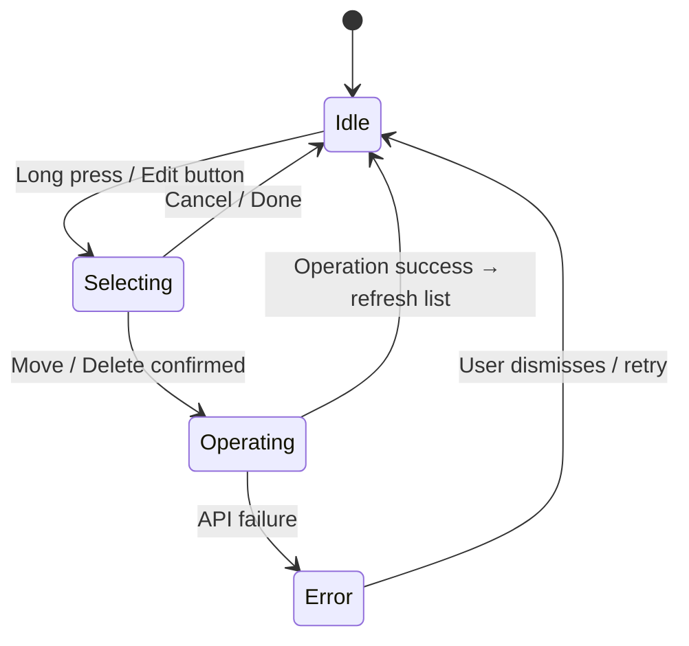
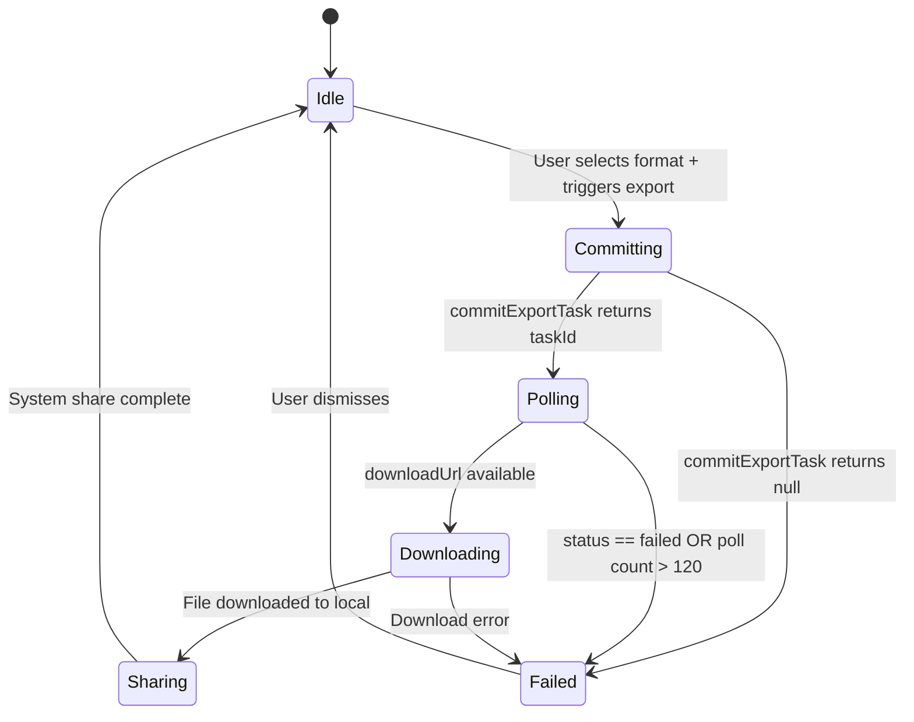

# 08 - File Management (文件管理)

> Module: File Edit / Export / Category Management
> Covers: SRD bitables "文件编辑及导出" (5 reqs) + "文件分类管理" (5 reqs)
> Last updated: 2026-04-02

---

## 1. Overview

- **Objective**: Provide users with full lifecycle management of recording files -- organization into folders, batch operations (select/move/rename/delete), and export/share to external applications.
- **Scope**:
  - File list display with pagination and pull-to-refresh
  - Folder CRUD (create / rename / delete)
  - File filter by category
  - Multi-select mode with batch operations (move, delete)
  - Single file rename
  - Share/export recording audio as MP3/WAV
  - Share transcription/summary as TXT/DOCX/PDF
  - Share link creation with configurable expiration
  - Send to third-party apps (Notion/Slack)
- **Non-scope**:
  - Audio recording (see Module 04)
  - Audio upload to S3 (see Module 04/07)
  - Transcription/summary generation (see Module 05/06)
  - AI Chat (see Module 07)
  - Nested folder hierarchies (current design is flat, single-level folders)

---

## 2. Definitions

| Term | Definition | Notes |
|------|-----------|-------|
| FileCategory | A user-created folder used to organize recordings | Mapped to `FileCategory` model; synced server+local |
| Protected Folder | System folders that cannot be deleted or renamed: "All", "Default" (id=`0`), "Recycling" (id=`-1`) | `isProtectedAllOrDefault` guard |
| Multi-select Mode | Edit mode where user can select multiple files for batch operations | Triggered by long-press or edit button |
| Share Link | A time-limited URL granting external access to a recording's audio/transcript/summary | Created via `ShareFileApi.createShare` |
| Export Task | An async backend job that converts transcription/summary to PDF/DOCX/TXT | Polled until `downloadUrl` is available |
| Batch Export | Multiple export tasks committed and polled together | Max 120 poll cycles (~4 min timeout) |

---

## 3. System Boundary

```
[APP: AudioFileEditMixin]  ←→  [APP: CategoryService]  ←→  [BACKEND: /api/v1/folders]
[APP: SharePopuController] ←→  [APP: ShareFileApi]      ←→  [BACKEND: share + export_worker]
                                                          ←→  [AWS S3 + CloudFront]
```

| Component | Responsibility | Not Responsible |
|-----------|---------------|-----------------|
| APP (`AudioFileEditMixin`) | Multi-select UI, batch selection state, trigger move/rename/delete | Server-side file storage |
| APP (`CategoryService`) | Folder CRUD orchestration, local-first caching via `CategoryRepository` | Folder creation policy (backend enforced) |
| APP (`SharePopuController`) | Export format selection, share link creation, export task polling, file download + system share | Backend export rendering (PDF/DOCX generation via wkhtmltopdf/pandoc) |
| BACKEND | Folder API, share link generation, export task management, audio format conversion | UI rendering, local audio file management |
| AWS S3 | Audio/export file storage | Access control (handled by presigned/signed URLs) |

---

## 4. Scenarios

### S1: Multi-select and Move Files to Folder

- **Trigger**: User enters multi-select mode (long press or edit button)
- **Steps**:
  1. User taps file cards to select (checkbox appears)
  2. User taps "Move" action
  3. Folder picker sheet appears with existing folders + "New Folder" option
  4. User selects target folder
  5. APP calls `POST /api/v1/records/{recordId}/folder` for each selected record
  6. Local `RecordingRepository` updates category assignment
  7. File list refreshes, selected files appear under new folder
- **Expected**: All selected files move to target folder; list reflects change immediately

### S2: Create New Folder

- **Trigger**: User taps "New Folder" in category management
- **Steps**:
  1. User enters folder name
  2. APP trims input, validates non-empty and non-duplicate
  3. APP calls `POST /api/v1/folders` with `{name, folder_type: "audio"}`
  4. On success, `CategoryService.loadFileCategories` re-syncs full list
  5. New folder appears in sidebar/drawer
- **Expected**: Folder created with server-assigned ID; local cache updated

### S3: Delete Folder

- **Trigger**: User swipes or long-presses a folder, taps "Delete"
- **Steps**:
  1. APP checks `isProtectedAllOrDefault` -- if true, operation blocked
  2. Confirmation dialog shown
  3. APP calls `DELETE /api/v1/folders/{id}`
  4. On success, all recordings in that folder are moved to "all" (`recordingRepo.updateCategoryBatch`)
  5. Folder removed from `CategoryRepository`
  6. If deleted folder was currently selected, view resets to "All"
- **Expected**: Folder deleted; orphaned recordings re-assigned to "All"; no data loss

### S4: Export Audio as MP3/WAV

- **Trigger**: User taps "Export Audio" from share popup
- **Steps**:
  1. User selects format (MP3 or WAV)
  2. APP initiates local audio transcode via `AudioTranscodeService` (FFmpeg)
  3. Transcoded file saved to user's share directory
  4. System share sheet presented with the file
- **Expected**: Audio exported in selected format; system share sheet opens

### S5: Export Transcription/Summary as PDF/DOCX/TXT

- **Trigger**: User taps "Export Transcription" or "Export Summary" from share popup
- **Steps**:
  1. User selects target format (TXT/DOCX/PDF)
  2. APP calls `ShareFileApi.commitExportTask` (or `commitExportTaskBatch` for multi-summary)
  3. APP polls `getExportFileInfo` every 2 seconds until `downloadUrl` is returned
  4. APP downloads file from CloudFront URL to local share directory
  5. System share sheet presented
- **Expected**: Export completes within polling timeout; file shared via OS share sheet

### S6: Create Share Link

- **Trigger**: User taps "Share Link" from share popup
- **Steps**:
  1. User configures: include audio? transcript? summary? Expiration (1/7/30 days or custom)
  2. APP calls `ShareFileApi.createShare` with `{audioId, expire_date, include_audio, include_transcript, include_summary_ids}`
  3. On success, share URL returned and displayed
  4. User copies link or shares via system share
- **Expected**: Share link generated with selected content and expiration

---

## 5. Functional Requirements

| ID | Description | Level | Verification |
|----|------------|-------|-------------|
| FR-FM-001 | System MUST display the recording file list with pull-to-refresh and pagination | MUST | Scroll test: new page loads at bottom; pull-to-refresh fetches latest |
| FR-FM-002 | System MUST support multi-select mode enabling batch selection of files | MUST | Enter edit mode; select 3+ files; count badge updates |
| FR-FM-003 | System MUST allow moving selected files to a target folder via `POST /api/v1/records/{recordId}/folder` | MUST | Move 2 files; verify they appear in target folder and disappear from source |
| FR-FM-004 | System MUST allow single/batch deletion of files via confirmation dialog | MUST | Delete 1 file; delete 3 files in batch; confirm list updates |
| FR-FM-005 | System MUST allow renaming a single file inline | MUST | Rename file; verify new name persists after refresh |
| FR-FM-006 | System MUST support creating folders via `POST /api/v1/folders` with folder_type=audio | MUST | Create folder; verify it appears in sidebar |
| FR-FM-007 | System MUST support renaming folders via `PUT /api/v1/folders/{id}` | MUST | Rename folder; verify name change persists |
| FR-FM-008 | System MUST support deleting non-protected folders via `DELETE /api/v1/folders/{id}` | MUST | Delete custom folder; verify recordings move to "All" |
| FR-FM-009 | System MUST prevent deletion/rename of protected folders (All, Default, Recycling) | MUST | Attempt delete on "All" folder; verify operation blocked |
| FR-FM-010 | System MUST filter file display by selected category | MUST | Select folder; verify only files in that folder shown |
| FR-FM-011 | System MUST validate folder name is non-empty and non-duplicate before creation/rename | MUST | Submit empty name; submit duplicate name; verify rejection |
| FR-FM-012 | System MUST support exporting audio as MP3 or WAV via local FFmpeg transcoding | MUST | Export as MP3; verify file format and playability |
| FR-FM-013 | System MUST support exporting transcription/summary as TXT/DOCX/PDF via backend export task | MUST | Export summary as PDF; verify download and share |
| FR-FM-014 | System MUST poll export task status every 2 seconds until download URL is available or timeout (max 120 polls, ~4 min) | MUST | Trigger export; verify polling cadence and timeout behavior |
| FR-FM-015 | System MUST support creating share links with configurable expiration (1/7/30 days or custom date) | MUST | Create link with 7-day expiry; verify link works before and fails after expiry |
| FR-FM-016 | System MUST support sending content to Notion/Slack via third-party integration | MUST | Send to Notion; verify content appears in target |
| FR-FM-017 | System SHOULD sync folder list local-first (load from Hive, then fetch from server and replace) | SHOULD | Kill network; verify local folders still display; restore network and verify sync |

**Trace to SRD:**

| FR | SRD Req | Status |
|----|---------|--------|
| FR-FM-001 | APP-011 | V1.0 Done |
| FR-FM-002 | APP-016 | V1.0 Done |
| FR-FM-003 | APP-017 | V1.0 Done |
| FR-FM-004 | APP-018 | V1.0 Done |
| FR-FM-005 | APP-019 | V1.0 Done |
| FR-FM-006 | APP-012 | V1.0 Done |
| FR-FM-007 | APP-243 (category) | V1.0 Done |
| FR-FM-008 | APP-244 | V1.0 Done |
| FR-FM-009 | APP-012 (implicit) | V1.0 Done |
| FR-FM-010 | APP-015 | V1.0 Done |
| FR-FM-012 | APP-243 (export) | V1.2 Done (提前实现) |
| FR-FM-015 | APP-243 (share) | V1.2 Done (提前实现) |

---

## 6. State Model

### 6.1 File Operation State



| State | Meaning | Entry Condition | Exit Condition |
|-------|---------|----------------|----------------|
| Idle | Normal file list view | App launch / operation complete | User enters edit mode |
| Selecting | Multi-select mode active, checkboxes visible | Long press or edit button | Cancel, or confirm an operation |
| Operating | API call in progress (move/delete/rename) | User confirms batch action | API returns success or failure |
| Error | Operation failed, toast shown | API error | User dismisses error |

### 6.2 Export Task State



| State | Meaning | Duration | Code Reference |
|-------|---------|----------|---------------|
| Committing | Submitting export task to backend | < 2s | `SharePopuController.commitExportTask` |
| Polling | Checking export task status | 2s intervals, max 120 cycles | `SharePopuController.getExportFileInfo` |
| Downloading | Downloading exported file from CloudFront | Depends on file size | `_downloadExportFile` |
| Sharing | System share sheet displayed | User-controlled | `TranscriptionShareService.shareFile` |
| Failed | Export failed with error message | Until dismissed | `ExportFileStatus.failed` |

### 6.3 Illegal State Transitions

| Disallowed Transition | Reason | Defense |
|-----------------------|--------|---------|
| Idle -> Polling | No export task exists | `exportTaskId` null check |
| Selecting -> Sharing | Must go through operation | UI flow enforcement |
| Polling -> Committing | Cannot re-commit while polling | `isDispose` guard |

---

## 7. Data Contract

### 7.1 Folder API

| Method | Path | Request Body | Response Body | Error Codes |
|--------|------|-------------|---------------|-------------|
| GET | `/api/v1/folders?folder_type=audio` | -- | `[FileCategory]` | 401/500 |
| POST | `/api/v1/folders` | `{name:string, folder_type:string}` | `FileCategory` | 400 (empty name) / 409 (duplicate) |
| PUT | `/api/v1/folders/{id}` | `{name:string}` | void (code=0) | 400/404 |
| DELETE | `/api/v1/folders/{id}` | -- | void (code=0) | 403 (protected) / 404 |
| POST | `/api/v1/records/{recordId}/folder` | `{folder_id:string}` | void (code=0) | 404 |

### 7.2 FileCategory Model

| Field | Type | Required | Unit | Example |
|-------|------|----------|------|---------|
| id | string | Yes | -- | `"f_abc123"` or `"0"` (default) or `"all"` |
| name | string | Yes | -- | `"Work Meetings"` |
| folder_type | string | No | -- | `"audio"` |
| count | int | No | files | `12` |
| created_at | string | No | ISO 8601 | `"2026-03-15T10:00:00Z"` |
| updated_at | string | No | ISO 8601 | `"2026-03-20T14:30:00Z"` |

### 7.3 Share/Export API

| Method | Path | Request Body | Response | Notes |
|--------|------|-------------|----------|-------|
| GET | `/api/v1/shares/{audioId}` | -- | `ShareInfoModel` | Get existing share info |
| POST | `/api/v1/shares` | `{audioId, expire_date, include_audio, include_transcript, include_summary_ids}` | share URL string | Create share link |
| DELETE | `/api/v1/shares/{audioId}` | -- | void | Delete share link |
| POST | `/api/v1/exports` | `{id, is_transcription, target_format}` | export task ID | 1=PDF, 2=Word, 3=TXT |
| GET | `/api/v1/exports/{taskId}` | -- | `ExportInfoModel` | Poll status: 1=processing, 2=success, 3=failed |
| POST | `/api/v1/exports/batch` | `{reportIds, isTranscription, targetFormat}` | `[ExportTaskBatchCommitResultModel]` | Batch export |
| GET | `/api/v1/exports/batch/status` | `{exportTaskIds}` | `[ExportTaskStatusBatchItemModel]` | Batch status poll |

### 7.4 Export Formats

| Format Code | Format | Scope |
|-------------|--------|-------|
| 1 | PDF | Transcription + Summary |
| 2 | DOCX (Word) | Transcription + Summary |
| 3 | TXT | Transcription + Summary |
| -- | MP3 | Audio (local FFmpeg) |
| -- | WAV | Audio (local FFmpeg) |

---

## 8. Error Handling

| Case | Trigger | System Behavior | State Change | User Perception |
|------|---------|----------------|--------------|-----------------|
| Folder name empty | User submits blank name | Operation rejected locally | Stays in current state | Validation error (no API call) |
| Folder name duplicate | Name already exists | Operation rejected locally | Stays in current state | Toast: name already exists |
| Delete protected folder | Attempt to delete All/Default/Recycling | `isProtectedAllOrDefault` returns true, no API call | No change | Operation not available in UI |
| Move API failure | Network error during file move | Toast error; files remain in original folder | Operating -> Error -> Idle | Error toast |
| Export task failed | Backend returns status=3 (failed) | `ExportInfoModel.status = failed`, display error in bottom sheet | Polling -> Failed | Error message in export dialog |
| Export poll timeout | > 120 polls (~4 min) without completion | Stop polling, show timeout message | Polling -> Failed | Toast: "Export timeout, please try again" |
| Export download failure | CloudFront URL unreachable | `ExportFileStatus.failed` with "Download failed" message | Downloading -> Failed | Error in export dialog |
| Category sync failure | Server unreachable during `loadFileCategories` | Fallback to local Hive cache | No state change | Stale data displayed; no error toast |
| Folder delete with active selection | Deleted folder was currently selected | `wasCurrentSelection` flag triggers reset to "All" | View resets | Automatic navigation to All files |

---

## 9. Non-functional Requirements

| Metric | Requirement | Measured Value | Source |
|--------|------------|----------------|--------|
| Folder sync strategy | Local-first: load Hive, then fetch server | Hive -> API -> replaceAll | `CategoryService.loadFileCategories` |
| Export poll interval | 2 seconds between status checks | 2s | `SharePopuController.getExportFileInfo` |
| Export poll max cycles | 120 polls (~4 minutes) | 120 | `_batchPollCount > 120` guard |
| Audio transcode codec | AAC-LC output to .m4a container | FFmpeg AAC | `AudioTranscodeService` |
| Share link expiration options | 1 day / 7 days / 30 days / Custom | 4 options | `SharePopuController.linkExpiresList` |
| CloudFront signed URL validity | 24 hours | 24h | `nfr_config_values.json` |
| HTTP timeout (normal API) | connect: 30s, send: 60s, receive: 60s | As configured | `network_timeout_config.dart` |
| Network retry | 3 retries, 1s base delay, 2x exponential | Default retry config | `retry_interceptor.dart` |

---

## 10. Observability

### Logs

| Event | Level | Carried Fields | Component |
|-------|-------|---------------|-----------|
| `serverCategories loaded` | INFO | category count, category list | `CategoryService` |
| `Failed to load local file categories` | ERROR | error, stackTrace | `CategoryService` |
| `Failed to sync file categories from server` | ERROR | error, stackTrace | `CategoryService` |
| `export_batch_progress` | INFO (print) | downloaded count / total, allDownloaded flag | `SharePopuController` |
| `share_file_error` | ERROR (print) | exception | `SharePopuController` |

### Metrics

| Metric | Meaning | Alert Threshold |
|--------|---------|----------------|
| export_success_rate | Percentage of export tasks completing successfully | < 95% |
| export_p95_latency | P95 time from commit to download complete | > 60s |
| folder_sync_failure_rate | Rate of folder list sync failures | > 5% |

### Tracing

| Field | Purpose |
|-------|---------|
| `audioId` | Links file operations to specific recording across export/share/move |
| `exportTaskId` | Tracks individual export task through commit -> poll -> download |
| `_activeBatchKey` | Groups batch export tasks for unified progress tracking |
