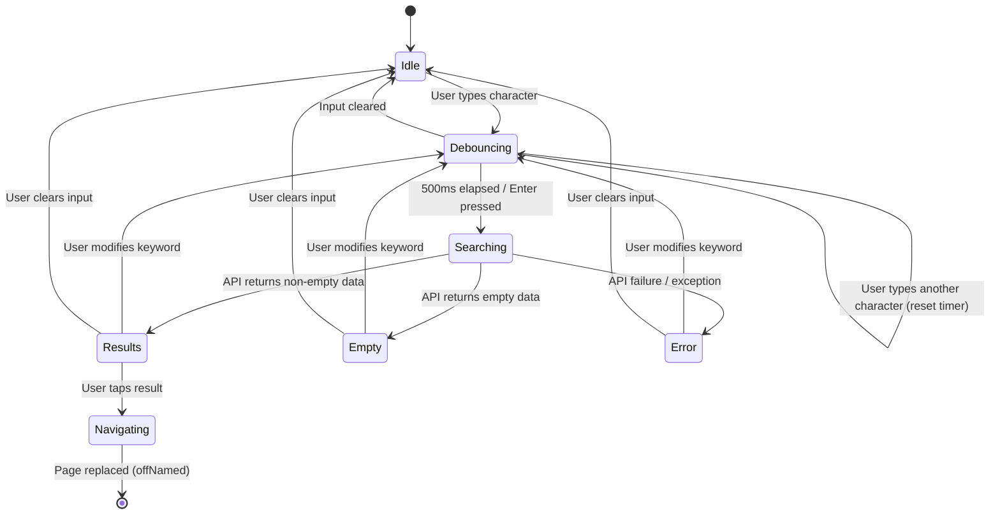

# 09 - Search (搜索功能)

> Module: Global Search across recordings and tasks
> Covers: SRD bitables "搜索功能" (5 reqs)
> Last updated: 2026-04-02

---

## 1. Overview

- **Objective**: Enable users to quickly find recordings and tasks by keyword, with real-time search, tabbed result display, and one-tap navigation to content.
- **Scope**:
  - Keyword search across recording titles
  - Keyword search across transcription content (V1.2 -- server-side trigram search)
  - Tabbed result display: File results + Task results
  - Search result keyword highlighting (V1.2)
  - Result tap to navigate to transcription detail
  - Search debounce (500ms)
  - Pagination with "More" button
- **Non-scope**:
  - Full-text search within AI Chat history (separate module)
  - Search within template community (handled by template_community module)
  - Advanced filter by type/time/category (APP-222 -- planned V1.2, UED not started)
  - Offline local search (current implementation is API-only; see Gap Analysis)

---

## 2. Definitions

| Term | Definition | Notes |
|------|-----------|-------|
| Global Search | Unified search across recordings (audio files) and tasks (to-do items) | Single API endpoint returns both |
| Debounce | Timer-based input throttling to avoid excessive API calls | 500ms delay after last keystroke |
| Trigram Search | PostgreSQL trigram-based fuzzy matching for transcription content | Backend: `crud_line.search_by_keywords()` |
| SearchFileItem | UI view model for a recording search result | Contains id, title, date, duration, type, status |
| SearchTaskItemViewModel | UI view model for a task search result | Contains id, title, date, isCompleted |

---

## 3. System Boundary

```
[APP: SearchPageController] → [SearchApi] → [BACKEND: /api/v1/records/search]
                                                    ↓
                                           [AI: PostgreSQL trigram index]
```

| Component | Responsibility | Not Responsible |
|-----------|---------------|-----------------|
| APP (`SearchPageController`) | Input handling, debounce, result parsing, UI state, navigation | Text indexing, ranking algorithm |
| APP (`SearchApi`) | HTTP request construction, response deserialization | Search logic |
| BACKEND | Search query routing, result aggregation (audios + tasks) | Transcription content indexing |
| AI (PostgreSQL) | Trigram-based full-text search on transcription content | Real-time indexing (batch processed) |

---

## 4. Scenarios

### S1: Normal Keyword Search

- **Trigger**: User types keyword in search bar
- **Steps**:
  1. User opens search page (autofocus on text field)
  2. User types characters; each keystroke resets 500ms debounce timer
  3. After 500ms of no input, `_performSearch()` fires
  4. APP calls `GET /api/v1/records/search?keyword={keyword}`
  5. Response parsed into `fileResults` (audio matches) and `taskResults` (task matches)
  6. Tab bar appears (File / Task) if any results exist
  7. Results displayed with title, date, duration, type
- **Expected**: Results appear within ~1s of typing pause; tabs reflect counts

### S2: Search Submit (Enter Key)

- **Trigger**: User presses Enter/Submit on keyboard
- **Steps**:
  1. Debounce timer canceled immediately
  2. `_performSearch()` fires without delay
  3. Same API call and result handling as S1
- **Expected**: Instant search without 500ms wait

### S3: Tap File Result to Navigate

- **Trigger**: User taps a file item in search results
- **Steps**:
  1. `onFileItemTap` called with `SearchFileItem`
  2. `Get.offNamed(Routes.TRANSCRIPTION, arguments: {recordingId, status})` replaces search page
  3. User lands on transcription detail page
- **Expected**: Seamless navigation; back button returns to page before search (not search page)

### S4: Empty Search Results

- **Trigger**: Search keyword matches nothing
- **Steps**:
  1. API returns empty `audios` and `tasks` arrays
  2. Tab bar hidden
  3. Empty state illustration shown: "There are no search records for the time being"
- **Expected**: Clear empty state; no error message

### S5: Search Failure (Network Error)

- **Trigger**: Network unavailable during search
- **Steps**:
  1. `_performSearch()` catches exception
  2. `fileResults` and `taskResults` cleared
  3. Error toast: "search.search_failed"
  4. Empty state displayed
- **Expected**: Graceful degradation; user can retry by typing again

---

## 5. Functional Requirements

| ID | Description | Level | Verification |
|----|------------|-------|-------------|
| FR-SR-001 | System MUST search recording titles by keyword via `GET /api/v1/records/search` | MUST | Search "meeting"; verify matching recordings returned |
| FR-SR-002 | System MUST search transcription content by keyword (server-side trigram matching) | MUST | Search word appearing only in transcript body; verify recording found |
| FR-SR-003 | System MUST debounce search input with 500ms delay after last keystroke | MUST | Type quickly; verify only one API call after 500ms pause |
| FR-SR-004 | System MUST bypass debounce and search immediately when user presses Enter/Submit | MUST | Type keyword + press Enter; verify instant API call |
| FR-SR-005 | System MUST display results in two tabs: File and Task | MUST | Search with mixed results; verify both tabs populated |
| FR-SR-006 | System MUST navigate to transcription detail page when user taps a file result, passing recordingId and status | MUST | Tap result; verify correct transcription page opens |
| FR-SR-007 | System MUST display empty state when no results match the keyword | MUST | Search gibberish; verify empty illustration shown |
| FR-SR-008 | System MUST clear results and display error toast on API failure | MUST | Simulate network error; verify toast and cleared results |
| FR-SR-009 | System SHOULD highlight matched keywords in search results | SHOULD | Search "project"; verify keyword highlighted in result text |
| FR-SR-010 | System SHOULD support search result filtering by type/time/category | SHOULD | **Gap: APP-222 planned V1.2, UED not started** |
| FR-SR-011 | System MUST support search result click-through navigation | MUST | Tap any result; verify navigation to correct detail |
| FR-SR-012 | System SHOULD support paginated search results with "More" button | SHOULD | Search with many results; tap More; verify next page loads |
| FR-SR-013 | System MUST log search events to AnalyticsService with searchType, resultCount, and query | MUST | Perform search; verify analytics event logged |

**Trace to SRD:**

| FR | SRD Req | Status |
|----|---------|--------|
| FR-SR-001 | APP-216 | V1.0 Done |
| FR-SR-002 | APP-217 | V1.2 Done (提前实现: trigram search) |
| FR-SR-009 | APP-223 | V1.2 Done (提前实现: search_view highlight) |
| FR-SR-010 | APP-222 | V1.2 Planned (UED not started) |
| FR-SR-011 | APP-243 (search) | V1.0 Done |

---

## 6. State Model

### 6.1 Search State Machine



### 6.2 State Definitions

| State | Meaning | Entry Condition | Exit Condition | Observable |
|-------|---------|----------------|----------------|-----------|
| Idle | Search page open, no keyword | Page open / input cleared | User types | `searchKeyword.value.isEmpty` |
| Debouncing | User typing, timer running | Keystroke received | Timer fires or input cleared | Timer active, no API call |
| Searching | API call in flight | Debounce expired or Enter | API response received | Loading indicator (implicit) |
| Results | Search results displayed in tabs | Non-empty API response | User modifies input or navigates | `fileResults.isNotEmpty \|\| taskResults.isNotEmpty` |
| Empty | No matching results | Empty API response | User modifies input | Empty state illustration |
| Error | Search failed | API exception | User modifies input | Error toast shown |
| Navigating | Transitioning to transcription | User taps result | Page replaced | `Get.offNamed` called |

### 6.3 Illegal State Transitions

| Disallowed Transition | Reason | Defense |
|-----------------------|--------|---------|
| Idle -> Results | Cannot have results without searching | API call required |
| Searching -> Searching | No concurrent searches | Debounce timer cancels previous |
| Error -> Results | Must re-search after error | Results cleared on error |

---

## 7. Data Contract

### 7.1 Search API

| Method | Path | Query Params | Response Body |
|--------|------|-------------|---------------|
| GET | `/api/v1/records/search` | `keyword` (required), `page` (optional, default 1), `page_size` (optional, default 10) | `SearchResponse` |

### 7.2 SearchResponse Model

| Field | Type | Required | Notes |
|-------|------|----------|-------|
| audios | `List<SearchAudioItem>` | Yes | May be empty array |
| tasks | `List<SearchTaskItem>` | Yes | May be empty array |
| page | int | Yes | Current page number |
| page_size | int | Yes | Items per page |
| total_count | int | Yes | Total matching results |
| total_page | int | Yes | Total pages available |

### 7.3 SearchAudioItem Model

| Field | Type | Required | Example |
|-------|------|----------|---------|
| id | string | Yes | `"rec_abc123"` |
| name | string | Yes | `"Team Standup 2026-03-15"` |
| start_time | string | Yes | `"2026-03-15T09:00:00Z"` |
| duration | string/int | Yes | `"1800"` (seconds) |
| abstract | string | No | First line of transcription |
| status | int | No | Recording processing status |
| source_type | string | No | `"phone"` / `"device"` |
| s3_url | string | No | Audio file URL |
| denoised_s3_url | string | No | Denoised audio URL |
| folder_id | string | No | Parent folder ID |
| folder_name | string | No | Parent folder name |
| is_read | bool | No | Default: false |

### 7.4 SearchTaskItem Model

| Field | Type | Required | Example |
|-------|------|----------|---------|
| id | string | Yes | `"task_xyz789"` |
| name | string | Yes | `"Follow up with client"` |
| audio_id | string | No | Source recording ID |
| title | string | No | Task title |
| content | string | No | Task body |
| remind_time | string | No | `"2026-03-20T14:00:00Z"` |
| priority | string | No | Task priority level |
| folder_id | string | No | Parent folder ID |

---

## 8. Error Handling

| Case | Trigger | System Behavior | State Change | User Perception |
|------|---------|----------------|--------------|-----------------|
| Empty keyword | User clears input | Results cleared, no API call | -> Idle | Empty state shown |
| API failure | Network error / server 500 | `fileResults.clear()`, `taskResults.clear()`, error toast | Searching -> Error | Toast: "search_failed" |
| API timeout | Request exceeds 60s receive timeout | Exception caught, same as API failure | Searching -> Error | Toast: "search_failed" |
| Malformed response | `tasks` or `audios` is null in response | Null replaced with empty array | Searching -> Empty | Empty state (graceful) |
| Analytics logging failure | AnalyticsService not registered or throws | Caught silently, search results unaffected | No change | No user impact |
| Rapid typing | User types faster than 500ms per character | Each keystroke resets debounce timer; only final value searched | Debouncing -> Debouncing | No flickering results |

---

## 9. Non-functional Requirements

| Metric | Requirement | Measured Value | Source |
|--------|------------|----------------|--------|
| Search debounce interval | 500ms after last keystroke | 500ms | `SearchPageController._searchDebounceTimer` |
| Search API timeout | < 60s (receive timeout) | 60s | `network_timeout_config.dart` |
| Backend search engine | PostgreSQL trigram index (`pg_trgm`) | trigram GIN index | `crud_line.search_by_keywords()` |
| Default page size | 10 results per page | 10 | `SearchApiImpl` default |
| Network retry | 3 retries with exponential backoff | 1s * 2^n | `retry_interceptor.dart` |
| Autofocus on open | Search input auto-focused when page opens | Immediate | `autofocus: true` in TextField |

### Gap: Offline Search

The current implementation is **API-only** -- there is no local/offline search capability. When the device is offline, search returns an error. This is a known architectural limitation:

- `SearchPageController._performSearch` calls `_searchApi.search()` which requires network
- `RecordingRepository` (Hive) has local data but no search index
- **Recommendation**: For V1.3+, consider adding local title search against `RecordingRepository` as fallback when offline, with clear indication that transcription content search requires network

---

## 10. Observability

### Logs

| Event | Level | Carried Fields | Component |
|-------|-------|---------------|-----------|
| `搜索完成` | INFO | audio count, task count | `SearchPageController` |
| `搜索失败` | ERROR | error message | `SearchPageController` |
| `搜索异常` | ERROR | error, stackTrace | `SearchPageController` |
| `Failed to log search analytics` | WARN | error | `SearchPageController` |

### Metrics (via AnalyticsService)

| Event | Fields | Purpose |
|-------|--------|---------|
| `search_event` | `searchType: "text"`, `resultCount: int`, `query: string` | Track search usage and hit rates |

### Tracing

| Field | Purpose |
|-------|---------|
| `keyword` | The search query string -- logged in analytics and debug logs |
| `recordingId` | Passed to transcription page on result tap -- links search to content view |
| `status` | Recording processing status -- determines transcription page behavior |
