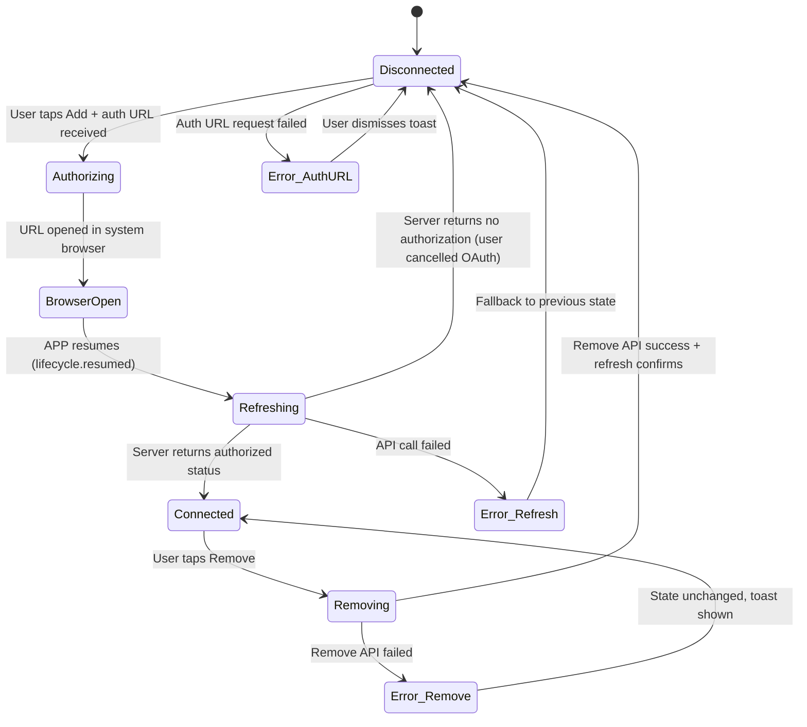
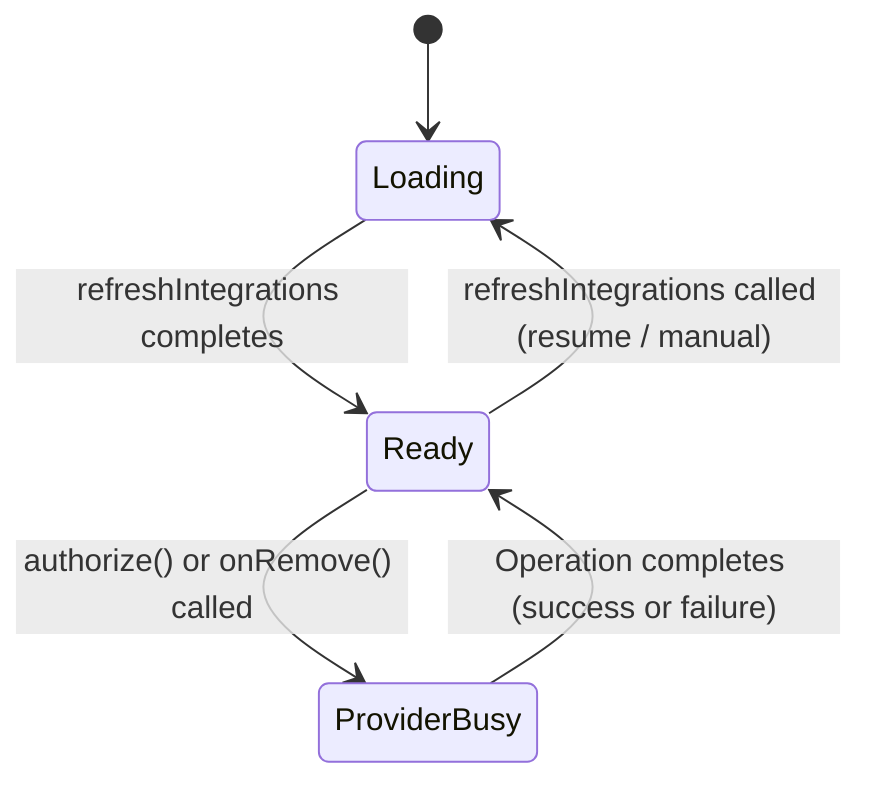

# 10.1 - Third-Party Integrations (第三方集成)

> Sub-module of: 10-Settings
> Covers: SRD new requirements APP-320 ~ APP-325 (6 reqs)
> Last updated: 2026-04-02

---

## 1. Overview

- **Objective**: Allow users to connect their Memoket account with third-party platforms (Slack, Google, Notion) via OAuth authorization, enabling content sharing and cross-platform workflows.
- **Scope**:
  - Integration management page with card-per-provider layout
  - OAuth authorization flow: APP -> BACKEND (get auth URL) -> system browser -> OAuth provider -> callback -> BACKEND -> APP refreshes status
  - Authorization status display (connected / disconnected)
  - Authorized account display (server account with fallback to login email)
  - Remove/disconnect authorization
  - "Coming Soon" section for future integrations (ChatGPT, Claude, Manus)
- **Non-scope**:
  - The actual data sync/push to Slack/Google/Notion (handled by BACKEND workers)
  - OAuth token refresh/rotation (handled entirely by BACKEND)
  - Content selection for Notion/Slack export (handled by `SharePopuController` in Module 08)
  - Calendar-specific integration (see Module 14 Calendar Sync)
  - MCP service authorization (see Module 21 MCP)

---

## 2. Definitions

| Term | Definition | Notes |
|------|-----------|-------|
| IntegrationProvider | Enum of supported third-party platforms: `slack`, `google`, `notion` | Each has an `apiValue` string |
| Backend-Mediated OAuth | OAuth pattern where APP never directly contacts the OAuth provider; BACKEND acts as intermediary to obtain auth URL and handle callback | APP only opens a URL in the system browser |
| Auth URL | A one-time URL returned by BACKEND that, when opened in browser, initiates the OAuth consent flow with the target provider | Returned by `POST /api/v1/users/integrations/add` |
| Provider Busy Guard | Per-provider mutex preventing concurrent add/remove operations | `_providerBusyMap` in controller |
| Lifecycle Resume Refresh | Automatic re-fetch of integration status when APP returns to foreground | Handles the "user completes OAuth in browser and returns to app" scenario |

---

## 3. System Boundary

```
┌──────────┐   1. Get auth URL   ┌──────────┐   2. Build OAuth URL   ┌──────────────┐
│   APP    │ ──────────────────> │ BACKEND  │ ───────────────────>  │ OAuth Provider│
│          │ <── authUrl ─────── │          │                       │ (Slack/Google │
│          │                     │          │ <── callback ───────  │  /Notion)     │
│          │   3. Open browser   │          │   4. Exchange token   └──────────────┘
│          │ ──> System Browser ─┼──────────┤
│          │                     │          │   5. Store token
│          │   6. User returns   │          │      (backend DB)
│          │   (AppLifecycle     │          │
│          │    .resumed)        │          │
│          │                     │          │
│          │   7. Refresh status │          │
│          │ ──────────────────> │          │
│          │ <── integrations    │          │
└──────────┘     list            └──────────┘
```

| Component | Responsibility | Not Responsible |
|-----------|---------------|-----------------|
| APP (`IntegrationsController`) | Display integration status, trigger OAuth via browser, auto-refresh on resume | Token exchange, token storage, token refresh |
| APP (`IntegrationsService`) | Encapsulate API calls, resolve display account | OAuth flow logic |
| BACKEND | Generate provider-specific OAuth URLs, handle callbacks, store tokens, expose status API | UI rendering, provider-specific data formats |
| OAuth Provider (Slack/Google/Notion) | Authenticate user, grant consent, issue tokens via callback | Memoket business logic |

**Critical design decision**: The APP never handles OAuth tokens directly. The BACKEND constructs the full OAuth URL (with client_id, redirect_uri pointing back to BACKEND, scopes, etc.) and returns it to the APP. The APP merely opens this URL in the system browser. After the user completes consent, the OAuth provider redirects to the BACKEND callback endpoint, where the token exchange happens server-side. This keeps all OAuth secrets on the backend.

---

## 4. Scenarios

### S1: Connect New Integration (OAuth Flow)

- **Trigger**: User taps "Add" button on a disconnected provider card
- **Steps**:
  1. `IntegrationsController.authorize(provider)` checks busy guard; if busy, no-op
  2. Sets provider busy flag
  3. Calls `IntegrationsService.fetchAuthorizationUrl(provider)`
  4. Service calls `POST /api/v1/users/integrations/add` with `{provider: "slack"}`
  5. BACKEND returns `{authUrl: "https://slack.com/oauth/v2/authorize?..."}` (includes BACKEND's redirect_uri)
  6. APP opens URL via `UrlLauncherUtil.openUrl(authUrl)` -- launches system browser
  7. User sees Slack/Google/Notion consent page in browser
  8. User grants permission -> OAuth provider redirects to BACKEND callback
  9. BACKEND exchanges code for tokens, stores in DB
  10. User switches back to APP
  11. `didChangeAppLifecycleState(AppLifecycleState.resumed)` fires
  12. `refreshIntegrations(showLoading: true)` fetches updated list
  13. Provider card now shows "Connected" with authorized account
- **Expected**: Provider status changes from disconnected to connected; authorized account displayed

### S2: Remove Integration

- **Trigger**: User taps "Remove" button on a connected provider card
- **Steps**:
  1. `IntegrationsController.onRemove(provider)` checks busy guard
  2. Calls `IntegrationsService.removeIntegration(provider)`
  3. Service calls `POST /api/v1/users/integrations/delete` with `{provider: "google"}`
  4. On success, `refreshIntegrations()` fetches updated list
  5. Provider card reverts to disconnected state
- **Expected**: Provider authorization removed; card shows "Add" button

### S3: View Integration Status on Page Load

- **Trigger**: User navigates to integrations page
- **Steps**:
  1. `IntegrationsBinding` lazy-puts `IntegrationsService` and `IntegrationsController`
  2. `onReady()` calls `refreshIntegrations(showLoading: true)`
  3. `GET /api/v1/users/integrations` returns list of `UserIntegrationInfo`
  4. `_applyIntegrations` maps each to per-provider reactive state
  5. Cards rendered: each shows authorized/disconnected, with account email if connected
- **Expected**: All three provider cards display current authorization status

### S4: Auth URL Retrieval Failure

- **Trigger**: Network error when requesting auth URL from BACKEND
- **Steps**:
  1. `fetchAuthorizationUrl` returns empty string
  2. Controller shows error toast: "integrations.auth_open_failed"
  3. No browser opened; provider state unchanged
- **Expected**: User sees error; can retry by tapping Add again

### S5: User Returns from Browser Without Completing OAuth

- **Trigger**: User opens browser for OAuth but cancels or closes browser
- **Steps**:
  1. APP receives `resumed` lifecycle event
  2. `refreshIntegrations` fetches current status
  3. Status unchanged (still disconnected)
  4. No error shown
- **Expected**: Graceful handling; card remains disconnected

---

## 5. Functional Requirements

| ID | Description | Level | Verification |
|----|------------|-------|-------------|
| FR-IN-001 | System MUST display Slack, Google, and Notion integration cards showing current authorization status (connected/disconnected) | MUST | Open integrations page; verify 3 cards with correct states |
| FR-IN-002 | System MUST retrieve authorization URL from BACKEND via `POST /api/v1/users/integrations/add` and open it in system browser | MUST | Tap Add; verify browser opens with OAuth URL |
| FR-IN-003 | System MUST automatically refresh integration status when APP resumes from background (AppLifecycleState.resumed) | MUST | Complete OAuth in browser; return to app; verify status updated within 2s |
| FR-IN-004 | System MUST remove authorization via `POST /api/v1/users/integrations/delete` and refresh status on success | MUST | Tap Remove; verify card reverts to disconnected |
| FR-IN-005 | System MUST display authorized account: prefer server-returned account, fallback to current login email | MUST | Connect integration; verify email shown; if server returns specific account, verify that shown instead |
| FR-IN-006 | System MUST display "Coming Soon" section with ChatGPT, Claude, Manus icons for future integrations | MUST | Verify Coming Soon section visible with 3 icons |
| FR-IN-007 | System MUST prevent concurrent add/remove operations on the same provider via per-provider busy guard | MUST | Rapid-tap Add twice; verify only one API call fires |
| FR-IN-008 | System MUST show error toast when auth URL retrieval fails | MUST | Simulate network failure; verify toast shown |
| FR-IN-009 | System MUST show error toast when integration removal fails | MUST | Simulate failure; verify toast "operation_failed" |
| FR-IN-010 | System MUST register `WidgetsBindingObserver` on init and remove on close to observe lifecycle | MUST | Verify no memory leak; observer cleaned up on page dispose |

**Trace to SRD:**

| FR | SRD Req | Status |
|----|---------|--------|
| FR-IN-001 | APP-320 | V1.2 Done |
| FR-IN-002 | APP-321 | V1.2 Done |
| FR-IN-003 | APP-322 | V1.2 Done |
| FR-IN-004 | APP-323 | V1.2 Done |
| FR-IN-005 | APP-324 | V1.2 Done |
| FR-IN-006 | APP-325 | V1.2 Done |

---

## 6. State Model

### 6.1 Integration Authorization State Machine (per provider)



### 6.2 State Definitions

| State | Meaning | Entry | Exit | Observable |
|-------|---------|-------|------|-----------|
| Disconnected | Provider not authorized | Initial / OAuth cancelled / Remove success | User taps Add | `isXxxAuthorized.value == false` |
| Authorizing | Fetching auth URL from BACKEND | Add tapped, busy guard clear | Auth URL received or failed | `_isProviderBusy(provider) == true` |
| BrowserOpen | System browser showing OAuth consent page | `UrlLauncherUtil.openUrl` called | User returns to APP | APP is in background |
| Refreshing | Fetching latest integration list from server | `didChangeAppLifecycleState(resumed)` | API response received | `isLoading.value == true` |
| Connected | Provider authorized, account displayed | Server confirms authorization | User taps Remove | `isXxxAuthorized.value == true` |
| Removing | Deletion API in flight | Remove tapped, busy guard clear | API response | `_isProviderBusy(provider) == true` |
| Error_AuthURL | Auth URL request failed | Network/server error | Toast dismissed | Toast visible |
| Error_Remove | Remove request failed | Network/server error | Toast dismissed | Toast visible, card stays Connected |

### 6.3 Illegal State Transitions

| Disallowed | Reason | Defense |
|-----------|--------|---------|
| Disconnected -> Connected | Must go through OAuth flow | Server-side validation |
| Authorizing -> Authorizing | Concurrent auth on same provider | Per-provider busy guard |
| Removing -> Removing | Concurrent remove on same provider | Per-provider busy guard |
| Connected -> Authorizing | Cannot re-authorize while connected | UI shows Remove, not Add |

### 6.4 Controller-Level State



| State | Observable |
|-------|-----------|
| Loading | `isLoading.value == true` |
| Ready | `isLoading.value == false && no busy providers` |
| ProviderBusy | `_providerBusyMap[provider] == true` |

---

## 7. Data Contract

### 7.1 Integration API Endpoints

| Method | Path | Request Body | Response Body | Error Codes |
|--------|------|-------------|---------------|-------------|
| GET | `/api/v1/users/integrations` | -- | `List<UserIntegrationInfo>` | 401/500 |
| POST | `/api/v1/users/integrations/add` | `{provider:string}` | `IntegrationAuthPayload` | 400 (invalid provider) / 500 |
| POST | `/api/v1/users/integrations/delete` | `{provider:string}` | void (code=0) | 400/404/500 |

### 7.2 UserIntegrationInfo Model

| Field | Type | Required | Notes |
|-------|------|----------|-------|
| provider | string | Yes | `"slack"` / `"google"` / `"notion"` |
| account | string | No | Authorized account email/name from provider |
| expiresAt | string | No | Token expiration (ISO 8601) |
| source | string | No | Authorization source |

**Business rule**: Presence in the list implies `isAuthorized = true`. Absence means disconnected.

### 7.3 IntegrationAuthPayload Model

| Field | Type | Required | Notes |
|-------|------|----------|-------|
| authUrl | string | Yes | Full OAuth authorization URL to open in browser |

### 7.4 IntegrationProvider Enum

| Value | API String | Display |
|-------|-----------|---------|
| `slack` | `"slack"` | Slack |
| `google` | `"google"` | Google |
| `notion` | `"notion"` | Notion |

### 7.5 OAuth Flow Sequence (Detailed)

```
APP                          BACKEND                      OAuth Provider
 │                             │                              │
 │  POST /integrations/add     │                              │
 │  {provider: "slack"}        │                              │
 │ ───────────────────────>    │                              │
 │                             │  Build OAuth URL:            │
 │                             │  client_id + redirect_uri    │
 │                             │  (pointing to BACKEND) +     │
 │                             │  scope + state               │
 │  {authUrl: "https://..."}   │                              │
 │ <───────────────────────    │                              │
 │                             │                              │
 │  Open URL in browser ──────────────────────────────>       │
 │                             │                              │
 │  (user grants consent)      │                              │
 │                             │  <── callback with code ──── │
 │                             │                              │
 │                             │  Exchange code for tokens    │
 │                             │  ───────────────────────>    │
 │                             │  <── access + refresh ─────  │
 │                             │                              │
 │                             │  Store tokens in DB          │
 │                             │                              │
 │  (user returns to APP)      │                              │
 │  AppLifecycle.resumed       │                              │
 │                             │                              │
 │  GET /integrations          │                              │
 │ ───────────────────────>    │                              │
 │  [{provider:"slack",        │                              │
 │    account:"user@..."}]     │                              │
 │ <───────────────────────    │                              │
```

---

## 8. Error Handling

| Case | Trigger | System Behavior | State Change | User Perception |
|------|---------|----------------|--------------|-----------------|
| Auth URL request fails | Network error / BACKEND 500 | Empty auth URL returned; toast: "auth_open_failed" | Disconnected (unchanged) | Error toast; Add button still active |
| Auth URL empty | BACKEND returns empty authUrl | Toast: "auth_open_failed"; browser not opened | Disconnected (unchanged) | Error toast |
| Browser launch fails | `UrlLauncherUtil.openUrl` throws | Exception caught; toast: "auth_open_failed" | Disconnected (unchanged) | Error toast |
| OAuth cancelled by user | User closes browser without consent | Resume triggers refresh; status still disconnected | Disconnected (unchanged) | No error; card unchanged |
| Refresh API fails | Network error on resume | `fetchIntegrations` returns empty list; previous state preserved | Loading -> fallback | Brief loading then unchanged cards |
| Remove API fails | Network error during remove | Toast: "operation_failed"; card stays connected | Connected (unchanged) | Error toast |
| Concurrent operations | Rapid tap on Add/Remove | Per-provider busy guard returns early | No change | Second tap ignored |
| Invalid provider string | Server returns unknown provider in list | `IntegrationProvider.tryParse` returns null; item skipped | No change | Unknown provider silently ignored |

---

## 9. Non-functional Requirements

| Metric | Requirement | Measured Value | Source |
|--------|------------|----------------|--------|
| Auth URL retrieval latency | < 5s | ~1-2s typical | `UserApi.addIntegration` |
| Resume refresh latency | < 3s from resume to updated UI | ~1-2s | `refreshIntegrations` |
| Concurrent operation guard | Exactly 1 in-flight operation per provider | Per-provider busy map | `_providerBusyMap` |
| HTTP timeout | connect: 30s, send: 60s, receive: 60s | Standard config | `network_timeout_config.dart` |
| Retry policy | 3 retries, 1s base, 2x exponential | Default | `retry_interceptor.dart` |

---

## 10. Observability

### Logs

| Event | Level | Carried Fields | Component |
|-------|-------|---------------|-----------|
| `获取用户集成列表失败` | WARN | code, message | `IntegrationsService` |
| `获取集成授权链接失败` | WARN | provider, code, message | `IntegrationsService` |
| `删除集成授权失败` | WARN | provider, code, message | `IntegrationsService` |
| `打开集成授权页失败` | ERROR | provider, error, stackTrace | `IntegrationsController` |
| `删除集成授权失败` | ERROR | provider, error, stackTrace | `IntegrationsController` |

### Metrics

| Metric | Meaning | Alert Threshold |
|--------|---------|----------------|
| integration_auth_success_rate | Percentage of OAuth flows completing successfully | < 80% |
| integration_remove_success_rate | Percentage of remove operations succeeding | < 95% |
| resume_refresh_latency_p95 | P95 time for integration list refresh on resume | > 5s |

### Tracing

| Field | Purpose |
|-------|---------|
| `provider.apiValue` | Identifies which integration platform in all log lines |
| `currentUserEmail` | Fallback account identifier for display |
