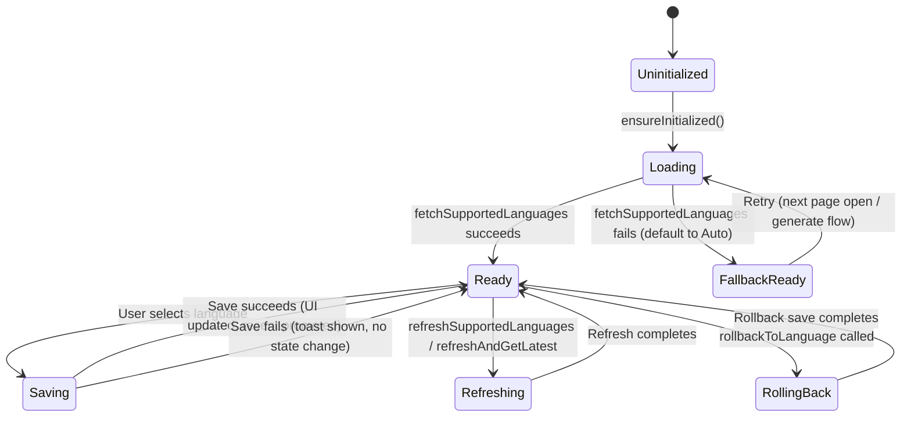

# 10.2 - Summary Language Preference (摘要语言偏好)

> Sub-module of: 10-Settings
> Covers: SRD new requirements APP-330 ~ APP-332 (3 reqs)
> Last updated: 2026-04-02

---

## 1. Overview

- **Objective**: Allow users to select a preferred language for AI-generated summaries, with the selection shared globally across settings, generate, and regenerate flows, and with automatic rollback on generation failure.
- **Scope**:
  - Summary language picker (bottom sheet with "Recent" + "All Supported" sections)
  - Global singleton state sharing across settings page, generate dialog, and regenerate flow
  - Language preference persistence via server API (`/api/v1/users/used-language`)
  - Priority sorting of language list (popular languages first, then alphabetical)
  - Failure rollback: automatic revert to previous language when summary generation fails
  - "Single-flight" request deduplication to prevent concurrent API calls
- **Non-scope**:
  - App UI language switching (Module 10, FR-ST-011)
  - Transcription language (determined by ASR service, not user preference)
  - Translation of existing summaries (not supported; requires regeneration)

---

## 2. Definitions

| Term | Definition | Notes |
|------|-----------|-------|
| SummaryLanguageOption | A supported language with code, appName, nativeName | e.g., `{code: "english", appName: "English", nativeName: "English"}` |
| SummaryLanguagePayload | Server response containing `recent` (up to 3) and `all` (full list) of supported languages | From `POST /api/v1/users/supported-languages` |
| Recent Languages | Last 3 languages the user has selected, shown at top of picker | Managed locally in `recentLanguages` list |
| Auto | Special language code meaning "let AI decide based on source audio language" | Code: `"auto"`, always sorted first |
| Single-Flight | Pattern where concurrent requests for the same resource share a single in-flight Future | `_refreshInFlight` field in controller |
| Failure Rollback | Reverting to previous language setting when summary generation fails | Via `rollbackToLanguage(previousCode)` |
| Priority Languages | 10 commonly-used languages sorted before the rest | english, chinese_simplified, chinese_traditional, japanese, spanish, french, german, portuguese, korean, italian |

---

## 3. System Boundary

```
[Settings Page]  ─┐
[Generate Dialog] ─┼─→ [SummaryLanguageController (permanent singleton)]
[Regenerate Flow] ─┘           │
                               ├─→ [UserApi: GET supported-languages]
                               └─→ [UserApi: POST used-language]
                                         │
                                    [BACKEND: /api/v1/users/]
```

| Component | Responsibility | Not Responsible |
|-----------|---------------|-----------------|
| `SummaryLanguageController` | Fetch/cache language list, manage selection, save preference, rollback | Summary generation, transcription |
| `SummaryLanguageBottomSheet` | UI for language picker (recent + all sections) | State management (delegated to controller) |
| BACKEND | Store user language preference, return supported languages, apply language to generation API | Language detection, translation |
| AI | Use `summary_language` parameter in generation requests | Storing language preference |

---

## 4. Scenarios

### S1: Select Language from Settings Page

- **Trigger**: User taps "Summary Language" in settings, bottom sheet opens
- **Steps**:
  1. `SummaryLanguageController.ensureInitialized()` called (no-op if already loaded)
  2. Bottom sheet shows "Recent" section (up to 3) + "All Supported" section
  3. All list sorted: Auto first, then 10 priority languages, then alphabetical
  4. User taps a language (e.g., "Japanese")
  5. `selectLanguage(option)` fires:
     a. Sets `isSaving = true`
     b. Calls `saveLanguagePreference(code: "japanese")`
     c. `POST /api/v1/users/used-language` with `{code: "japanese"}`
     d. On success: updates `selectedLanguageCode`, `selectedLanguageName`, promotes to recent
     e. Shows success toast, closes bottom sheet
  6. Settings page now shows "Japanese" as current language
- **Expected**: Language saved to server; UI reflects new selection everywhere

### S2: Language Used in Generate Flow

- **Trigger**: User triggers summary generation (new recording processed)
- **Steps**:
  1. Generate flow calls `SummaryLanguageController.shared.refreshAndGetLatestSelectedLanguageCode()`
  2. Controller fires single-flight refresh: `POST /api/v1/users/supported-languages`
  3. Returns latest `currentSelectedLanguageCode` (from `recent[0]` or fallback `"auto"`)
  4. Generate API called with `summary_language` parameter
- **Expected**: Generation uses the user's latest language preference

### S3: Generation Failure Rollback

- **Trigger**: Summary generation fails after language was changed
- **Steps**:
  1. Before generation, caller saves `previousCode = currentSelectedLanguageCode`
  2. User selects new language; `saveLanguagePreference` persists it
  3. Generation API fails
  4. Caller invokes `rollbackToLanguage(previousCode: previousCode)`
  5. Controller checks: if `previousCode` still in supported list, save it back
  6. If `previousCode` no longer supported, fallback to "auto"
  7. `POST /api/v1/users/used-language` with rollback code
  8. UI reverts to previous language display
- **Expected**: Language preference automatically reverts; user sees original language

### S4: First Launch / No Previous Selection

- **Trigger**: New user opens settings or triggers generation for the first time
- **Steps**:
  1. `ensureInitialized()` calls `fetchSupportedLanguages()`
  2. Server returns payload; if `recent` is empty, controller defaults to "Auto"
  3. `currentSelectedLanguageCode` returns `"auto"`
  4. `currentSelectedLanguageDisplayName` returns `"Auto"`
- **Expected**: Default to "Auto" when no preference exists

---

## 5. Functional Requirements

| ID | Description | Level | Verification |
|----|------------|-------|-------------|
| FR-SL-001 | System MUST present a bottom sheet language picker showing "Recent" (up to 3) and "All Supported" sections | MUST | Open picker; verify sections; verify recent count <= 3 |
| FR-SL-002 | System MUST save selected language to server via `POST /api/v1/users/used-language` immediately on selection | MUST | Select language; verify API call; refresh page and verify persisted |
| FR-SL-003 | System MUST share language selection as a global singleton (`SummaryLanguageController.shared`) across settings, generate dialog, and regenerate flow | MUST | Change in settings; verify generate dialog shows updated language |
| FR-SL-004 | System MUST automatically rollback to previous language when summary generation fails, via `rollbackToLanguage()` | MUST | Trigger failed generation after language change; verify language reverts |
| FR-SL-005 | System MUST default to "Auto" when no language preference exists (empty recent list) | MUST | New user; verify "Auto" displayed |
| FR-SL-006 | System MUST sort "All" languages: Auto first, then 10 priority languages, then alphabetical by appName | MUST | Open picker; verify Auto at top; verify English/Chinese/Japanese before French/German |
| FR-SL-007 | System MUST deduplicate languages in the "All" list by code | MUST | Verify no duplicate entries |
| FR-SL-008 | System MUST use single-flight pattern to prevent concurrent language list refresh requests | MUST | Trigger 3 concurrent refreshes; verify only 1 API call |
| FR-SL-009 | System MUST refresh language list before generation API calls via `refreshAndGetLatestSelectedLanguageCode()` | MUST | Generate summary; verify language list refreshed first |
| FR-SL-010 | System MUST promote selected language to top of recent list (max 3 items) | MUST | Select 4 different languages; verify recent shows last 3 |

**Trace to SRD:**

| FR | SRD Req | Status |
|----|---------|--------|
| FR-SL-001 | APP-330 | V1.2 Done |
| FR-SL-003 | APP-331 | V1.2 Done |
| FR-SL-004 | APP-332 | V1.2 Done |

---

## 6. State Model

### 6.1 Summary Language State Machine



### 6.2 State Definitions

| State | Meaning | Observable |
|-------|---------|-----------|
| Uninitialized | Controller created but no API call made | `_initialized == false` |
| Loading | Fetching supported languages from server | `isLoading.value == true` |
| Ready | Language list loaded, selection available | `allLanguages.isNotEmpty` |
| FallbackReady | API failed but "Auto" default available | `allLanguages.isEmpty && selectedLanguageCode == "auto"` |
| Saving | Persisting user selection to server | `isSaving.value == true` |
| Refreshing | Re-fetching language list (single-flight) | `_refreshInFlight != null` |
| RollingBack | Reverting language after generation failure | Internal (uses `saveLanguagePreference`) |

### 6.3 Illegal State Transitions

| Disallowed | Reason | Defense |
|-----------|--------|---------|
| Uninitialized -> Saving | Cannot save without language list | `ensureInitialized` called in `onInit` |
| Saving -> Saving | No concurrent saves | `isSaving.value` guard |
| Refreshing -> Refreshing | No concurrent refreshes | `_refreshInFlight` single-flight pattern |

---

## 7. Data Contract

### 7.1 API Endpoints

| Method | Path | Request Body | Response Body | Notes |
|--------|------|-------------|---------------|-------|
| POST | `/api/v1/users/supported-languages` | -- | `SummaryLanguagePayload` | Returns recent + all |
| POST | `/api/v1/users/used-language` | `UsedLanguageRequest` | void (code=0) | Save preference |

### 7.2 SummaryLanguagePayload Model

| Field | Type | Required | Notes |
|-------|------|----------|-------|
| recent | `List<SummaryLanguageOption>` | Yes | Up to 3 recently used |
| all | `List<SummaryLanguageOption>` | Yes | Full supported language list |

### 7.3 SummaryLanguageOption Model

| Field | Type | Required | Example |
|-------|------|----------|---------|
| code | string | Yes | `"english"`, `"auto"`, `"chinese_simplified"` |
| appName | string | Yes | `"English"`, `"Auto"` |
| nativeName | string | No | `"English"`, `"简体中文"` |
| notes | string | No | Additional info |

**Computed property**: `displayTitle` -- the user-facing name (typically `appName`)

**Computed property**: `isAuto` -- `code == "auto"`

### 7.4 UsedLanguageRequest Model

| Field | Type | Required | Notes |
|-------|------|----------|-------|
| code | string | Yes | Language code to save as preference |

### 7.5 Priority Language Codes (Sorting Order)

| Priority | Code | Language |
|----------|------|---------|
| 0 | `auto` | Auto (always first) |
| 1 | `english` | English |
| 2 | `chinese_simplified` | Simplified Chinese |
| 3 | `chinese_traditional` | Traditional Chinese |
| 4 | `japanese` | Japanese |
| 5 | `spanish` | Spanish |
| 6 | `french` | French |
| 7 | `german` | German |
| 8 | `portuguese` | Portuguese |
| 9 | `korean` | Korean |
| 10 | `italian` | Italian |
| 11+ | (alphabetical by appName) | All other languages |

---

## 8. Error Handling

| Case | Trigger | System Behavior | State Change | User Perception |
|------|---------|----------------|--------------|-----------------|
| Language list fetch fails | Network error on `fetchSupportedLanguages` | Toast: "summary_language.load_failed"; default to "Auto" | Loading -> FallbackReady | Toast; picker may show limited/empty list |
| Language save fails | Network error on `saveLanguagePreference` | Toast: "summary_language.save_failed"; selection not applied | Saving -> Ready (unchanged) | Toast; bottom sheet stays open |
| Rollback code not in list | Previous language removed from supported list during rollback | Fallback to "Auto" via `resolveRollbackLanguageCode` | RollingBack -> Ready | Silent fallback to Auto |
| Rollback save fails | Network error during rollback | Returns false; caller may retry | RollingBack -> Ready | No toast (silent failure) |
| Concurrent refresh | Multiple callers trigger refresh simultaneously | Single-flight: all await same Future | Only 1 API call | No duplicate requests |
| Empty language list | Server returns empty `all` array | `allLanguages` empty; `selectedLanguageCode` stays "auto" | Loading -> FallbackReady | Picker shows no options; "Auto" in settings |

---

## 9. Non-functional Requirements

| Metric | Requirement | Measured Value | Source |
|--------|------------|----------------|--------|
| Singleton lifecycle | Permanent GetxService (never disposed) | `permanent: true` in `Get.put` | `SummaryLanguageController.shared` |
| Recent list max size | 3 items | `next.take(3)` | `_promoteRecentLanguage` |
| Language list deduplication | No duplicate codes in "All" section | Set-based dedup | `_sortAllLanguages` |
| API timeout | < 60s | Standard network config | `network_timeout_config.dart` |
| Single-flight dedup | Max 1 concurrent refresh request | `_refreshInFlight` pattern | Controller |

---

## 10. Observability

### Logs

| Event | Level | Carried Fields | Component |
|-------|-------|---------------|-----------|
| `开始请求 Summary Language 支持列表` | INFO | -- | `SummaryLanguageController` |
| `Summary Language 支持列表请求成功` | INFO | recent count, all count | `SummaryLanguageController` |
| `Summary Language 支持列表请求失败` | WARN | code, message | `SummaryLanguageController` |
| `静默刷新 Summary Language 列表` | INFO | -- | `SummaryLanguageController` |

### Metrics

| Metric | Meaning | Alert Threshold |
|--------|---------|----------------|
| language_save_success_rate | Percentage of language preference saves succeeding | < 95% |
| language_list_load_latency_p95 | P95 time to fetch supported languages | > 5s |

### Tracing

| Field | Purpose |
|-------|---------|
| `selectedLanguageCode` | Current language preference -- passed to all generation APIs |
| `previousCode` | Pre-change language code used for rollback tracking |
