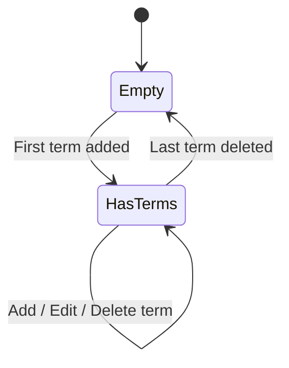
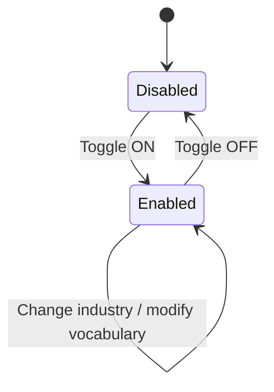
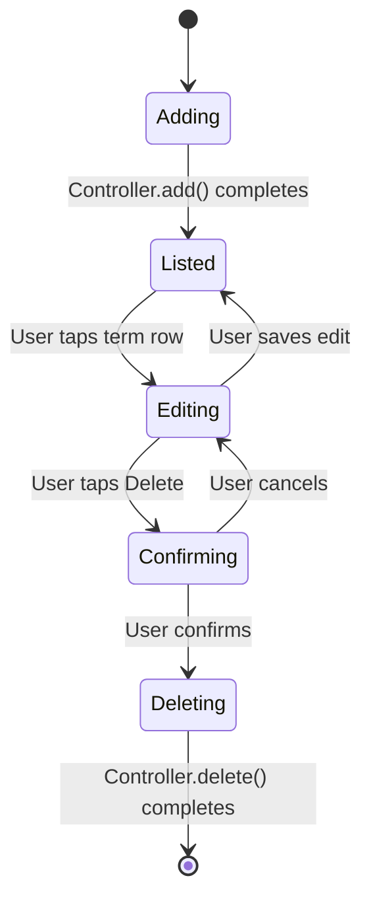

# 10.3 - Custom Vocabulary & Termbase (自定义��汇/术语库)

> Sub-module of: 10-Settings
> Covers: SRD new requirements APP-335 ~ APP-338 (4 reqs)
> Last updated: 2026-04-02

---

## 1. Overview

- **Objective**: Allow users to add custom vocabulary (names, companies, specialized terms) and select an industry termbase to improve AI transcription and summary accuracy.
- **Scope**:
  - Custom Termbase hub with master toggle (enable/disable termbase feature)
  - Vocabulary management: add / edit / delete custom words
  - Vocabulary display grouped by first letter (A-Z)
  - Industry termbase selection from 11 predefined industry categories
  - Word count display on termbase hub page
- **Non-scope**:
  - Automatic vocabulary extraction from transcriptions (not implemented)
  - Custom industry termbase creation (only predefined industries available)
  - Server-side vocabulary sync API integration (current implementation is local-only via controller state; **no persistent API observed in codebase**)
  - Multi-language vocabulary (all terms treated as single-language strings)

---

## 2. Definitions

| Term | Definition | Notes |
|------|-----------|-------|
| Custom Termbase | The umbrella feature encompassing vocabulary + industry termbase | Controlled by master toggle |
| Vocabulary | A user-managed list of custom words that AI should prioritize during transcription | Grouped A-Z by first character |
| Industry Termbase | A predefined set of industry-specific terminology that AI loads for improved accuracy | Selected from 11 categories |
| Term | A single vocabulary entry (word or phrase) | e.g., "Kubernetes", "Dr. Smith" |
| A-Z Grouping | Display organization where terms are grouped under their first letter | Case-insensitive; sorted alphabetically |

---

## 3. System Boundary

```
[CustomTermbaseView] ──→ [CustomTermbaseController]
         │                         │
         │                    Master toggle + Industry selection
         │
[VocabularyView] ──→ [VocabularyController]
                          │
                     Add / Edit / Delete terms
                          │
                    [Local state (in-memory)]
                          │
                    (No server API observed)
```

| Component | Responsibility | Not Responsible |
|-----------|---------------|-----------------|
| `CustomTermbaseView` | Termbase hub UI: toggle, vocabulary card, industry card | Vocabulary CRUD UI |
| `CustomTermbaseController` | Master toggle state, industry selection state | Vocabulary management |
| `VocabularyView` | Vocabulary list display (A-Z), add/edit/delete bottom sheets | Industry selection |
| `VocabularyController` | Vocabulary CRUD operations, A-Z grouping, word count | Industry termbase logic |
| AI Service | Use custom terms + industry during transcription/summary | Vocabulary storage |

---

## 4. Scenarios

### S1: Add a Custom Term

- **Trigger**: User taps "Add" button on vocabulary page
- **Steps**:
  1. Bottom sheet slides up with input field (autofocus) + "Term" label
  2. User types term (e.g., "Kubernetes")
  3. User taps "Add" button
  4. Bottom sheet closes
  5. `VocabularyController.add(text)` inserts term into grouped map
  6. Term appears under "K" section in vocabulary list
- **Expected**: New term added and visible in correct alphabetical group

### S2: Edit an Existing Term

- **Trigger**: User taps a term row in the vocabulary list
- **Steps**:
  1. Edit bottom sheet slides up with current term pre-filled
  2. User modifies text (e.g., "Kubernetes" -> "K8s")
  3. User taps "Save"
  4. Bottom sheet closes
  5. `VocabularyController.edit(oldTerm, newTerm)` replaces entry
  6. Old term removed from group; new term appears in correct group
- **Expected**: Term updated; A-Z grouping recalculated

### S3: Delete a Term

- **Trigger**: User taps "Delete term" button in edit bottom sheet
- **Steps**:
  1. Confirmation dialog: "Delete this term?" with warning about transcription accuracy
  2. User taps "Delete"
  3. Dialog and bottom sheet close
  4. `VocabularyController.delete(term)` removes entry
  5. Term disappears from list; if group becomes empty, group header removed
- **Expected**: Term permanently removed; list updates immediately

### S4: Select Industry Termbase

- **Trigger**: User taps "Industry" card on custom termbase page
- **Steps**:
  1. Bottom sheet shows 11 industry categories with current selection checkmarked
  2. User taps new industry (e.g., "Healthcare and Wellness")
  3. Selection returned via `Navigator.pop(title)`
  4. `CustomTermbaseController.selectedIndustry.value` updated
  5. Industry card subtitle updates to show selected industry
- **Expected**: Industry selection persisted in controller state; AI uses corresponding termbase

### S5: Toggle Custom Termbase On/Off

- **Trigger**: User toggles the master switch on custom termbase page
- **Steps**:
  1. `CustomTermbaseController.checked.value` toggled
  2. When OFF: AI ignores custom vocabulary and industry termbase
  3. When ON: AI applies custom vocabulary + selected industry terms
- **Expected**: Toggle immediately reflected; AI behavior changes on next generation

### S6: Empty Vocabulary State

- **Trigger**: User opens vocabulary page with no terms added
- **Steps**:
  1. Empty state illustration shown with message: "Add custom terms to improve transcription accuracy."
  2. User can tap "Add" button in app bar to add first term
- **Expected**: Clear empty state with call-to-action

---

## 5. Functional Requirements

| ID | Description | Level | Verification |
|----|------------|-------|-------------|
| FR-VC-001 | System MUST display vocabulary list grouped by first letter (A-Z), sorted alphabetically | MUST | Add terms "Apple", "Banana", "Azure"; verify A group has Apple+Azure, B has Banana |
| FR-VC-002 | System MUST allow adding a new term via bottom sheet with text input | MUST | Add term "GPT-4"; verify it appears under "G" |
| FR-VC-003 | System MUST allow editing an existing term via bottom sheet with pre-filled text | MUST | Edit "GPT-4" to "GPT-4o"; verify update reflected |
| FR-VC-004 | System MUST allow deleting a term with confirmation dialog warning about accuracy impact | MUST | Delete term; confirm dialog; verify removed from list |
| FR-VC-005 | System MUST show confirmation dialog before deletion with message: "Removing this term may affect the accuracy of transcriptions and summaries that use it. This action cannot be undone." | MUST | Tap delete; verify exact warning text |
| FR-VC-006 | System MUST display vocabulary count on the custom termbase hub page | MUST | Add 5 terms; verify "5 term" displayed on hub card |
| FR-VC-007 | System MUST provide a master toggle to enable/disable the custom termbase feature | MUST | Toggle off; verify state change |
| FR-VC-008 | System MUST allow industry selection from 11 predefined categories via bottom sheet | MUST | Open industry picker; verify 11 options; select one; verify checkmark |
| FR-VC-009 | System MUST display empty state illustration when vocabulary list is empty | MUST | Open vocabulary with no terms; verify empty state shown |
| FR-VC-010 | System SHOULD persist vocabulary and industry selection to server for cross-device sync | SHOULD | **Gap: APP-338 -- Industry termbase API integration planned V1.2** |

**Trace to SRD:**

| FR | SRD Req | Status |
|----|---------|--------|
| FR-VC-001 | APP-335 | V1.2 Done |
| FR-VC-002 | APP-336 | V1.2 Done |
| FR-VC-003/004 | APP-337 | V1.2 Done |
| FR-VC-008/010 | APP-338 | V1.2 Planned (industry termbase loading from server) |

---

## 6. State Model

### 6.1 Vocabulary State



### 6.2 Custom Termbase State



### 6.3 Vocabulary Item Lifecycle



### 6.4 State Definitions

| State | Meaning | Observable |
|-------|---------|-----------|
| Empty | No custom terms exist | `controller.grouped.isEmpty` |
| HasTerms | One or more terms in vocabulary | `controller.grouped.isNotEmpty` |
| Disabled | Custom termbase feature toggled off | `controller.checked.value == false` |
| Enabled | Custom termbase feature toggled on | `controller.checked.value == true` |

### 6.5 Illegal State Transitions

| Disallowed | Reason | Defense |
|-----------|--------|---------|
| Empty -> Editing | Cannot edit non-existent term | UI only shows edit when terms exist |
| Disabled -> Adding (server) | Terms added locally even when disabled | Local-only; no server enforcement yet |

---

## 7. Data Contract

### 7.1 Vocabulary Data (In-Memory)

The vocabulary is managed entirely in `VocabularyController` state. There is no dedicated vocabulary API endpoint observed in the current codebase.

| Field | Type | Notes |
|-------|------|-------|
| grouped | `Map<String, List<String>>` | Key = uppercase first letter, Value = sorted term list |
| getListSize() | int | Total term count across all groups |

### 7.2 Industry Categories (Hardcoded)

The industry list is currently hardcoded in `_IndustryBottomSheet`:

| # | Category |
|---|---------|
| 1 | Information Technology and Engineering |
| 2 | Energy and Environment |
| 3 | Finance and Law |
| 4 | Education and Research |
| 5 | Public Service |
| 6 | Healthcare and Wellness |
| 7 | Creative and Media |
| 8 | Architecture and Real Estate |
| 9 | Human Resources and Administration |
| 10 | Retail and Consumer |
| 11 | Tourism and Logistics |

### 7.3 Custom Termbase Controller State

| Field | Type | Default | Notes |
|-------|------|---------|-------|
| checked | `RxBool` | -- | Master toggle: enable/disable |
| selectedIndustry | `RxString` | `""` | Currently selected industry name |

### 7.4 Future API (APP-338 -- Planned)

When industry termbase server integration is implemented, expected contract:

| Method | Path | Request Body | Response | Notes |
|--------|------|-------------|----------|-------|
| GET | `/api/v1/users/termbase/industries` | -- | `List<IndustryCategory>` | Server-driven categories |
| POST | `/api/v1/users/termbase/select` | `{industry: string}` | void | Save selection |
| GET | `/api/v1/users/termbase/vocabulary` | -- | `List<string>` | User's custom terms |
| POST | `/api/v1/users/termbase/vocabulary` | `{terms: List<string>}` | void | Sync terms to server |

---

## 8. Error Handling

| Case | Trigger | System Behavior | State Change | User Perception |
|------|---------|----------------|--------------|-----------------|
| Empty term submitted | User taps Add with blank input | Term not added (controller validation) | No change | No visible feedback (silent rejection) |
| Duplicate term | User adds term that already exists | Behavior depends on controller impl (may add duplicate) | May add duplicate | Potential duplicate in list |
| Delete cancelled | User taps Cancel in delete confirmation | Bottom sheet stays open, no deletion | No change | Dialog closes, term preserved |
| Controller not registered | `VocabularyController` not in GetX | `getController` factory creates instance | Fresh instance | No error; empty initial state |
| Industry selection cancelled | User closes bottom sheet without selecting | `Navigator.pop()` returns null; no update | No change | Previous selection preserved |

### Known Gaps

| Gap | Description | Impact | Recommendation |
|-----|-----------|--------|---------------|
| No server persistence for vocabulary | Terms stored only in controller memory; lost on app restart | Data loss | Implement vocabulary sync API (V1.3+) |
| No duplicate validation | Same term can potentially be added twice | UI clutter | Add dedup check in `VocabularyController.add` |
| No term length limit | No max character count on term input | Potential UI overflow | Add max length validation (e.g., 100 chars) |
| Industry termbase not loaded from server | Industry categories hardcoded; APP-338 planned | Static list | Implement server-driven categories |

---

## 9. Non-functional Requirements

| Metric | Requirement | Measured Value | Source |
|--------|------------|----------------|--------|
| Vocabulary grouping | Alphabetical by first character, case-insensitive | Sorted keys | `grouped.keys.toList()..sort()` |
| Industry categories | 11 predefined options | Hardcoded list | `_IndustryBottomSheet` |
| Input autofocus | Add/edit bottom sheets auto-focus the text field | `autofocus: true` | Both bottom sheets |
| Confirmation before delete | Delete requires explicit confirmation dialog | DeleteDialog.show | `_showEditTermBottomSheet` |

---

## 10. Observability

### Logs

No dedicated logging observed in `VocabularyController` or `CustomTermbaseController` in the current codebase. Recommended additions:

| Event | Level | Carried Fields | Component |
|-------|-------|---------------|-----------|
| `vocabulary_term_added` | INFO | term, total_count | `VocabularyController` |
| `vocabulary_term_edited` | INFO | old_term, new_term | `VocabularyController` |
| `vocabulary_term_deleted` | INFO | term, remaining_count | `VocabularyController` |
| `industry_selected` | INFO | industry_name | `CustomTermbaseController` |
| `termbase_toggled` | INFO | enabled: bool | `CustomTermbaseController` |

### Metrics

| Metric | Meaning | Alert Threshold |
|--------|---------|----------------|
| vocabulary_term_count | Number of custom terms per user | Informational |
| industry_selection_rate | Percentage of users who select an industry | Informational |
| termbase_enabled_rate | Percentage of users with termbase feature enabled | Informational |

### Tracing

| Field | Purpose |
|-------|---------|
| `term` | The vocabulary entry being operated on |
| `selectedIndustry` | Current industry selection -- passed to AI for transcription context |
| `checked` | Termbase enable/disable state -- determines if AI uses custom terms |
