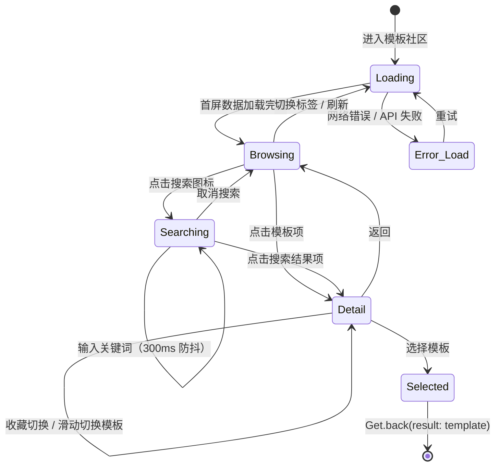

# 11. 模板社区（Template Community）

> Module: Template Community | Requirements: 7 (APP-300 ~ APP-306) | Version: V1.2 NEW

---

## 1. Overview

- **Objective**: 为用户提供摘要模板的浏览、搜索、收藏和 AI 智能推荐能力，使用户能够发现并选用最适合其录音场景的模板。
- **Scope**:
  - 模板列表浏览（我的模板 / 推荐 / 发现三级标签）
  - 关键词搜索（300ms 防抖）
  - 模板详情卡片（轮播浏览、翻译原文展示）
  - 收藏管理（收藏/取消收藏，实时同步列表）
  - AI 智能推荐（基于录音话题的 Top-5 推荐弹窗）
- **Non-scope**:
  - 用户自定义创建/编辑模板（仅消费平台提供的模板）
  - 模板内容的多语言翻译逻辑（由 AI 端 `template_locales` 表管理）
  - 摘要生成流程（见 06-summary.md）

---

## 2. Definitions

| 术语 | 定义 | 备注 |
|------|------|------|
| Template | 摘要模板，包含 id、标题、场景分类、描述、提示词内容、多语言支持 | 对应 `Template` model |
| TemplateScene | 服务端驱动的模板场景分类（如 Meeting、Interview、Lecture 等） | 由 AI 端 `_SCENE_NAME_MAP` 定义，共 15 个场景 |
| Root Tab | 模板社区的一级标签：`myTemplates` / `recommend` / `discover` | 对应 `TemplateCommunityRootTab` enum |
| My Sub Tab | "我的模板"下的二级标签：`recentlyUsed` / `favorite` | 对应 `TemplateCommunityMySubTab` enum |
| Topic-based Recommendation | AI 基于录音内容提取 `main_topic`，映射到 `_SCENE_NAME_MAP` 场景 ID 后按频率排序推荐模板 | 3 层回退：话题匹配 → General → 随机填充 |
| Community Base URL | 模板社区独立的 API 基础地址，与主 API 隔离 | `BackendConfigService.communityBaseUrl` |
| Frosted Sheet | AI 对话中弹出的磨砂底部弹窗，展示 Top-5 推荐模板 | `template_community_sheet.dart` |

---

## 3. System Boundary

```
[APP (Flutter)] ←HTTPS→ [BACKEND (template-community-api)] ←REST→ [AI (templates.py)]
                                                                     ↓
                                                              [PostgreSQL (AI tables)]
```

| 组件 | 职责 | 不负责 |
|------|------|--------|
| APP | 模板列表 UI、搜索交互、收藏切换、详情卡片轮播、推荐弹窗展示 | 推荐算法计算、模板内容管理 |
| BACKEND (template-community-api) | API 代理、用户收藏/使用记录管理、请求路由到 AI | 推荐排序算法 |
| AI (templates.py) | 模板 CRUD、场景分类、话题提取、推荐排序（`_rank_scene_ids_from_topics`）、关键词搜索 | 用户收藏/使用记录 |

### 数据所有权

| 数据 | 所有者 | 存储 |
|------|--------|------|
| 模板内容 + 多语言翻译 | AI | `templates` + `template_locales` 表 |
| 场景分类映射 | AI | `_SCENE_NAME_MAP`（代码常量，15 条） |
| 用户收藏记录 | BACKEND | template-community-api 数据库 |
| 用户使用记录 | BACKEND | template-community-api 数据库 |
| 用户选择持久化（本地） | APP | Hive (`UserChoiceTemplateService`) |

---

## 4. Scenarios

### S1: 浏览模板列表

- **Trigger**: 用户从设置页或 AI 对话入口进入模板社区
- **Steps**: 1. 加载"我的模板 > 最近使用"列表 → 2. 用户切换 Root Tab → 3. 触发对应 API 分页请求 → 4. 展示列表
- **Expected**: 不同标签展示对应内容，分页加载正常，切换到"发现"时预加载场景分类

### S2: 搜索模板

- **Trigger**: 用户点击搜索图标并输入关键词
- **Steps**: 1. 进入搜索模式 → 2. 输入关键词 → 3. 300ms 防抖后发送搜索请求 → 4. 展示搜索结果
- **Expected**: 搜索结果实时更新，空关键词恢复原列表，取消搜索恢复正常浏览

### S3: 查看模板详情

- **Trigger**: 用户点击列表中的模板项
- **Steps**: 1. 打开轮播详情卡片 → 2. 左右滑动切换模板 → 3. 上下拖拽展开/收起 → 4. 查看翻译原文
- **Expected**: 详情卡片以轮播形式展示当前列表页的模板，支持收藏切换

### S4: 收藏模板

- **Trigger**: 用户在详情页点击收藏按钮
- **Steps**: 1. 调用收藏 API → 2. 更新详情页收藏状态 → 3. 同步回列表页收藏状态
- **Expected**: 收藏状态即时切换，列表页与详情页同步

### S5: AI 推荐模板（AI 对话中）

- **Trigger**: 用户在 AI 对话中进入模板选择
- **Steps**: 1. 弹出磨砂底部弹窗 → 2. 调用推荐 API（携带 audio_id） → 3. AI 基于录音话题排序 → 4. 展示 Top-5 推荐模板
- **Expected**: 推荐模板与当前录音话题高度相关，用户选择后携带结果返回

### S6: 选择模板并返回

- **Trigger**: 用户在详情页点击"下次使用"或直接选择模板
- **Steps**: 1. 保存用户选择到本地 (`UserChoiceTemplateService`) → 2. `Get.back(result: template)` 返回上一页
- **Expected**: 调用方收到所选模板对象

---

## 5. Functional Requirements

| ID | 需求编号 | 描述 | 级别 | 验证方法 |
|----|---------|------|------|---------|
| FR-1100 | APP-300 | 系统 MUST 支持「我的模板 / 推荐 / 发现」三个根标签切换，切换时加载对应数据 | MUST | UI 标签切换 + API 请求验证 |
| FR-1101 | APP-301 | "我的模板"标签下 MUST 支持「最近使用 / 收藏」两个子标签切换 | MUST | 子标签切换 + 列表内容验证 |
| FR-1102 | APP-302 | "发现"标签 MUST 展示服务端驱动的场景分类标签，用户选择分类后按分类筛选模板 | MUST | 发现标签分类加载 + 筛选结果验证 |
| FR-1103 | APP-303 | 搜索 MUST 支持 300ms 防抖的实时关键词搜索，空关键词时恢复原列表 | MUST | 输入关键词 → 验证 300ms 后发送请求；清空 → 恢复列表 |
| FR-1104 | APP-304 | 模板详情 MUST 以轮播卡片形式展示，支持左右滑动切换和上下拖拽展开，支持翻译原文展示 | MUST | 滑动交互 + 原文展示验证 |
| FR-1105 | APP-305 | 收藏切换 MUST 调用 `POST /api/v1/template-community/favorite` 并实时同步列表页状态 | MUST | 收藏后列表刷新验证 |
| FR-1106 | APP-306 | AI 推荐 MUST 在 AI 对话中弹出磨砂底部弹窗，展示基于录音话题排序的 Top-5 推荐模板 | MUST | 弹窗展示 + 推荐内容与录音话题相关性验证 |
| FR-1107 | - | 所有分页列表 MUST 支持下拉刷新和上拉加载更多，页大小为 10 | MUST | 分页行为验证 |
| FR-1108 | - | 进入"发现"标签时 SHOULD 预加载场景分类数据 | SHOULD | 分类数据预加载验证 |
| FR-1109 | - | 用户选择模板后 MUST 通过 `Get.back(result:)` 返回选中模板给调用方 | MUST | 返回值验证 |

---

## 6. State Model

### 状态机



### 状态定义

| 状态 | 含义 | 进入条件 | 退出条件 | 代码映射 |
|------|------|---------|---------|---------|
| Loading | 正在加载模板列表 | 首次进入 / 切换标签 / 刷新 | 加载完成或失败 | `isInitialLoading.value == true` |
| Browsing | 浏览模板列表 | 加载完成 | 搜索 / 点击项 / 切换标签 | `isInitialLoading.value == false && !isSearchMode.value` |
| Searching | 搜索模式 | 点击搜索图标 | 取消搜索 | `isSearchMode.value == true` |
| Detail | 查看模板详情 | 点击列表项 | 返回 / 选择模板 | 详情页 route active |
| Selected | 已选择模板 | 用户点击选择 | 返回调用方 | `Get.back(result:)` |
| Error_Load | 加载失败 | 网络错误 / API 失败 | 重试 | `isInitialLoading == false && templates.isEmpty` |

### 非法状态

| 不允许的转移 | 原因 | 防御措施 |
|-------------|------|---------|
| Loading → Detail | 列表未加载完成不可点击 | Loading 状态下列表不可交互 |
| Searching → Selected | 搜索模式不直接选择 | 必须先进入详情 |

---

## 7. Data Contract

### 7.1 API Endpoints

| 方法 | 路径 | 请求体 | 响应体 | 备注 |
|------|------|--------|--------|------|
| POST | `/api/v1/template-community/scenes` | `{language}` | `{data: {scene_id: scene_name, ...}}` | 发现分类列表 |
| POST | `/api/v1/template-community/list` | `{templates_type?, scene?, language, page, page_size}` | `{list: [Template], total_count, total_page, page, page_size}` | 发现列表 |
| POST | `/api/v1/template-community/recommend/list` | `{audio_id?, templates_type?, language, page, page_size}` | `{templates: [Template], total_count, total_page}` | 推荐列表 |
| POST | `/api/v1/template-community/favorite/list` | `{templete_type, language, page, page_size}` | `{list: [Template], total_count, total_page}` | 收藏列表 |
| POST | `/api/v1/template-community/usage/list` | `{language, page, page_size}` | `{list: [Template], total_count, total_page}` | 使用记录 |
| POST | `/api/v1/template-community/favorite` | `{template_id: int, favorite: bool, language}` | `{code, msg}` | 收藏/取消 |

> 所有社区 API 使用独立的 `communityBaseUrl`，与主 API base 隔离。

### 7.2 Template Model

| 字段 | 类型 | 必填 | 说明 |
|------|------|------|------|
| templateId | int | yes | 模板 ID |
| title | String | yes | 模板标题 |
| scene | int | yes | 场景分类 ID（对应 `_SCENE_NAME_MAP`） |
| description | String | no | 模板描述 |
| content | String | no | 模板提示词内容 |
| language | String | no | 模板语言代码 |
| isFavorite | bool | yes | 当前用户是否已收藏 |
| usageCount | int | no | 使用次数 |

### 7.3 AI Recommendation Algorithm

```
Input:  audio_id (可选), tenant_id, language
Process:
  1. 若 audio_id 提供 → 获取该录音的 Segment.main_topic 列表
     若 audio_id 为空 → 获取用户最近 50 条录音的 main_topic
  2. _rank_scene_ids_from_topics(): 将 topics 通过 _SCENE_NAME_MAP 映射为 scene_id，按出现频率排序
  3. 按 ranked scene_id 查询模板，3 层回退：
     Layer 1: 话题匹配的 scene 模板
     Layer 2: "General" 场景模板（兜底）
     Layer 3: 随机其他场景模板，填充至 target_count=30
  4. _deduplicate_templates(): 去重
Output: 排序后的模板列表 + 分页信息
```

---

## 8. Error Handling

| Case | 触发条件 | 系统行为 | 状态变化 | 用户感知 |
|------|---------|---------|---------|---------|
| 网络断开 | 无网络连接 | `NetworkConnectivityService.isOnline()` 检查失败 | Browsing → 保持（列表不变） | Toast: "网络错误" |
| API 返回失败 | 社区 API 返回非成功 code | 停止加载，`hasMore = false` | Loading → Error_Load | 列表为空或保持当前数据 |
| 推荐无结果 | 录音无 segment 或话题无法匹配 | AI 回退到 General + 随机场景 | 无影响 | 展示泛化推荐（非空列表） |
| 收藏 API 失败 | 收藏/取消收藏请求失败 | UI 回滚收藏状态 | Detail 不变 | Toast 提示 |
| 分类加载失败 | 场景分类 API 异常 | `isDiscoverCategoriesLoading = false`，分类列表为空 | Loading → Browsing（空分类） | 发现标签无分类标签 |

---

## 9. Non-functional Requirements

| 指标 | 要求 | 说明 |
|------|------|------|
| 搜索防抖 | 300ms | `debounce(inputKeyword, ..., time: Duration(milliseconds: 300))` |
| 分页大小 | 10 条/页 | `static const int pageSize = 10` |
| 推荐目标数量 | 30 条 | AI 端 `target_count=30` |
| 推荐回退层级 | 3 层 | 话题匹配 → General → 随机 |
| 首屏加载 | SHOULD < 2s | Loading overlay 期间 |
| 场景分类预加载 | 进入页面即加载 | 不等待用户切换到发现标签 |

---

## 10. Observability

### Logs

| 事件 | 级别 | 携带字段 | 组件 |
|------|------|---------|------|
| fetchTemplates(community) | DEBUG | rootTab, page, keyword, success, list.length, totalPage | `TemplateCommunityApiImpl` |
| fetchDiscoverCategories | DEBUG | categories.length, success | `TemplateCommunityApiImpl` |
| favoriteTemplate | DEBUG | templateId, favorite, success | `TemplateCommunityApiImpl` |
| _fetchAndUpdate failed | ERROR | error, stackTrace | `TemplateCommunityListController` |
| loadDiscoverCategories failed | ERROR | error, stackTrace | `TemplateCommunityListController` |

### Metrics

| 指标 | 含义 | 告警阈值 |
|------|------|---------|
| template_list_load_time | 模板列表加载耗时 | > 3s |
| template_recommend_relevance | 推荐模板与录音话题的匹配率 | 人工抽样评估 |
| template_favorite_success_rate | 收藏操作成功率 | < 95% |

### Tracing

| 字段 | 作用 |
|------|------|
| audio_id | 串联录音 → 推荐 → 模板选择 → 摘要生成 |
| template_id | 串联模板选择 → 摘要生成结果 |
| request_id | 串联单次 API 调用 |
