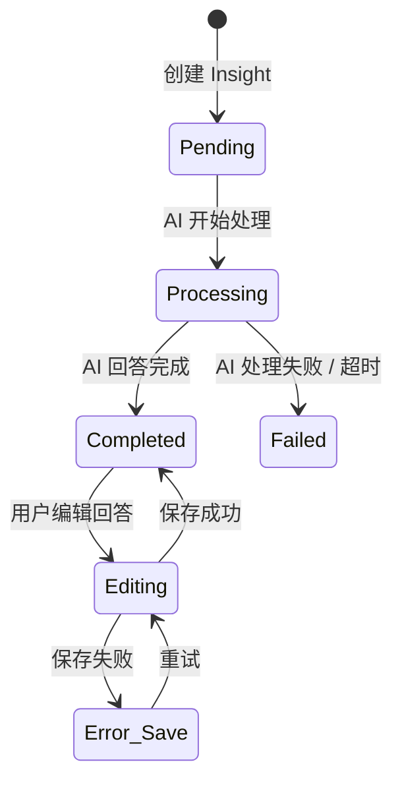
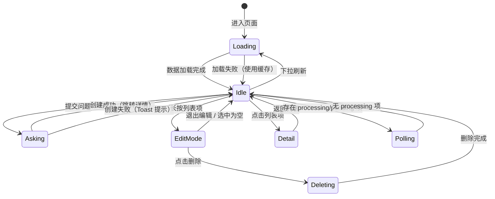

# 12. AI Insight 跨录音问答

> Module: AI Insight | Requirements: 5 (APP-310 ~ APP-314) | Version: V1.2 NEW

---

## 1. Overview

- **Objective**: 提供跨录音的智能问答能力，用户可以针对所有录音内容进行提问，系统基于 RAG 管线从全部录音知识库中检索相关内容并生成回答。
- **Scope**:
  - Insight 会话列表管理（分页、刷新、缓存）
  - 跨录音提问（创建新 Insight，跳转详情）
  - 实时回答展示（轮询状态更新 / SSE 流式传输）
  - 回答内容编辑与保存
  - 批量会话删除（编辑模式）
- **Non-scope**:
  - 单录音内 AI Chat（见 07-ai-chat.md）
  - RAG 管线的内部实现细节（由 AI 端负责：意图识别 → 检索 → 生成）
  - 导出/分享 Insight 结果为 PDF/DOCX（复用 Export 流程）
  - Web Browsing Agent 模式（见 Web Browsing 模块）

---

## 2. Definitions

| 术语 | 定义 | 备注 |
|------|------|------|
| AI Insight | 跨录音知识问答功能，用户提出问题后 AI 在所有录音中检索并生成回答 | 与单录音 AI Chat 不同 |
| RAG | Retrieval Augmented Generation，检索增强生成。先从知识库检索相关内容，再将检索结果作为上下文输入 LLM 生成回答 | AI 端 `insight/pipeline.py` |
| Insight Session | 一次 Insight 问答会话，包含用户提问和 AI 回答 | 对应 AI 端 `InsightChat` schema |
| InsightHistoryItem | 列表中的一条 Insight 记录，包含 id、query、status、createdAt | APP 端数据模型 |
| Polling | 定时轮询机制，每 15 秒查询处理中的 Insight 状态 | `_pollingInterval = 15` |
| Processing Status | Insight 处理状态：`pending` / `processing` / `completed` / `failed` | API 返回整数 0/1/2，APP 映射为字符串 |
| RRF | Reciprocal Rank Fusion，倒数排名融合算法，合并 pgvector 向量搜索和 trigram 文本搜索的结果 | AI 端 `retrieval/fusion.py` |
| Evidence Package | RAG 检索结果打包：匹配的转录片段 + 对话元数据 + 相关性分数 | AI 端 `models.py` |

---

## 3. System Boundary

```
[APP (Flutter)] ←HTTPS→ [BACKEND (audio-api)] ←REST/SSE→ [AI (insights.py)]
                                                              ↓
                                                     [AI Celery Worker]
                                                              ↓
                                                     [Redis Stream] ←→ [LLM API]
                                                              ↓
                                                     [PostgreSQL + pgvector]
```

| 组件 | 职责 | 不负责 |
|------|------|--------|
| APP | 会话列表 UI、提问输入、轮询状态、回答展示与编辑、批量删除 | 检索算法、LLM 调用、向量搜索 |
| BACKEND (audio-api) | API 代理、AES 加密/解密、SSE 转发 | RAG 管线、知识检索 |
| AI (insights.py + pipeline) | Insight 会话管理、RAG 管线（意图识别 → 向量检索 → trigram 检索 → RRF 融合 → LLM 生成）、Redis Stream 消息发布 | 用户认证、UI 渲染 |

### RAG Pipeline 详解

```
用户提问 → 意图识别(LLM) → 工具选择
                              ↓
                     [pgvector 向量搜索] + [trigram 文本搜索]
                              ↓
                     RRF 分数融合 → 证据打包
                              ↓
                     LLM 流式生成回答 → Redis Stream → SSE → APP
```

---

## 4. Scenarios

### S1: 查看 Insight 列表

- **Trigger**: 用户进入 AI Insight 页面
- **Steps**: 1. 从本地缓存加载列表 → 2. 后台调用 API 获取最新数据 → 3. 合并展示 → 4. 检查是否有 processing 项 → 5. 有则启动轮询
- **Expected**: 列表快速展示（缓存优先），后台静默更新

### S2: 提交新问题

- **Trigger**: 用户在输入框输入问题并提交
- **Steps**: 1. 调用 `POST /api/v1/insight/chats` 创建新 Insight → 2. 清空输入框 → 3. 插入新项到列表顶部 → 4. 跳转详情页 → 5. 启动轮询
- **Expected**: 新 Insight 立即出现在列表顶部，详情页显示处理中状态

### S3: 查看 AI 回答

- **Trigger**: 用户点击列表项或提交问题后自动跳转
- **Steps**: 1. 进入详情页 → 2. 如果状态为 processing，每 15 秒轮询 → 3. 状态变为 completed 后停止轮询 → 4. 展示完整回答
- **Expected**: 处理中显示 loading，完成后展示 AI 回答内容

### S4: 编辑回答

- **Trigger**: 用户在详情页编辑回答内容
- **Steps**: 1. 编辑内容 → 2. 调用 `PUT /api/v1/insight/chats/{id}` 保存 → 3. 更新本地状态
- **Expected**: 编辑后的内容保存到服务端

### S5: 批量删除

- **Trigger**: 用户长按列表项进入编辑模式
- **Steps**: 1. 进入编辑模式 → 2. 选择多个项 → 3. 点击删除 → 4. 逐个调用 `DELETE /api/v1/insight/chats/{id}` → 5. 从列表移除 → 6. 退出编辑模式
- **Expected**: 选中项被删除，列表刷新，无选中项时自动退出编辑模式

### S6: 下拉刷新

- **Trigger**: 用户在列表页下拉刷新
- **Steps**: 1. 清除本地缓存 → 2. 强制从 API 获取最新数据 → 3. 重建列表
- **Expected**: 列表数据为最新状态

---

## 5. Functional Requirements

| ID | 需求编号 | 描述 | 级别 | 验证方法 |
|----|---------|------|------|---------|
| FR-1200 | APP-310 | 系统 MUST 分页展示 Insight 历史问答列表，支持下拉刷新和上拉加载更多，每页 20 条 | MUST | 分页加载验证 + 刷新行为验证 |
| FR-1201 | APP-310 | 列表 MUST 优先从本地缓存加载，后台静默同步最新数据 | MUST | 断网时缓存可用验证 |
| FR-1202 | APP-311 | 长按列表项 MUST 进入编辑模式，支持多选和批量删除 | MUST | 长按触发 + 多选 + 删除操作验证 |
| FR-1203 | APP-311 | 编辑模式下选中项为空时 MUST 自动退出编辑模式 | MUST | 取消全部选择后自动退出验证 |
| FR-1204 | APP-312 | 提交问题 MUST 调用创建 API，清空输入框，将新项插入列表顶部，并自动跳转详情页 | MUST | 提交流程全链路验证 |
| FR-1205 | APP-313 | 详情页 MUST 展示 AI 回答内容，处理中状态 MUST 每 15 秒轮询更新，完成后自动停止 | MUST | 轮询间隔 = 15s 验证 + 自动停止验证 |
| FR-1206 | APP-313 | 系统 MUST 支持批量查询 Insight 状态（`queryByIds`），减少轮询请求数 | MUST | 多个 processing 项时批量查询验证 |
| FR-1207 | APP-314 | 用户 MUST 能编辑回答内容并保存到服务端 | MUST | 编辑保存后刷新验证 |
| FR-1208 | APP-314 | 用户 SHOULD 能导出分享 Insight 回答 | SHOULD | 导出功能可用性验证 |
| FR-1209 | - | 删除操作 MUST 逐个调用单条删除 API（批量删除 = 循环单删） | MUST | 多条删除请求验证 |

---

## 6. State Model

### 会话状态机（单条 Insight）



### 列表页状态机



### 状态定义

| 状态 | 含义 | 进入条件 | 退出条件 | 代码映射 |
|------|------|---------|---------|---------|
| Loading | 加载列表中 | 首次进入 / 下拉刷新 | 加载完成 | `isLoading.value == true` |
| Idle | 列表空闲 | 加载完成 | 操作触发 | `isLoading == false && !isAsking && !isEditMode` |
| Asking | 提交问题中 | 用户提交 | 创建成功/失败 | `isAsking.value == true` |
| EditMode | 编辑模式 | 长按列表项 | 退出 / 删除完成 | `isEditMode.value == true` |
| Polling | 轮询中 | 存在 processing/pending 项 | 全部完成 | `_pollingTimer != null` |
| Pending | Insight 待处理 | 刚创建 | AI 开始处理 | `status == 'pending'` |
| Processing | Insight 处理中 | AI 接收任务 | 完成/失败 | `status == 'processing'` |
| Completed | Insight 已完成 | AI 回答完成 | - | `status == 'completed'` |
| Failed | Insight 处理失败 | AI 超时/异常 | - | `status == 'failed'` |

---

## 7. Data Contract

### 7.1 API Endpoints

| 方法 | 路径 | 请求体 | 响应体 | 备注 |
|------|------|--------|--------|------|
| GET | `/api/v1/insight/chats` | query: `{page, page_size}` | `{data: {histories: [...], page, page_size, total_count, total_page}}` | 会话列表 |
| POST | `/api/v1/insight/chats` | `{content: string}` | `{data: {id, query, status, created_at}}` | 创建 Insight |
| GET | `/api/v1/insight/chats/ids/query` | query: `{ids: []}` | `{data: [InsightHistoryItem]}` | 批量状态查询 |
| GET | `/api/v1/insight/chats/{id}` | - | `{data: InsightDetailResponse}` | 获取详情 |
| PUT | `/api/v1/insight/chats/{id}` | `{content: string}` | `{data: InsightDetailResponse}` | 更新回答 |
| DELETE | `/api/v1/insight/chats/{id}` | - | `{code, msg}` | 删除单条 |

### 7.2 InsightHistoryItem Model

| 字段 | 类型 | 必填 | 说明 |
|------|------|------|------|
| id | String | yes | Insight 会话 ID（兼容 int 和 string） |
| query | String | yes | 用户提问内容 |
| status | String | yes | 状态：`pending` / `processing` / `completed` / `failed` |
| createdAt | DateTime | yes | 创建时间 |

### 7.3 CreateChatResponse Model

| 字段 | 类型 | 必填 | 说明 |
|------|------|------|------|
| id | String | yes | 新创建的 Insight ID |
| query | String | yes | 问题内容（优先使用 API 返回值） |
| status | String | yes | 初始状态（API 返回 int 0/1/2，APP 映射为字符串） |
| createdAt | DateTime | yes | 创建时间 |

### 7.4 Status Mapping

| API 返回值 (int) | APP 映射 (String) | 含义 |
|-----------------|-------------------|------|
| 0 | `processing` | 处理中 |
| 1 | `completed` | 已完成 |
| 2 | `failed` | 失败 |
| 其他 | `pending` | 待处理 |

### 7.5 本地缓存

| 存储 | Key 格式 | 值 | 隔离策略 |
|------|---------|-----|---------|
| Hive (StorageService) | box: `insight_cache_{userKey}`, key: `insight_chats_list` | JSON (`InsightChatListResponse`) | 按用户隔离 |

---

## 8. Error Handling

| Case | 触发条件 | 系统行为 | 状态变化 | 用户感知 |
|------|---------|---------|---------|---------|
| 首次加载 API 失败 | 网络错误 / API 异常 | 从缓存加载数据，如有缓存则展示 | Loading → Idle (有缓存) 或保持 Loading | 有缓存：正常展示；无缓存：空列表 |
| 提交问题失败 | createChat API 返回失败 | Toast 提示错误信息 | Asking → Idle | Toast: "提交问题失败" |
| 轮询状态查询失败 | queryByIds API 异常 | 忽略本次轮询，等待下次轮询 | Polling 继续 | 无感知（静默失败） |
| 删除失败 | 单条 DELETE API 失败 | Toast 提示错误，已删成功的不回滚 | Deleting → EditMode | Toast: "删除失败" |
| 编辑保存失败 | updateContent API 失败 | Toast 提示错误，本地保持编辑内容 | Error_Save | Toast 提示 |
| Insight 处理超时 | AI 端超时（默认 300s soft limit） | AI 返回 `status = failed` | Processing → Failed | 详情页显示失败状态 |
| 缓存解析失败 | 缓存数据损坏 | 忽略缓存，从 API 加载 | Loading → Idle | 无感知 |

---

## 9. Non-functional Requirements

| 指标 | 要求 | 说明 |
|------|------|------|
| 轮询间隔 | 15 秒 | `static const int _pollingInterval = 15` |
| 列表页大小 | 20 条/页 | `static const int _pageSize = 20` |
| AI 处理超时 | < 300s (soft limit) | AI Celery `soft_time_limit=300` |
| 缓存策略 | Cache-first + Background refresh | 优先展示缓存，后台更新 |
| 批量删除 | 逐条串行删除 | 无原生批量删除 API |
| SSE 流式传输 P95 首 token | < 3s | AI 端意图识别 + 首 chunk |
| RAG 检索精度 | pgvector + trigram + RRF 融合 | 多路召回，倒数排名融合 |

---

## 10. Observability

### Logs

| 事件 | 级别 | 携带字段 | 组件 |
|------|------|---------|------|
| 提交问题失败 | ERROR | error, message | `AiInsightController` |
| 加载数据失败 | ERROR | error | `AiInsightController` |
| 批量查询状态失败 | DEBUG | error | `AiInsightController` |
| 删除失败 | ERROR | error, message | `AiInsightController` |
| 缓存加载失败 | DEBUG | error | `AiInsightController` |
| AI Insight event (request) | INFO | action, contentLength | `AnalyticsService` |
| AI Insight event (delete) | INFO | action | `AnalyticsService` |

### Metrics

| 指标 | 含义 | 告警阈值 |
|------|------|---------|
| insight_create_success_rate | Insight 创建成功率 | < 99% |
| insight_processing_p95_latency | AI 处理 P95 耗时 | > 60s |
| insight_polling_miss_rate | 轮询失败率 | > 10% |
| rag_retrieval_relevance | RAG 检索结果相关性 | 人工抽样 |

### Tracing

| 字段 | 作用 |
|------|------|
| insight_id / session_id | 串联创建 → 处理 → 回答全链路 |
| tenant_id | 串联用户 → 录音 → Insight |
| request_id | 串联单次 API 调用 |
