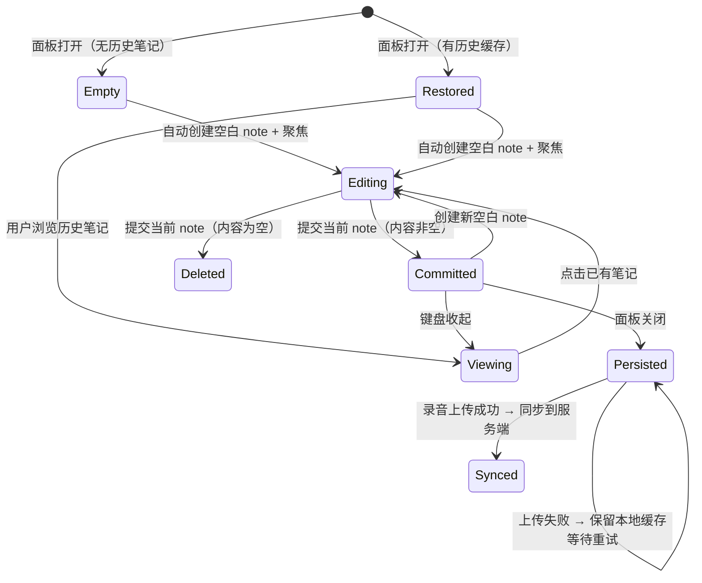

# 13. 录音笔记（Recording Notes）

> Module: Recording Notes | Requirements: 3 (APP-340 ~ APP-342) | Version: V1.2 NEW

---

## 1. Overview

- **Objective**: 允许用户在录音过程中随时添加文字笔记，笔记自动关联录音时间点，录音结束上传成功后自动同步到服务端。
- **Scope**:
  - 录音中添加笔记（弹出笔记输入面板）
  - 笔记与录音时间点自动关联
  - 本地持久化存储（Hive，按用户 + 录音 ID 隔离）
  - 上传成功后自动同步到服务端（合并去重）
  - 转录详情页查看笔记
- **Non-scope**:
  - 笔记的富文本编辑（仅纯文本）
  - 笔记独立于录音的管理（笔记始终归属于某条录音）
  - 笔记的云端编辑/删除（上传后不可修改）
  - 离线同步冲突解决（采用"服务端覆盖本地"策略）

---

## 2. Definitions

| 术语 | 定义 | 备注 |
|------|------|------|
| RecordingNoteEntry | 单条录音笔记，包含 id、noteTime（录音时间点）、content（文本内容）、createdAtMs（创建时间戳） | `shared/models/recording_note_entry.dart` |
| noteTime | 笔记关联的录音时间点，格式 `HH:MM:SS` | 由 `RecordingNoteTimeUtils.formatToDisplay()` 转换 |
| Empty Note | UI 为输入体验自动创建的空白笔记占位，不持久化 | `content.trim().isEmpty` 的 note |
| Previous Record ID | 预签名前的本地录音 ID | 上传后可能变更为服务端 ID |
| Server Record ID | 上传完成后服务端返回的录音 ID | `completeUpload` 后确定 |
| Merge Dedup | 合并去重策略：以 `noteTime + content.trim()` 为业务特征键去重 | 服务端版本覆盖本地版本 |

---

## 3. System Boundary

```
[Recording UI] → [RecordingNotesSheetController] → [Hive Storage]
                                                        ↓ (上传成功后)
                                                  [RecordingNotesSyncService]
                                                        ↓
                                                  [NotesService → NotesApi]
                                                        ↓
                                                  [BACKEND audio-api]
```

| 组件 | 职责 | 不负责 |
|------|------|--------|
| APP (RecordingNotesSheetController) | 笔记 UI 交互、时间点关联、本地存储读写、编辑状态管理 | 服务端同步 |
| APP (RecordingNotesSyncService) | 上传后合并本地笔记、调用 API 同步到服务端、清理旧缓存 | UI 交互 |
| APP (NotesService) | API 调用封装（创建录音笔记） | 本地存储 |
| BACKEND | 接收并持久化笔记数据 | 笔记内容生成 |

---

## 4. Scenarios

### S1: 录音中添加笔记

- **Trigger**: 用户在录音面板点击笔记按钮
- **Steps**: 1. 弹出笔记输入面板 → 2. 从本地缓存恢复历史笔记 → 3. 自动在末尾创建空白笔记并聚焦 → 4. 记录当前录音时间点 → 5. 用户输入内容 → 6. 可继续添加多条
- **Expected**: 每条笔记独立记录时间点，输入体验流畅

### S2: 编辑已有笔记

- **Trigger**: 用户点击已有笔记
- **Steps**: 1. 切换到该笔记的编辑态 → 2. 初始文本灌入输入框 → 3. 用户修改 → 4. 空内容自动删除该笔记
- **Expected**: 编辑后内容即时更新，空笔记被清理

### S3: 关闭笔记面板

- **Trigger**: 用户点击 Done 或手势关闭面板
- **Steps**: 1. 提交当前编辑中的笔记 → 2. 清理末尾空白占位 → 3. 将 `content.trim().isNotEmpty` 的笔记写入 Hive
- **Expected**: 笔记持久化到本地，下次打开可恢复

### S4: 录音上传成功后同步

- **Trigger**: `AudioUploadService.uploadAudioFile()` 成功且 `completeUpload` 返回
- **Steps**: 1. `RecordingNotesSyncService.syncAfterUpload()` 被调用 → 2. 合并 previousRecordId 和 serverRecordId 两个 key 下的笔记 → 3. 以 `noteTime + content.trim()` 去重（服务端覆盖本地） → 4. 调用 `NotesService.createRecordingNotes()` 上传 → 5. 更新本地缓存到 serverRecordId → 6. 删除旧 previousRecordId 缓存
- **Expected**: 笔记同步到服务端，本地缓存迁移到正确 key

### S5: 转录详情页查看笔记

- **Trigger**: 用户打开转录详情页
- **Steps**: 1. 从服务端拉取笔记 → 2. 写入本地缓存 → 3. 在笔记 Tab 展示
- **Expected**: 展示带时间点的笔记列表

---

## 5. Functional Requirements

| ID | 需求编号 | 描述 | 级别 | 验证方法 |
|----|---------|------|------|---------|
| FR-1300 | APP-340 | 录音中 MUST 能弹出笔记输入面板，每条笔记自动关联当前录音时间点（HH:MM:SS 格式） | MUST | 时间点记录验证：笔记 noteTime 与录音 durationMs 一致 |
| FR-1301 | APP-340 | 面板打开时 MUST 自动在列表末尾创建空白笔记并聚焦键盘 | MUST | 面板打开 → 键盘弹起 → 末尾有空 note 验证 |
| FR-1302 | APP-340 | 系统 MUST 支持连续添加多条笔记，提交当前笔记后立即创建新空白笔记（键盘不收起） | MUST | 连续添加交互验证 |
| FR-1303 | APP-341 | 笔记 MUST 实时保存到本地缓存，存储隔离策略为按用户 key + 录音 ID | MUST | 不同用户/录音的笔记互不影响验证 |
| FR-1304 | APP-341 | 面板关闭时 MUST 持久化所有 `content.trim().isNotEmpty` 的笔记到 Hive | MUST | 关闭后重新打开恢复验证 |
| FR-1305 | APP-341 | 空内容的笔记 MUST 不被持久化（仅作 UI 输入占位） | MUST | 持久化数据中无空内容 note 验证 |
| FR-1306 | APP-342 | 录音上传成功后 MUST 自动将本地笔记同步到服务端 | MUST | 上传成功后服务端存在笔记验证 |
| FR-1307 | APP-342 | 同步时 MUST 合并 previousRecordId 和 serverRecordId 下的笔记，以 `noteTime + content.trim()` 为去重键 | MUST | 预签名前后 ID 变更场景验证 |
| FR-1308 | APP-342 | 同步成功后 MUST 将本地缓存迁移到 serverRecordId，删除旧 previousRecordId 缓存 | MUST | 缓存 key 迁移验证 |
| FR-1309 | - | 笔记面板 MUST 支持手机录音和设备录音两种场景 | MUST | 两种录音源下笔记功能可用 |

---

## 6. State Model

### 笔记生命周期状态机



### 状态定义

| 状态 | 含义 | 进入条件 | 退出条件 | 代码映射 |
|------|------|---------|---------|---------|
| Empty | 无笔记 | 面板首次打开且无缓存 | 创建空白 note | `notes.isEmpty && hasLoaded.value` |
| Restored | 已恢复历史 | `loadFromDisk()` 成功 | 编辑/查看 | `notes.isNotEmpty && hasLoaded.value` |
| Editing | 编辑中 | 聚焦某条 note | 提交/键盘收起 | `editingNoteId.value != null` |
| Committed | 已提交 | 内容写回 notes 列表 | 创建新 note / 面板关闭 | `editingNoteId.value == null && notes.isNotEmpty` |
| Persisted | 已持久化 | `persistToDisk()` 完成 | 同步到服务端 | Hive 中存在数据 |
| Synced | 已同步 | `syncAfterUpload()` 成功 | - | 服务端已接收 |

### 非法状态

| 不允许的转移 | 原因 | 防御措施 |
|-------------|------|---------|
| Empty → Synced | 没有笔记无需同步 | `notes.isEmpty` 时跳过同步 |
| Editing → Synced | 未持久化不可同步 | 上传前 `persistToDisk()` |

---

## 7. Data Contract

### 7.1 RecordingNoteEntry Model

| 字段 | 类型 | 必填 | 单位 | 说明 |
|------|------|------|------|------|
| id | String | yes | - | 笔记 ID（创建时为 `DateTime.now().millisecondsSinceEpoch.toString()`） |
| noteTime | String | yes | HH:MM:SS | 录音时间点（`RecordingNoteTimeUtils.formatToDisplay()`） |
| content | String | yes | - | 笔记文本内容 |
| createdAtMs | int | yes | 毫秒时间戳 | 创建时间 |

### 7.2 本地存储

| 存储 | Key 格式 | 值 | 序列化 |
|------|---------|-----|--------|
| Hive (StorageService) | box: `recording_notes_{userKey}`, key: `notes_{recordId}` | `List<Map<String, dynamic>>` | `RecordingNoteEntry.toJson()` |

### 7.3 API Endpoint

| 方法 | 路径 | 请求体 | 响应体 | 备注 |
|------|------|--------|--------|------|
| POST | `/api/v1/records/{audioId}/notes` | `{notes: [{id, noteTime, content, createdAtMs}]}` | `{code, msg}` | 批量创建笔记（由 `NotesService.createRecordingNotes()` 调用） |

### 7.4 Merge Algorithm

```
Input:  previousRecordId, serverRecordId
Process:
  1. 读取本地 notes_previousRecordId 和 notes_serverRecordId
  2. 以 "{noteTime}|{content.trim()}" 为 key 建立 Map
  3. 先插入 previousRecordId 的笔记
  4. 再插入 serverRecordId 的笔记（覆盖本地版本）
  5. 按 createdAtMs 升序排序
Output: 合并去重后的笔记列表
```

---

## 8. Error Handling

| Case | 触发条件 | 系统行为 | 状态变化 | 用户感知 |
|------|---------|---------|---------|---------|
| 本地缓存读取失败 | Hive 数据损坏 | `loadFromDisk` catch 异常，`notes.clear()` | → Empty | 无历史笔记显示 |
| 本地持久化失败 | Hive 写入异常 | `persistToDisk` catch 异常并 log | Editing → 状态不变 | 无感知（下次打开可能丢失） |
| 服务端同步失败 | `createRecordingNotes` API 失败 | log warning，保留本地缓存 | Persisted → 保持 | 无感知（笔记仍在本地，不影响录音） |
| 录音被中断 | 来电/系统中断录音 | `RecordingInterruptedStopListener` 触发，Toast 提示，`closeSheetToken++` 关闭面板 | Editing → Persisted（onClose 兜底保存） | Toast: "录音被中断，已自动保存" |
| 设备断连中 | BLE 设备录音断连（grace period 内） | 操作按钮禁用 (`isActionButtonsDisabled`) | Editing 继续，但暂停/停止不可用 | 按钮灰色不可点击 |
| 多次 persistToDisk | 关闭流程重复触发 | dirty flag 防重入，等当前写完再判断是否需要再写 | 无影响 | 无感知 |

---

## 9. Non-functional Requirements

| 指标 | 要求 | 说明 |
|------|------|------|
| 笔记时间精度 | 毫秒级创建时间，显示精度 HH:MM:SS | `durationMs` 来自 `RecordItem.duration` |
| 持久化时机 | 面板关闭时保存 + `onClose` 兜底 | 非实时保存（关闭时保存策略） |
| 存储隔离 | 按用户 key + 录音 ID 双维度隔离 | `recording_notes_{userKey}` / `notes_{recordId}` |
| 排序规则 | 按 `createdAtMs` 升序（自然书写顺序） | 恢复时保持写入顺序 |
| 同步时机 | 录音上传成功后自动触发 | 在 `AudioUploadService` 流程中调用 |
| 空 note 过滤 | 持久化和同步时过滤 `content.trim().isEmpty` | 空 note 仅为 UI 输入占位 |

---

## 10. Observability

### Logs

| 事件 | 级别 | 携带字段 | 组件 |
|------|------|---------|------|
| loadFromDisk failed | ERROR | error, stackTrace | `RecordingNotesSheetController` |
| persistToDisk failed | ERROR | error, stackTrace | `RecordingNotesSheetController` |
| 录音笔记同步服务端失败 | WARN | message | `RecordingNotesSyncService` |
| 录音笔记已同步服务端 | INFO | id, count | `RecordingNotesSyncService` |
| syncAfterUpload 异常 | ERROR | error, stackTrace | `RecordingNotesSyncService` |
| onDone stop recording failed | ERROR | error, stackTrace | `RecordingNotesSheetController` |

### Metrics

| 指标 | 含义 | 告警阈值 |
|------|------|---------|
| notes_sync_success_rate | 笔记同步成功率 | < 95% |
| notes_persist_failure_rate | 本地持久化失败率 | > 1% |
| notes_per_recording_avg | 每条录音平均笔记数 | 统计用，无告警 |

### Tracing

| 字段 | 作用 |
|------|------|
| recordId | 串联录音 → 笔记 → 同步 |
| userKey | 串联用户 → 隔离存储 |
| previousRecordId / serverRecordId | 串联预签名前后 ID 变更 |
