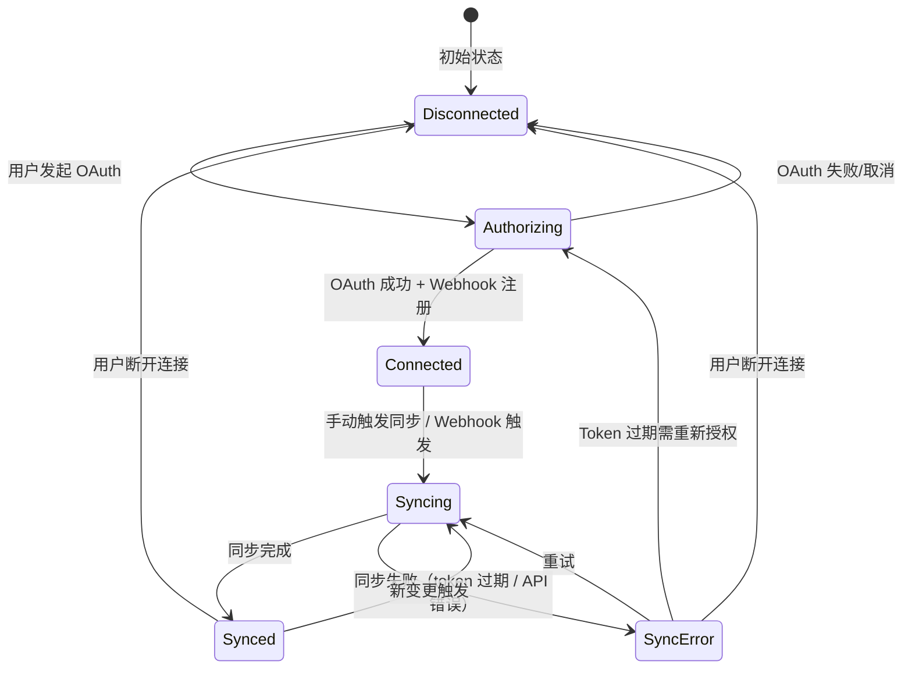
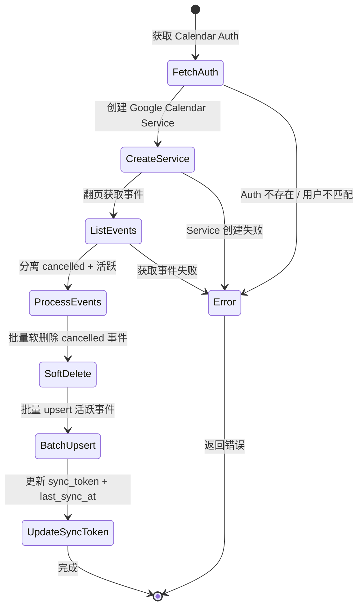

# 14. Google Calendar 双向同步

> Module: Calendar Sync | Requirements: 3 (APP-355 ~ APP-357) | Version: V1.2 NEW

---

## 1. Overview

- **Objective**: 实现 Memoket 任务与 Google Calendar 事件之间的双向数据同步：Google Calendar 事件变更自动同步为 Memoket 任务，Memoket 任务变更推送到 Google Calendar。
- **Scope**:
  - Google Calendar OAuth 授权连接/断开
  - Google → Memoket 方向：事件变更通过 Webhook 实时通知 + 批量同步
  - Memoket → Google 方向：任务变更推送到 Google Calendar
  - Webhook 注册、过期管理
  - 同步记录维护（`google_calendar_sync` 表）
  - 增量同步（`syncToken`）
- **Non-scope**:
  - 非 Google Calendar 的日历服务（当前仅支持 Google）
  - 日历 UI 展示（APP 端仅触发同步和展示状态，不提供日历视图）
  - 多日历支持（当前仅同步 `primary` 日历）
  - 重复事件的完整 recurrence 规则解析（仅同步单个实例 `singleEvents=true`）

> **重要说明**：此模块主要为 BACKEND 功能。APP 端角色有限——仅负责 OAuth 授权触发、同步触发和状态展示。核心同步逻辑全部在 BACKEND (user-api + task-rpc) 中实现。

---

## 2. Definitions

| 术语 | 定义 | 备注 |
|------|------|------|
| Calendar Auth | Google Calendar OAuth 授权记录，存储 access_token、refresh_token、过期时间、sync_token | `user_calendar_auth` 表 |
| Sync Token | Google Calendar API 提供的增量同步令牌，用于只获取上次同步后的变更 | `nextSyncToken` 由 Google 返回 |
| ETag | Google Calendar 事件的版本标记，用于检测事件是否发生变更 | 每次事件更新 etag 变化 |
| Webhook | Google Calendar Push Notification 机制，事件变更时主动回调到 BACKEND | 包含 channel_id、resource_id、expires_at |
| Sync Direction | 同步方向标记：`from_google`（Google → Memoket）或 `to_google`（Memoket → Google） | `constx.SyncFromGoogle` / `constx.SyncToGoogle` |
| Sync Status | 同步状态：`synced` / `pending` / `failed` | `constx.SyncStatusSynced` 等 |
| google_calendar_sync | 同步记录表，维护 Google Event 与 Memoket Task 的映射关系 | 由 task-rpc 管理 |
| Cancelled Event | Google Calendar 中状态为 `cancelled` 的事件（已删除/已取消） | 触发 Memoket 任务软删除 |
| Primary Calendar | Google Calendar 的默认日历 | `googleCalendarId = "primary"` |

---

## 3. System Boundary

```
[Google Calendar API] ←OAuth2→ [BACKEND (user-api)] ←gRPC→ [BACKEND (user-rpc)]
         ↓ Webhook                    ↓ REST                       ↓
[BACKEND (task-api)] ←gRPC→ [BACKEND (task-rpc)] ←→ [PostgreSQL]
         ↑                                              ↑
[APP (Flutter)] — 仅触发授权/同步/展示状态 ——————————————————→
```

| 组件 | 职责 | 不负责 |
|------|------|--------|
| **APP** | OAuth 授权触发（复用 integrations 模块 OAuth 流程）、手动触发同步、展示同步状态 | 同步逻辑、事件解析、Webhook 处理 |
| **BACKEND (user-api)** | OAuth 授权管理、Calendar Sync 逻辑编排（`sync_logic.go`）、Webhook 接收与分发 | 任务 CRUD |
| **BACKEND (user-rpc)** | Calendar Auth CRUD（加密存储 token）、Sync Token 更新 | 同步��辑 |
| **BACKEND (task-rpc)** | Task CRUD、`google_calendar_sync` 记录管理（BatchUpsert、BatchSoftDelete）、Webhook 记录管理 | OAuth 授权 |
| **Google Calendar API** | 事件数据源、OAuth Provider、Webhook Push | Memoket 业务逻辑 |

### APP 端角色（极简）

APP 在此模块中仅有 3 个触发点：
1. **授权**：通过 integrations 页面发起 Google Calendar OAuth（复用 `IntegrationsController`）
2. **触发同步**：调用 `POST /api/v1/calendar/sync`
3. **展示状态**：显示连接状态、上次同步时间

---

## 4. Scenarios

### S1: 连接 Google Calendar（OAuth 授权）

- **Trigger**: 用户在设置页点击连接 Google Calendar
- **Steps**: 1. APP 请求 `POST /api/v1/calendar/auth-url` → 2. BACKEND 生成 OAuth URL → 3. APP 打开浏览器 → 4. 用户授权 → 5. Google 回调 BACKEND → 6. BACKEND 交换 token 并加密存储 → 7. 注册 Webhook → 8. APP resume 刷新状态
- **Expected**: 授权成功，日历同步就绪

### S2: Google → Memoket 同步（手��触发）

- **Trigger**: APP 调用 `POST /api/v1/calendar/sync`
- **Steps**: 1. BACKEND 获取 Calendar Auth → 2. 创建 Google Calendar Service（使用存储的 OAuth token） → 3. 翻页获取事件列表（时间窗口：昨天 ~ 未来 10 天，但仅同步结束时间在"现在 ~ 未来 7 天"的事件） → 4. 分离 cancelled 事件和活跃事件 → 5. 批量软删除 cancelled 对应任务 → 6. 批量 upsert 活跃事件为 Memoket 任务 → 7. 更新 sync_token 和 last_sync_at
- **Expected**: Google Calendar 事件映射为 Memoket 任务，cancelled 事件对应任务被软删除

### S3: Google → Memoket 同步（Webhook 触发）

- **Trigger**: Google Calendar 事件变更，Push Notification 到 BACKEND
- **Steps**: 1. BACKEND 接收 Webhook 通知 → 2. 验证 channel_id 和 resource_id → 3. 查询变更事件 → 4. 执行同步（同 S2 的 Step 3-7）
- **Expected**: 实时感知 Google Calendar 变更

### S4: Memoket → Google 同步

- **Trigger**: 用户在 Memoket 中创建/修改/删除任务
- **Steps**: 1. Task 变更 → 2. 查询 `google_calendar_sync` 是否有映射 → 3. 若有：更新 Google Calendar 事件 → 4. 若无：创建 Google Calendar 事件并插入映射记录
- **Expected**: Memoket 任务变更同步到 Google Calendar

### S5: 断开连接

- **Trigger**: 用户在设置页断开 Google Calendar
- **Steps**: 1. APP 调用断开 API → 2. BACKEND 删除 Calendar Auth → 3. 批量软删除该用户的 Webhook 和 sync 记录
- **Expected**: 停止同步，清理相关数据

---

## 5. Functional Requirements

| ID | 需求编号 | 描述 | 级别 | 验证方法 |
|----|---------|------|------|---------|
| FR-1400 | APP-355 | 系统 MUST 支持通过 OAuth 2.0 连接 Google Calendar，安全存储 access_token 和 refresh_token（加密） | MUST | OAuth 授权流程验证 + token 加密存储验证 |
| FR-1401 | APP-355 | 授权成功后 MUST 自动注册 Google Calendar Webhook | MUST | Webhook 注册记录验证 |
| FR-1402 | APP-356 | 系统 MUST 支持 Google → Memoket 方向同步：将 Google Calendar 事件映射为 Memoket 任务（标题、开始/结束时间、地点、参与者） | MUST | 同步后 Memoket 任务内容与 Google 事件一致验证 |
| FR-1403 | APP-356 | 同步 MUST 仅处理结束时间在"当前时间 ~ 未来 7 天"范围内的事件 | MUST | 超出范围事件不同步验证 |
| FR-1404 | APP-356 | 对 Google Calendar 中 `status = cancelled` 的事件，MUST 对应软删除 Memoket 任务 | MUST | 取消事件对应任务被删除验证 |
| FR-1405 | APP-356 | 系统 MUST 支持 Memoket → Google 方向同步：任务变更推送到 Google Calendar | MUST | 任务创建/修改后 Google Calendar 同步验证 |
| FR-1406 | APP-356 | 同步记录 MUST 通过 `google_event_id` 和 `etag` 识别变更，避免重复同步 | MUST | 同一事件多次同步不产生重复验证 |
| FR-1407 | APP-357 | 系统 MUST 注册 Google Calendar Webhook，接收事件变更的实时推送通知 | MUST | Webhook 回调接收验证 |
| FR-1408 | APP-357 | Webhook MUST 包含 channel_id、resource_id 和过期时间，过期后 SHOULD 自动续期 | MUST | Webhook 过期管理验证 |
| FR-1409 | - | 系统 MUST 支持增量同步（使用 Google API 的 `syncToken`），减少全量拉取 | MUST | 增量同步 token 更新验证 |
| FR-1410 | - | 若 `sync_completed_tasks` 设置为 false，SHOULD 跳过已结束的事件 | SHOULD | 配置项生效验证 |
| FR-1411 | - | 断开连接时 MUST 清理 Calendar Auth、Webhook 记录和同步记录 | MUST | 断开后数据清理验证 |

---

## 6. State Model

### 同步连接状态机



### 单次同步状态机



### 状态定义

| 状态 | 含义 | 进入条件 | 退出条件 | 代码映射 |
|------|------|---------|---------|---------|
| Disconnected | 未连接 | 初始 / 断开 / OAuth 失败 | 发起 OAuth | 无 Calendar Auth 记录 |
| Authorizing | OAuth 授权中 | 用户点击连接 | OAuth 完成/失败 | OAuth 浏览器流程进行中 |
| Connected | 已连接（待同步） | OAuth 成功 + Webhook 注册 | 触发同步 / 断开 | Calendar Auth 存在 |
| Syncing | 同步中 | 手动触发 / Webhook 触发 | 同步完成/失败 | `SyncLogic.Sync()` 执行中 |
| Synced | 已同步 | 同步完成 | 新变更触发 / 断开 | `last_sync_at` 已更新 |
| SyncError | 同步失败 | API 错误 / token 过期 | 重试 / 断开 / 重新授权 | 同步返回错误 |

---

## 7. Data Contract

### 7.1 APP-facing API Endpoints

| 方法 | 路径 | 请求体 | 响应体 | 备注 |
|------|------|--------|--------|------|
| POST | `/api/v1/calendar/auth-url` | `{provider: "google"}` | `{auth_url: string}` | 获取 OAuth 授权 URL |
| GET | `/api/v1/calendar/auth/callback` | query: `{code, state}` | redirect | OAuth 回调（浏览器） |
| POST | `/api/v1/calendar/sync` | `{id: int64, provider: "google"}` | `{msg: string}` | 触发同步 |
| POST | `/api/v1/calendar/disconnect` | `{id: int64, provider: "google"}` | `{msg: string}` | 断开连接 |
| GET | `/api/v1/calendar/settings` | - | `{data: CalendarSettings}` | 获取日历设置 |
| PUT | `/api/v1/calendar/settings` | `{sync_completed_tasks: bool, ...}` | `{msg: string}` | 更新日历设置 |
| GET | `/api/v1/calendar/providers` | - | `{data: [Provider]}` | 列表支持的日历提供商 |
| GET | `/api/v1/calendar/providers/{provider}/auths` | - | `{data: [CalendarAuth]}` | 列表授权记录 |

### 7.2 BACKEND Internal gRPC (task.proto)

| RPC Method | 请求 | 响应 | 说明 |
|-----------|------|------|------|
| `BatchUpsertGoogleCalendarSync` | `{items: [BatchUpsertItem]}` | `{success_count, fail_count}` | 批量创建/更新同步记录 + 任务 |
| `BatchSoftDeleteGoogleCalendarSync` | `{items: [{google_calendar_id, google_event_id}]}` | `{success_count, fail_count}` | 批量软删除（cancelled 事件） |
| `InsertGoogleCalendarSync` | `{user_id, local_event_id, google_event_id, ...}` | `{id}` | 插入同步记录（Memoket → Google） |
| `GetGoogleCalendarSyncByLocalEventId` | `{user_id, local_event_id}` | `{items: [SyncItem]}` | 查询映射 |
| `CreateCalendarWebhook` | `{user_id, auth_id, channel_id, resource_id, expires_at}` | `{id}` | 创建 Webhook |
| `BatchSoftDeleteCalendarWebhooksByAuthId` | `{auth_id}` | `{success_count}` | 清理 Webhook |
| `BatchSoftDeleteGoogleCalendarSyncByUserId` | `{user_id}` | `{success_count}` | 断开时清理 |

### 7.3 BatchUpsertGoogleCalendarSyncItem

| 字段 | 类型 | 必填 | 说明 |
|------|------|------|------|
| user_id | int64 | yes | 用户 ID |
| google_calendar_id | string | yes | Google 日历 ID（`"primary"`） |
| google_event_id | string | yes | Google 事件 ID |
| google_event_etag | string | no | 事件版本标记 |
| google_event_icaluid | string | no | iCal UID |
| sync_direction | string | no | 同步方向 (`from_google` / `to_google`) |
| sync_status | string | no | 同步状态 (`synced` / `pending` / `failed`) |
| event_title | string | no | 事件标题 |
| event_content | string | no | 事件内容/描述 |
| event_start_time | int64 | no | 开始时间（毫秒时间戳） |
| event_end_time | int64 | no | 结束时间（毫秒时间戳） |
| event_location | string | no | 地点 |
| event_participants | string[] | no | 参与者邮箱列表 |

### 7.4 Google Calendar API 查询参数

| 参数 | 值 | 说明 |
|------|-----|------|
| MaxResults | 250 | 每页最大事件数 |
| SingleEvents | true | 展开重复事件为单个实例 |
| ShowDeleted | true | 包含已删除事件（用于检测取消） |
| ShowHiddenInvitations | true | 包含隐藏的邀请 |
| TimeMin | now - 1 day | 查询起始时间 |
| TimeMax | now + 10 days | 查询结束时间 |
| 实际过滤 | event.End 在 [now, now + 7 days] | 代码层面二次过滤 |

### 7.5 Task ↔ Event 字段映射

| Google Calendar Event | Memoket Task | 映射规则 |
|----------------------|-------------|---------|
| `Summary` | `title` | 直接映射，空则"无标题事件" |
| `Description` (fallback `Summary`) | `content` | 优先 description |
| `Start.DateTime` / `Start.Date` | `start_time` | 转毫秒时间戳；Date 格式为全天事件 |
| `End.DateTime` / `End.Date` | `due_time` | 转毫秒时间戳 |
| `Location` | `location` | 可选字段 |
| `Attendees[].Email` | `participants` | 邮箱列表 |
| `Etag` | `google_event_etag` | 版本检测 |
| `ICalUID` | `google_event_icaluid` | 跨日历去重 |
| `Status == "cancelled"` | 软删除任务 | `BatchSoftDeleteGoogleCalendarSync` |

---

## 8. Error Handling

| Case | 触发条件 | 系统行为 | 状态变化 | 用户感知 |
|------|---------|---------|---------|---------|
| OAuth 授权失败/取消 | 用户取消或 code exchange 失败 | BACKEND log 错误，APP resume 刷新无变化 | Authorizing → Disconnected | 状态不变 |
| Google Client 未初始化 | 服务端 Google OAuth config 缺失 | 返回 `GoogleCalendarNotConfigured` 错误 | Syncing → SyncError | 同步失败提示 |
| Calendar Auth 不存在 | Auth ID 无效 | 返回 `GetCalendarAuthFailed` 错误 | Syncing → SyncError | 同步失败提示 |
| Auth 用户不匹配 | 请求用户与 Auth 所有者不一致 | 返回 `Unauthorized` 错误 | Syncing → SyncError | 权限错误提示 |
| Google API 事件列表失败 | Google API 返回错误 | 返回 `ListCalendarEventsFailed` | Syncing → SyncError | 同步失败提示 |
| 批量软删除失败 | task-rpc 调用失败 | log 错误但不中断主流程 | Syncing 继续 | 无感知（降级处理） |
| 批量 upsert 部分失败 | 部分记录写入失败 | log `success_count` 和 `fail_count` | Syncing → Synced（部分成功） | 无感知 |
| Token 过期 | OAuth token 过期 | Google API 返回 401 | Syncing → SyncError | 需重新授权 |
| Webhook 过期 | expires_at 已过 | Webhook 不再推送 | Connected 但无实时通知 | 手动同步仍可用 |
| 更新 sync_token 失败 | user-rpc 调用失败 | log 错误但不影响同步结果 | Synced（sync_token 未更新） | 下次同步可能重复拉取 |
| 无结束时间的事件 | event.End 为空 | 跳过该事件 | 无影响 | 该事件不同步 |

---

## 9. Non-functional Requirements

| 指标 | 要求 | ��明 |
|------|------|------|
| 同步时间窗口 | 查询：昨天 ~ 未来 10 天；过滤：当前 ~ 未来 7 天 | `oneDaysBefore` ~ `tenDaysLater` 查询，`now` ~ `sevenDaysLater` 过滤 |
| 翻页获取 | 每页最多 250 条事件 | Google API `MaxResults(250)` |
| 增量同步 | 第二次及后续同步使用 `syncToken` | 减少 API 调用量 |
| Token 加密存储 | OAuth token MUST 加密存储 | BACKEND user-rpc 负责 |
| 同步方向标记 | 每条同步记录标记 `sync_direction` | `from_google` / `to_google` |
| 全天事件处理 | 全天事件结束时间设为当天 23:59:59 | `time.Date(..., 23, 59, 59, ...)` |
| Webhook 有效期 | Google 默认 7 天（可配置） | 需定期续期 |
| Provider 限制 | 当前仅支持 `google` | 其他 provider 返回 `ProviderUnsupported` |

---

## 10. Observability

### Logs

| 事件 | 级别 | 携带字段 | 组件 |
|------|------|---------|------|
| Sync: userId required | INFO | - | `SyncLogic` |
| unsupported provider | ERROR | provider | `SyncLogic` |
| failed to get calendar auth | ERROR | error | `SyncLogic` |
| auth user mismatch | INFO | authUserId, headerUserId | `SyncLogic` |
| Google client not initialized | ERROR | - | `SyncLogic` |
| failed to list calendar events | ERROR | error | `SyncLogic` |
| got nextSyncToken | INFO | hasNextPage, pageToken | `SyncLogic` |
| batch soft deleted cancelled events | INFO | count, success, fail | `SyncLogic` |
| failed to batch upsert sync records | ERROR | error | `SyncLogic` |
| synced N events for user | INFO | syncedCount, userId | `SyncLogic` |
| updated calendar auth last sync at | INFO | authId, time | `SyncLogic` |

### Metrics

| 指标 | 含义 | 告警阈值 |
|------|------|---------|
| calendar_sync_success_rate | 同步成功率 | < 95% |
| calendar_sync_events_per_run | 每次同步处理的事件数 | 统计用 |
| calendar_sync_latency_p95 | 同步耗时 P95 | > 30s |
| calendar_webhook_active_count | 活跃 Webhook 数量 | 降至 0 时告警 |
| calendar_upsert_fail_rate | 批量 upsert 失败率 | > 5% |

### Tracing

| 字段 | 作用 |
|------|------|
| userId | 串联用户 → 授权 → 同步 |
| authId | 串联授权记录 → Webhook → 同步 |
| google_event_id | 串联 Google 事件 → Memoket 任务 |
| local_event_id (task_id) | 串联 Memoket 任务 → Google 事件 |
| sync_token | 串联增量同步轮次 |
