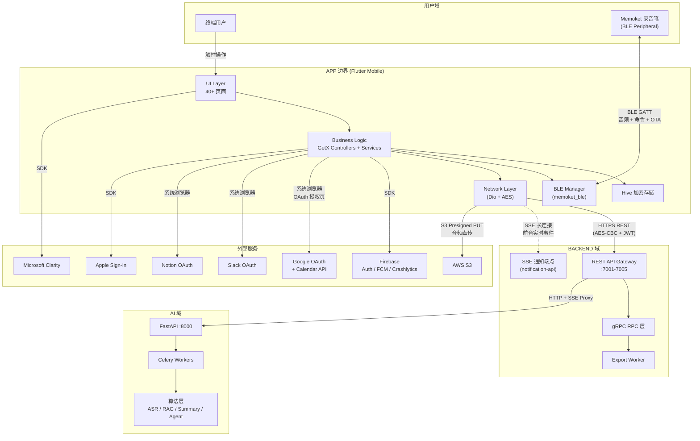
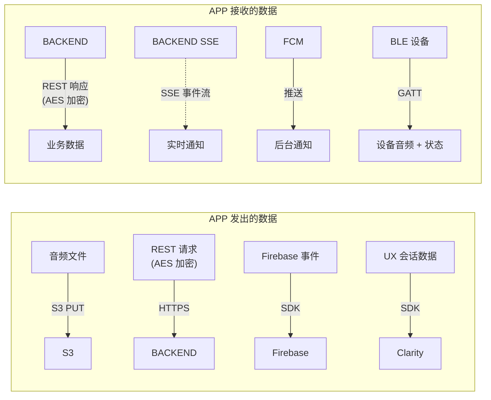

# APP 系统边界与上下文

> 定义 APP 与外部系统之间的职责划分、数据流方向、控制流方向

## 1. 系统上下文图

## 2. 职责矩阵

| 职责 | APP | BACKEND | AI |
|------|:---:|:-------:|:--:|
| 用户注册/登录 UI | **主** | 鉴权 + 用户存储 | -- |
| Firebase Auth 集成 | **主** | Token 验证 | -- |
| 本地麦克风录音 | **主** | -- | -- |
| BLE 设备通信与控制 | **主** | -- | -- |
| 音频上传（S3 直传） | **主** | 签发 Presigned URL | -- |
| 录音列表/详情 CRUD | UI 展示 | **主**（API + DB） | -- |
| 转录触发与结果获取 | 轮询/展示 | 转发请求 | **主**（ASR 执行） |
| 摘要生成 | 展示 | 转发请求 | **主**（模板引擎） |
| AI Chat（InFileChat） | SSE 展示 | SSE 透传代理 | **主**（LLM + 上下文） |
| AI Insight（CrossFileChat） | UI 交互 | 转发请求 | **主**（RAG 检索 + LLM） |
| Agent 报告 | 轮询/展示 | 转发请求 | **主**（规划 + 执行） |
| 模板社区浏览/收藏 | UI 交互 | **主**（CRUD） | 推荐算法 |
| 导出 PDF/DOCX | 触发 + 下载 | **主**（Export Worker 渲染） | 提供内容 |
| 推送通知 | 接收展示 | **主**（FCM 分发 + SSE） | 事件写入 Redis Stream |
| 第三方集成（Slack/Notion） | OAuth 跳转 + 状态展示 | **主**（OAuth 回调 + Token 管理） | -- |
| Google Calendar 同步 | 设置页展示 | **主**（双向同步 + Webhook） | -- |
| MCP 服务 | 入口展示 | **主**（工具注册 + OAuth） | 数据查询接口 |
| 设置/偏好管理 | **主**（UI + 本地缓存） | 持久化存储 | -- |

> **主** = 核心执行方；其余为协作方

## 3. 数据流方向

## 4. 控制流方向

| 控制流 | 方向 | 说明 |
|--------|------|------|
| 录音 → 上传 → AI 处理 | APP → S3 → BACKEND → AI | APP 主动发起，BACKEND 编排 AI 任务 |
| AI 处理完成通知 | AI → Redis Stream → BACKEND → SSE/FCM → APP | AI 完成后反向通知 APP |
| OAuth 授权 | APP → 系统浏览器 → OAuth Provider → BACKEND callback → APP 轮询 | APP 发起跳转，BACKEND 处理回调 |
| BLE 设备控制 | APP → BLE 设备 | APP 作为 BLE Central 主动控制 |
| BLE 音频传输 | BLE 设备 → APP | 设备主动推送音频数据 |
| 推送通知 | BACKEND → FCM → APP | 后台事件由 BACKEND 决定推送 |
| SSE 实时事件 | BACKEND → APP | APP 前台时建立长连接被动接收 |

## 5. 外部依赖清单

| 依赖 | 类型 | APP 集成方式 | 失败影响 |
|------|------|-------------|----------|
| Memoket BACKEND | 自研服务 | Dio HTTP + SSE | 核心功能不可用，降级为离线录音 |
| AWS S3 | 云存储 | Presigned URL 直传 | 无法上传音频，本地缓存等待重试 |
| Firebase Auth | 认证 | SDK | 无法登录（Google/Apple） |
| Firebase FCM | 推送 | SDK | 后台通知不可达，前台 SSE 不受影响 |
| Firebase Crashlytics | 监控 | SDK | 崩溃报告丢失，不影响功能 |
| Firebase Analytics | 分析 | SDK | 埋点丢失，不影响功能 |
| Microsoft Clarity | UX 分析 | SDK | 会话录制中断，不影响功能 |
| BLE 录音笔 | 自研硬件 | flutter_blue_plus + memoket_ble | 无法使用设备录音，本地录音不受影响 |
| Google/Apple/Slack/Notion OAuth | 第三方 | 系统浏览器跳转 | 对应集成功能不可用 |
