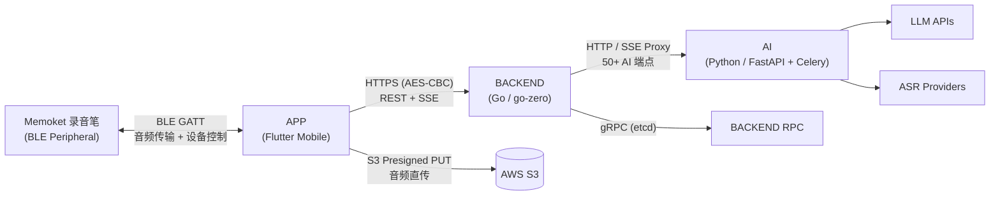

# Memoket System SRD Documentation

> SRD V1.2 | Generated 2026-04-03

## 系统概述

Memoket 是一款基于 AI 的智能录音与转录应用，配合自研 BLE 录音笔硬件，提供 **录音 → 云端上传 → AI 转录 → 智能摘要 → AI 对话** 全链路体验。

## 系统架构

### 三层职责划分

| 层级 | 技术栈 | 核心职责 |
|------|--------|----------|
| **APP** | Flutter 3.8+ / Dart / GetX | 用户交互、BLE 设备通信、本地录音、S3 直传、AI 对话展示 |
| **BACKEND** | Go / go-zero / gRPC / etcd | REST API 网关、用户鉴权、音频管理、通知分发、第三方集成 |
| **AI** | Python / FastAPI / Celery | ASR 转录、摘要生成、RAG 跨录音问答、Agent 执行、模板推荐 |

### 共享基础设施

| 组件 | 用途 |
|------|------|
| PostgreSQL + pgvector | 业务数据 + 向量检索（~50 张表） |
| Redis | 缓存 / Celery Broker / Stream 缓冲 / 通知路由 |
| AWS S3 + CloudFront | 音频文件 + 导出文档存储与分发 |
| Firebase | Auth / FCM / Crashlytics / Analytics |

## 文档导航

| 子系统 | 入口 | 说明 |
|--------|------|------|
| APP | [APP/README.md](APP/README.md) | 移动端 SRD — 14+10 模块，192 条需求 |
| BACKEND | BACKEND/README.md | 后端服务 SRD（待生成） |
| AI | AI/README.md | AI 服务 SRD（待生成） |

## 版本信息

| 项目 | 值 |
|------|-----|
| SRD 版本 | V1.2-draft |
| 基线代码 | APP develop@04d6f01a / BACKEND develop@dd6567a / AI fix/Ticket-001492@305a498 |
| V1.0 完成率 | 92.2%（83/90 完全实现） |
| V1.2 提前实现 | 63.5%（33/52 已提前完成） |
| 本次新增需求 | 40 条（10 个新模块） |
| 状态更新 | 35 条（V1.2 计划 → 已提前实现） |
